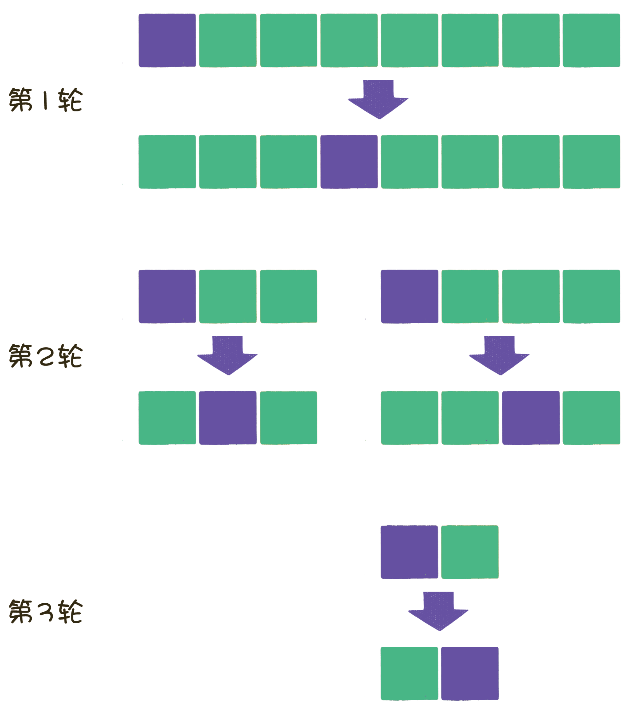

## 哈希表
也称为散列表
### 哈希冲突
1. 线式

h(k, i) = (h′(k) + i) mod m.

如果发生冲突，就一个一个往下查看直到第i个位置有空闲格

```
e.g.
m=8, h'(k)=k mod m

k    ｜ 10 19 31 22 14 16 
h'(k)|  2  3  7  6  6  0

hash table = [14, 16, 10, 19, - , - , 22, 31]
               0,  1,  2,  3,  4,  5,  6,  7  
```

2. 二次哈希 Quadratic

h(k, i) = (h′(k) + c1i + c2i^2) mod m

```
e.g.
m=8, h'(k)=k mod m, c1 = c2 = 1/2

k    ｜ 10 19 31 22 14 16 
h'(k)|  2  3  7  6  6  0

hash table = [- , - , 10, 19, - , - , 22, 31]
               0,  1,  2,  3,  4,  5,  6,  7  

14->6 -> 6+1/2(1+1^2) mod 8 = 7 依旧冲突
      -> 6+1/2(2+2^2) mod 8 = 1 不冲突 填入

hash table = [16, 14, 10, 19, - , - , 22, 31]
               0,  1,  2,  3,  4,  5,  6,  7        
```

3. Double hashing

h(k, i) = (h1(k) + ih2(k)) mod m

```
e.g.
m=7, h1(k)=k mod 7, h2(k)=1 + （k mod 7）

k    ｜ 10 19 31 22 14 16 
h1(k)|  3  5  3  1  0  2
h2(k)|  1  5  2  3  5  2

hash table = [- , - , - , 10, - , 19, - ]
               0,  1,  2,  3,  4,  5,  6  

31->3 冲突
3+2*1->5 冲突
3+2*2->0 空闲

hash table = [31, 22, 16, 10, - , 19, 14]
               0,  1,  2,  3,  4,  5,  6        
```


## 排序 

### 复杂度
[排序总结](https://blog.csdn.net/pange1991/article/details/85460755)
### 快速排序 O(nlogn)
基本思想：
1. 选中一个元素，将小于它的都放在左边大于它的都放在右边。
2. 再在他的左边和右边选中一个元素，重复上述操作。


实现方法
1. **双边循环法**
- 设置两个指针 left和right
- 随机在中间设置基准pivot
- left从start开始往右找到比pivot大的
- right从end开始往左找到比pivot小的
- 然后替换
- 使用递归
```c++
#include <iostream>
#include <vector>
#include <stack>
#include <map>
#include <string>
using namespace std;

void quickSort(vector<int> &arr, int startIndex, int endIndex);
int partition(vector<int> &arr, int startIndex, int endIndex);

int main(){
    vector<int> arr = {4,2,4,6,8,24,7,1,7,3,5,9,2,3};
    int end = (int)arr.size() - 1;
    quickSort(arr, 0, end);
    for(int i : arr) cout << i << ", ";
    
    return 0;
}
void quickSort(vector<int> &arr, int startIndex, int endIndex){
    //递归结束条件
    if(startIndex >= endIndex) return;
    //获得分化位置并且进行排序
    int temp = partition(arr, startIndex, endIndex);
    quickSort(arr, startIndex, temp - 1);
    quickSort(arr, temp + 1, endIndex);
}
int partition(vector<int> &arr, int startIndex, int endIndex){
    //选择第一个元素作为基准(也可以随机选择， 但选完要放在第一个)
    int pivot = arr[startIndex];
    int left = startIndex;
    int right = endIndex;
    //将所有小于基准的元素挪到左边
    while(left != right){
        //找到从右数第一个<pivot的位置
        while(left < right && arr[right] > pivot) right--;
        //找到从左数第一个>pivot的位置
        while(left < right && arr[left] <= pivot) left++;
        
        if(left < right) swap(arr[left], arr[right]);
    }
    //将pivot放在left/right的位置
    swap(arr[startIndex], arr[left]);
    return left;
}
```


2. **单边循环法**

- 一个指针mark
- 首位为基准，找到比基准大的就和mark+1位置调换，并且mark自增1。
- 最后将mark位置与基准调换，以实现小的在左大的在右。
```c++
#include <iostream>
#include <vector>
#include <stack>
#include <map>
#include <string>
using namespace std;

void quickSort(vector<int> &arr, int startIndex, int endIndex);
int partition(vector<int> &arr, int startIndex, int endIndex);

int main(){
    vector<int> arr = {4,2,4,6,8,24,7,1,7,3,5,9,2,3};
    int end = (int)arr.size() - 1;
    quickSort(arr, 0, end);
    for(int i : arr) cout << i << ", ";
    
    return 0;
}
void quickSort(vector<int> &arr, int startIndex, int endIndex){
    //初始化创建stack：每一个元素包含（startIndex，endIndex）的信息
    stack<map<string, int>> quickSortStack;
    map<string, int> root;
    root.insert({"endIndex", endIndex});
    root.insert({"startIndex", startIndex});

    quickSortStack.push(root);
    //初始时头尾为arr的头尾（未分化）
    while(!quickSortStack.empty()){
        //先获得栈顶元素信息
        map<string, int> temp = quickSortStack.top();
        int start = temp["startIndex"];
        int end = temp["endIndex"];
        quickSortStack.pop();
        //排序并且取得分化后的范围
        int mid = partition(arr, start, end);
        if(mid > start+1){
            map<string, int> param;
            param.insert({"startIndex", start});
            param.insert({"endIndex", mid-1});
            quickSortStack.push(param);
        }
        if(mid < end - 1){
            map<string, int> param;
            param.insert({"startIndex", mid+1});
            param.insert({"endIndex", end});
            quickSortStack.push(param);
        }
    }
}
int partition(vector<int> &arr, int startIndex, int endIndex){
    //选择第一个元素作为基准
    int pivot = arr[startIndex];
    int mark = startIndex;
    //将所有小于基准的元素挪到左边
    for(int i = startIndex+1; i <= endIndex; i++){
        if(arr[i] < pivot)
            swap(arr[++mark], arr[i]);
    }
    //将mark的位置和基准的位置调换-> 所有基准左边的值都比基准小
    swap(arr[mark], arr[startIndex]);
    return mark;
}


```

### 冒泡排序 O(n^2)
1. 基础版本

- i=[0~len)
- j=[1~len-i]

```c++
void bubbleSort(vector<int> &arr){
    int len = (int)arr.size();
    for(int i = 0; i < len; i++){
        for(int j = 1; j < len - i; j++){
            if(arr[j] < arr[j-1]) swap(arr[j], arr[j-1]);
        }
    }
}
```
2. 优化版本1（设立是否已排序完成标识）
```c++
void bubbleSort(vector<int> &arr){
    int len = (int)arr.size();
    for(int i = 0; i < len; i++){
        //标识
        bool isSorted = true;
        for(int j = 1; j < len - i; j++){
            if(arr[j] < arr[j-1]){
                swap(arr[j], arr[j-1]);
                //若有乱序则置false
                isSorted = false;
            }

        }
        if(isSorted) break;
    }
}
```

3. 优化版本2（标记最后一次变换的位置，此位置后面都已经排好序了）
```c++
void bubbleSort(vector<int> &arr){
    int len = (int)arr.size();
    //最后一次交换的位置
    int lastExchangeIndex = 0;
    //无序边界，每次比较只用比到这里
    int sortBorder = len - 1;
    for(int i = 0; i < len; i++){
        bool isSorted = true;
        for(int j = 0; j < sortBorder; j++){
            if(arr[j+1] < arr[j]){
                isSorted = false;
                swap(arr[j], arr[j+1]);
                lastExchangeIndex = j;
            }
        }
        sortBorder = lastExchangeIndex;
        if(isSorted) break;
    }
}
```

4. 鸡尾酒排序

鸡尾酒排序的元素比较和交换过程是 **双向** 的。
```c++
void bubbleSort(vector<int> &arr){
    int len = (int)arr.size();
    for(int i = 0; i < len/2; i++){
        // 从左到右
        bool isSorted = true;
        for(int j = 0; j < len-i-1; j++){
            if(arr[j+1] < arr[j]){
                isSorted = false;
                swap(arr[j], arr[j+1]);
            }
        }
        if(isSorted) break;
        // 从右到左
        isSorted = true;
        for(int j = len-i-1; j > i; j--){
            if(arr[j] < arr[j-1]){
                isSorted = false;
                swap(arr[j], arr[j-1]);
            }
        }
        if(isSorted) break;
    }
}
```

### 堆排序
```c++
//“下沉”
void downAdjust(vector<int> &arr, int parentIndex, int length){
    int temp = arr[parentIndex];
    int childIndex = 2*parentIndex+1;
    while(childIndex < length){
        if(childIndex + 1 < length && arr[childIndex+1] > arr[childIndex]) childIndex ++;
        if(temp >= arr[childIndex]) break;
        arr[parentIndex] = arr[childIndex];
        parentIndex = childIndex;
        childIndex = 2*childIndex + 1;
    }
    arr[parentIndex] = temp;
}
void heapSort(vector<int> &arr){
    int len = (int)arr.size();
    //构建最大堆
    for(int i = (len-2)/2; i >= 0; i--)
        downAdjust(arr, i, len);
    //删除堆顶，移到尾部，调整堆产生新的堆顶
    for(int i = len-1; i > 0; i--){
        swap(arr[0], arr[i]);
        downAdjust(arr, 0, i);
    }
}
```