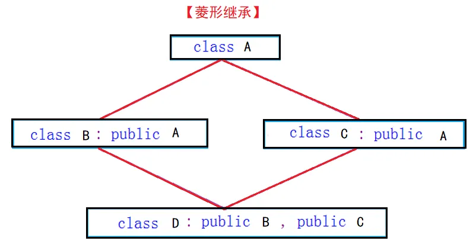

## 优先级[ 高到低 ]
- 第一级：圆括号【`()`】、下标运算符【`[]`】、分量运算符的指向结构体成员运算符【`->`】、结构体成员运算符【`.`】
- 第二级：
逻辑非运算符【`!`】、按位取反运算符【`~`】、自增自减运算符【`++ --`】、负号运算符【`-`】、类型转换运算符【`(类型)`】、指针运算符和取地址运算符【`*和&`】、长度运算符【`sizeof`】
- 第三级：乘法运算符【`*`】、除法运算符【`/`】、取余运算符【`%`】
- 第四级：加法运算符【`+`】、减法运算符【`-`】
- 第五级：左移动运算符【`<<`】、右移动运算符【`>>`】
- 第六级：关系运算符【`< > <= >=` 】
- 第七级：等于运算符【`==`】、不等于运算符【`!=`】
- 第八级：按位与运算符【`&`】
- 第九级：按位异或运算符【`^`】
- 第十级：按位或运算符【`|`】
- 第十一级：逻辑与运算符【`&&`】
- 第十二级：逻辑或运算符【`||`】
- 第十三级：条件运算符【`?:`】
- 第十四级：赋值运算符【`= += -= *= /= %= >>= <<.= &= |= ^=`】
- 第十五级：逗号运算符【`,`】


## 指针
const在\*前时`const *`，指向的**内容**不可变；

const在\*后时`* const`，指向**地址**不可变，且初始化时需要**初始值**设定项。
```c++
 

int main(){
   int i = 10;
   int j = 1;
   const int *p1;//(1)const在*前时，指向的内容不可变
   int const *p2 = &i; //(2)const在*前时，指向的内容不可变
   p2 = &j;//(3)地址变了，但内容没有变
   int *const p3 = &i;//(4)const在*后时，指向地址不可变，且初始化时需要初始值设定项
   *p3 = 20;//(5)内容变了，地址没变
   *p2 = 30;//(6)内容变了，地址没变 X
   p3 = &j;//(7)地址变了，但内容没有变 X
   return 0;
}

//6+7是错的
```
```c++
int *p[4]; //表示指针数组，有四个元素，每个元素都是整型指针。
int (*p)[4]; //表示行指针，所指对象一行有四个元素。
int *p(void); //表示函数，此函数无参，返回整型指针。
int(*P)(void) ;//表示函数指针，可以指向无参，且返回值为整型指针的函数。
```
## 继承
### 多态

``` c++

#include <iostream>
using namespace std;
class Base {
public:
    void fun1(){ cout<<"Base\n";}
    virtual void fun2() {cout<<"Base in";}
};
class Derived:public Base {
public:
    void fun1() {cout<<"Derived\n";}
    void fun2() {cout<<"Derived\n";};
};
void f(Base& b) {
    b.fun1();
    b.fun2();
}
int main() {
    Derived obj;
    f(obj);
}

// output = Base Derived
```

用**父类指针**指向**子类对象**时，默认调用父类的成员函数，除非
在父类的成员函数前加virtual，调用时调用的才是子类本身的那个成员函数。

构造函数调用顺序：虚父类构造函数、父类构造函数、自身构造函数 

析构函数调用顺序：自身析构函数、父类析构函数、虚父类析构函数 

```c++
int x[6][4], (*p)[4];//p是指向int[4]类型的指针，
p = x;
//p 指向x的首地址。
*(p+1)=?
//即加上2个指向类型的大小，即2 * 4 = 8个int，所以*(p+2)指向x[2][0]
```
# c
C源程序的基本组成单位是函数。
一个C源程序可由一个或多个函数组成。

## 栈/堆
### 动态分配
她们都在堆区域中保存内存 = 动态分配
### malloc / new

malloc只通过指定大小来分配内存，不调用构造函数 / 不会初始化，而new在malloc基础上可以调用构造函数初始化

malloc 是函数 而new操作符，所以new可以重载。

operator new /operator delete的实现可以基于malloc，而malloc的实现不可以去调用new。

使用malloc分配的内存后，如果在使用过程中发现内存不足，可以使用realloc函数进行内存重新分配实现内存的扩充。new没有这样直观的配套设施来扩充内存。

### malloc 原理
malloc调用mmap 和brk 获取内存
#### 1. 当分配小于128k内存时使用brk

使用_edata指针，总是指向已分配的堆尾

事实是这样的，_edata+30K只是完成**虚拟地址**的分配，A这块内存现在还是没有物理页与之对应的，等到进程第一次读写A这块内存的时候，发生缺页中断，这个时候，内核才分配A这块内存对应的物理页。


#### 2. 当分配大于128k内存时使用mmap

不去推动_edata指针，直接在堆和栈的中间分配一块虚拟内存


#### 3. free操作


brk分配的内存需要等到高地址内存释放以后才能释放（例如，在B释放之前，A是不可能释放的，这就是内存碎片产生的原因，什么时候 紧缩 看下面），而mmap分配的内存可以单独释放。

**free(B):**
B对应的虚拟内存和物理内存都没有释放，因为只有一个_edata指针，如果往回推，那么**D**这块内存怎么办呢？
　　当然，B这块内存，是可以重用的，如果这个时候再来一个40K的请求，那么malloc很可能就把B这块内存返回回去了。

**free(D):**
B和D连接起来，变成一块140K的空闲内存。

当最高地址空间的空闲内存超过128K（可由M_TRIM_THRESHOLD选项调节）时，执行内存紧缩操作（trim）。在上一个步骤free的时候，发现最高地址空闲内存超过128K，于是内存紧缩，变成图9所示。


# 继承
## 继承方式


## 特性
### 切片
派生类对象 可以赋值给 基类的对象 / 基类的指针 / 基类的引用。这里有个形象的说法叫切片或者切割。寓意把派生类中父类那部分切来赋值过去.
1. 赋值

    ```c++
    Parent p;
    Son s;
    p = s; // 编译器会自动把从属父类的内容那一部分给切片了,回去赋值给父类对象.
    // 调用的函数和变量都是父类的
    // p会调用构造函数和析构函数
    // s会调用son和parent的构造函数和析构函数
    ```
2. 引用
    ```c++
    Son s;
    Parent &p = s;
    //给子类对象里面的属于父类的取了一个别名
    //p指向s重写的虚函数
    //但p无法读取s的成员变量
    ```
3. 指针
    ```c++
    Son s;
    Parent *p = &s;
    //p指针指向子类中属于父类的东西。
    //引用是指针的语法糖，所以效果和引用的一样
    ```
### 隐藏

- 子类成员将屏蔽父类对同名成员的直接访问
  - 如果我们要访问一个成员变量,编译器优先调用子类里面的,如果子类里面不存在,那么就去父类里面找
- 成员函数的隐藏，只需要**函数名**相同就构成隐藏
## 菱形继承

菱形继承即多个类继承了同一个公共基类，而这些派生类又同时被一个类继承



遇到的问题是，当对象d里使用了父类a的成员函数，不知道是b里还是c里的。

所以继承时，在继承类里加上`virtual`。 继承时直接拷贝虚表，虚表里放的指针，本质地址没有变。
# 多态
## 静态多态
也称为编译器多态，编译期间就能确定要执行哪个函数

例如：函数重载，运算符重载、模版
## 动态多态
只有运行时才知道会跳转到哪个函数

利用虚函数和继承关系实现运行时的多态。
### 虚表

基类通过virtual关键字声明和实现虚函数，此时基类会拥有一张虚函数表，虚函数表会记录其对应的函数指针

子类的虚表：copy父类虚表+如果子类重写了虚函数，则会覆盖原来的虚函数指针+新写的虚函数直接附加在虚表后面

```c++
e.g.
class base {
public:
    int v1;
    virtual void f1() {}
    virtual void f2() {}
}

class sub : public base {
    int v2;
    virtual void f1() {}
}
```


1. 构造函数和析构函数能不能是虚函数？

        构造函数不能为虚函数，在构造过程是这样的，首先分配一块内存，然后调用构造函数。如果构造函数是虚函数，那么就需要虚函数表来调用，此时面对一块新鲜出炉的内存，去哪找虚函数表呢？因此构造函数不能为虚函数。

        析构函数相反，通常我们通过基类指针销毁对象时，如果析构函数不为虚函数，就不能正确识别对象类型，从而不能正确销毁对象，带来可能的内存泄漏问题。

2. 构造函数能不能调用虚函数？

        一般不提倡，原因有两个：

        一是在执行构造函数完成之前，构造的对象被认为“未完全生成”。当创建某个派生类的对象时，如果在它的基类的构造函数中调用虚函数，那么此时派生类的构造函数并未执行，所调用的函数可能操作还没有被初始化的成员，将导致灾难的发生。

        二是由于虚指针一直处于变化状态，并不能保证该函数所能访问到的虚指针就是当前被构造对象的最终虚指针，因为后面派生类的构造函数会对当前被构造对象的虚指针进行重写，因此无法完成动态联编。

        析构函数也可以按照同样的思路理解。可能会使用已经析构的成员对象，从而引发灾难。

## 强制转换

在c中，已经有强制类型转换
```c
(type) expression
```

对标c++中，按照类型转换的意图分类了

1. static_cast: **基本数据类型**的转换
    ```c++
    double a = 1.0;
    int b = static_cast <int> a;
    ```
2. dynamic_cast: 主要用于**对象指针/引用** 安全的向下转型（涉及继承时使用）
   1. 指向子类对象的父类指针 -> 子类指针
    ```c++
    Base* base = new Derived;
    Derived* der = dynamic_cast <Derived*> (base);
    ```
    2. 指向父类对象的父类指针 -> 子类指针
    ```c++
    Base* base = new Base;
    Derived* der = dynamic_cast <Derived*> (base);
    ```

3. const_cast: 去除常量性或增加常量性
4. reinterpret_cast: 将一种指针类型转换成另一种指针类型，往往用于不同类型的函数指针转换。**最好别用**
## 左值右值

左值 = 可寻址的变量，有持久性

右值 = 一般是不可寻址的常量，或在表达式求值过程中创建的无名临时对象，短暂性的

左值可以背修改，右值不行

### 左值引用
```c++
int x = 6;
int &y = x;
```

### 右值引用 
```c++
int x = 6;

//int &z1 = x*6;  错误
const int &z2 = x*6 //可以将一个const引用绑定到一个右值
int &&z3 = x*6; //正确的右值引用
```
### TODO move

# TODO 模版
C++模板类是什么,还有模板特化