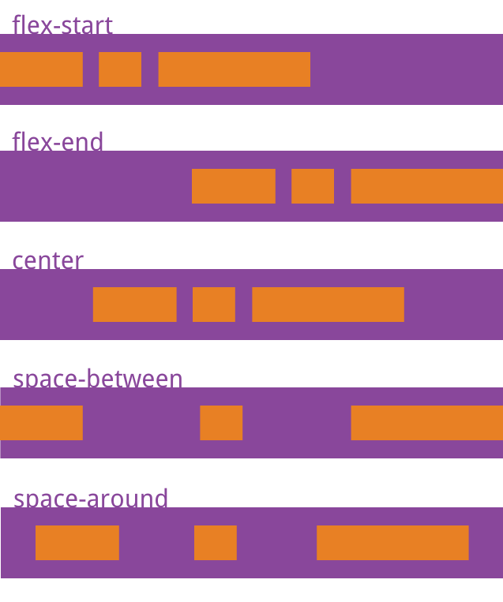

# CSS

## 覆盖问题
```html
<div class="red blue">123</div>
<div class="blue red">123</div>
```
```css
.red {
    color: red
}

.blue {
    color: blue
}
```
两个都是蓝色! 和引用的顺序无关 和定义的顺序有关 后面的覆盖前面的
## 单位

### 绝对长度单位

- px [像素] 屏幕
- pt [点]      打印、UI稿

### 相对长度单位

- em: 相对于当前元素或父元素的字体大小计算的。 如果当前文本没有设置字体尺寸则相对于默认的字体尺寸。即1em=16px
- rem: 相对于根元素的字体大小
- vw: 视窗宽度1%
- vh: 视窗高度1% 高度自适应

### Q.百分比 % 相对于谁?

百分比总是相对于**父元素**，无论是设置 `font-size` 或 `width` 等。如果父元素的相应属性，经浏览器计算后，仍无绝对值，那么 % 的实际效果等同于 默认值，如 height: 100%

## 预处理器

不需要考虑浏览器兼容问题，因为 CSS 预处理器最终编译和输出的仍是标准的 CSS 样式。

可以在 CSS 预处理器中：使用变量、简单逻辑判断、函数等基本编程技巧。

关于 CSS 预处理器：sass、less、stylus

## 选择器

>ID > 类 > 类型（标签） > 相邻 > 子代 > 后代 > 通配符 > 属性 > 伪类

- id 选择器（#myid）

- 类选择器（.myclass）

- 属性选择器（a[rel="external"]）

- 伪类选择器（a:hover, li:nth-child）
  - **伪类**：是一个以冒号作为前缀，被添加到一个选择器末尾的关键字当你希望样式在特定状态才被呈现到指定的元素时，你可以往元素的选择器后面加上对应的伪类。
    - :active，将样式添加到**被激活**的元素。
    - :focus，将样式添加到**被选中**的元素。
    - :hover，当**鼠标悬浮**在元素上方是，向元素添加样式。
    - :link，将特殊的样式添加到**未被访问过**的**链接**。
    - :visited，将特殊的样式添加到**被访问的链接**。
    - :first-child，将特殊的样式添加到**元素的第一个子元素**
    - :lang，允许创作者来定义指定的元素中**使用的语言**。
  - **伪元素**： after、before ----用于创建一些不在文档树中的元素，并为其添加样式。比如说，我们可以通过 ::before 来在一个元素前添加一些文本，并为这些文本添加样式。虽然用户可以看到这些文本，但是这些文本实际不在文档树中。
    - :first-letter，将特殊的样式添加到文本的**首字母**。
    - :first-line，将特殊的样式添加到文本的**首行**。
    - :before，在某元素**之前插入**某些内容。
    - :after，在某元素**之后插入**某些内容。

- 标签选择器（div, h1,p）

- 相邻选择器（h1 + p）

- 子选择器（ul > li）

- 后代选择器（li a）

- 通配符选择器（*）

!important >行内样式> ID 选择器「如：#header」> 类选择器「如：.foo」> 标签选择器「如：h1」 > 通配符选择器（*）

## 布局

### 弹性布局(`flex`)

```css
.box{
  display: flex | inline-flex;
}
```

设为 Flex 布局以后，子元素的float、clear和vertical-align属性将失效。


采用 Flex 布局的元素，称为 **Flex 容器（flex container）**，简称"容器"。它的所有子元素自动成为容器成员，称为 **Flex 项目（flex item)**，简称"项目"。

容器默认存在两根轴：**水平的主轴（main axis）**和**垂直的交叉轴（cross axis）**。

- 主轴的开始位置（与边框的交叉点）叫做main start，结束位置叫做main end；
- 交叉轴的开始位置叫做cross start，结束位置叫做cross end。

项目默认沿主轴排列。单个项目占据的主轴空间叫做main size，占据的交叉轴空间叫做cross size。

#### 容器的属性

```css
.box{
  display: flex | inline-flex;
  flex-direction: row[从左往右] | row-reverse[从右往左] | 
                  column[从上往下] | column-reverse[从下往上]; 
  /* 如果一条轴线排不下，如何换行。 */
  flex-wrap: nowrap[默认]不换行 
            | wrap 换行，第一行在上方。 
            | wrap-reverse 换行，第一行在下方。
  /* flex-flow属性是flex-direction属性和flex-wrap属性的简写形式，默认值为row nowrap。 */
  flex-flow:  <flex-direction> || <flex-wrap>;
  /* justify-content属性定义了item在主轴上的对齐方式 */
  justify-content: flex-start [默认] 左对齐| flex-end 右对齐| center 居中|
                  | space-between 两端对齐，项目之间的间隔都相等。
                  | space-around; 每个项目两侧的间隔相等。所以，项目之间的间隔比项目与边框的间隔大一倍。
  /* align-items属性定义项目在交叉轴上如何对齐。 */
  align-items: flex-start 交叉轴的起点对齐
              | flex-end 交叉轴的终点对齐。
              | center 交叉轴的中点对齐。
              | baseline 项目的第一行文字的基线对齐。
              | stretch 如果项目未设置高度或设为auto，将占满整个容器的高度。;
  /* align-content属性定义了多根轴线的对齐方式。如果项目只有一根轴线，该属性不起作用。 */
  align-content: flex-start 与交叉轴的起点对齐。
                | flex-end 与交叉轴的终点对齐。
                | center 与交叉轴的中点对齐 
                | space-between ：与交叉轴两端对齐，轴线之间的间隔平均分布。
                | space-around 每根轴线两侧的间隔都相等。所以，轴线之间的间隔比轴线与边框的间隔大一倍 
                | stretch（默认值）：轴线占满整个交叉轴。;
}
```

​																				`justify-content`



​																					`align-items`


​																			`align-content`


#### item的属性

```css
.item {
  /* default 0 排列顺序。数值越小，排列越靠前*/
  order: <integer>;

  /* 定义项目的放大比例默认为0，即如果存在剩余空间，也不放大。*/
  flex-grow: <number>; 
  
  /* 属性定义了项目的缩小比例，默认为1，即如果空间不足，该项目将缩小。 如果一个项目的flex-shrink属性为0，其他项目都为1，则空间不足时，前者不缩小。*/
  flex-shrink: <number>; 

  /* flex-basis属性定义了在分配多余空间之前，项目占据的主轴空间（main size）。浏览器根据这个属性，计算主轴是否有多余空间。它的默认值为auto，即项目的本来大小。 */
  /* 它可以设为跟width或height属性一样的值（比如350px），则项目将占据固定空间。 */
  flex-basis: <length> | auto; /* default auto */

  /*  flex属性flex-grow, flex-shrink 和 flex-basis的简写，默认值为0 1 auto。后两个属性可选。 */
  flex: none | [ <'flex-grow'> <'flex-shrink'>? || <'flex-basis'> ]
  /* 该属性有两个快捷值：auto (1 1 auto) 和 none (0 0 auto)。 */

  /* align-self属性允许单个项目有与其他项目不一样的对齐方式，可覆盖align-items属性。默认值为auto，表示继承父元素的align-items属性，如果没有父元素，则等同于stretch。 */
   align-self: auto | flex-start | flex-end | center | baseline | stretch;
}
```

​																				`align-self`


### display

- block [h1~h6、hr、p、pre、ul、ol、dl、table、div、form]
  - 设置宽高✅ 独占一行✅
- inline [span、a、br、b、strong、img、input、textarea]
  - 设置宽高❌ 独占一行❌
- inline-block [img,input,textarea,select,button,canvas,svg]
  - 设置宽高✅ 独占一行❌

### position

- fixed:
  - 相对于浏览器窗口是固定的，即使窗口滚动。
  - 脱离文档流，和其他元素重叠
- relative:
  - 这个相对是相对的元素本身。
  - 它所在的行不能再出现其他元素。
  - 不设置偏移量的时候 对元素没有任何影响，
  - 设置了偏移量，则基于自身初始的位置进行偏移。
  - 可以提升层级关系
- absolute:
  - 从文档流完全删除。元素定位后生成一个块级框，而不论原来它在正常流中生成何种类型的框。
  - 元素位置相对于最近的**已定位【相对绝对都可以】祖先元素**， 如果元素没有已定位的祖先元素，它的位置相对于**最初的包含块【可能是浏览器】**。会出现覆盖的情况，可以用z-index控制覆盖的顺序。
- sticky:
  - 粘性定位可以被认为是相对定位和固定定位的混合。
  - 须指定 top right bottom 或 left 四个阈值其中之一，才可使粘性定位生效。否则其行为与相对定位相同。
  - 定位~relative, 当父容器超出视角，sticky粘粘也会不见咯
- static:
  - 默认值。没有定位，元素出现在正常的流中（忽略 top, bottom, left, right 或者 z-index 声明

>父相对子绝对

### float

float在英文中是“漂浮”的意思，它可以让元素漂浮并重新排列！
咖啡漂浮物是一种饮料，上面漂浮着冰块，对吧？
想象一下，这个冰 = 元素。

当用吸管或勺子接触时，漂浮的冰淇淋会移动。float 属性是完全相同的概念。


`float: none;`


`float: left;`


`float: right;`


#### 特性

- 不参与高度计算
- 会有包裹性的特点：e.g.宽度很大（实际上其宽度为父元素的100%），但是高度只有一个p标签的高度。
- 会自动变成block元素

#### 浮动塌陷:

如果对div1，div2，div3都设置float: left，但是父元素div-outer没有设置宽度和高度，页面如图所示


因为都是float，父元素计算的高度为0

##### 解决方案:

1. clear: both
   1. 使用伪类:after[在元素后自动加上]：
      1. content，height，overflow这三个属性是为了保证该伪类不会显示出任何东西，而将其设置为block是为了让其宽度占满一行，这样浮动元素才能在其范围内，clear属性才能起作用。

    ```css
      &:after{
        content: ''
        display: block
        clear: both
        height: 0
        overflow: hidden}
    ```

   2. 新增一个`<div style="clear:both">`
2. 父元素触发**BFC**

### 盒子模型
border-sizing:
- border-box[IE盒子]：
  - width/height = content+padding+border
- content-box[标准盒子]:
  - width/height = content

### 水平/垂直居中 
1. 父相对子绝对
   这种方式通过设置各个方向的距离都是0，此时再讲margin设为auto，就可以在各个方向上居中了.缺点是需要知道子元素的宽高
  ```css
  .wp {
      position: relative;
  }
  .box {
      position: absolute;;
      top: 0;
      left: 0;
      right: 0;
      bottom: 0;
      margin: auto;
  }
  ```
2. 行内元素
  把box设置为行内元素，通过text-align就可以做到水平居中，但很多同学可能不知道通过通过vertical-align也可以在垂直方向做到居中，代码如下
  ```css
  /* 此处引用上面的公共代码 */
  /* 此处引用上面的公共代码 */

  /* 定位代码 */
  .wp {
      line-height: 300px;
      text-align: center;
      font-size: 0px;
  }
  .box {
      font-size: 16px;
      display: inline-block;
      vertical-align: middle;
      line-height: initial;
      text-align: left; /* 修正文字 */
  }
  ```
3. flex
  ```css
    .wp {
      display: flex;
      justify-content: center;
      align-items: center;
    }
  ``

### 三栏布局【左右固定，中间自适应】
1. 左右固定尺寸+float 中间margin
  ```css
  .left {
    float: left;
    width: 200px;
    height: 200px;
    background-color: aqua;
  }
  .right { 
    float: right;
    width: 200px;
    height: 200px;
    background-color: aquamarine;
  }
  .mid {
    background-color: cadetblue;
    height: 200px;
    margin-left: 220px;
    margin-right: 220px;
  } 
  ```
  主要内容无法最先加载 ，当主要内容过多时影响用户体验
2. BFC布局
  我们先把左右两栏元素浮动，中间栏不做其他属性，发现中间栏默认撑满全屏，这时候我们就可以利用BFC不会和浮动元素重叠的规则，把中间元素改成一个BFC，使用overflow:hidden或者display: flex达到中间栏自适应
  ```css
   .left {
    float: left;
    width: 200px;
    height: 200px;
    background-color: aqua;
    margin-right: 20px;
     
  }
  .right { 
    float: right;
    width: 200px;
    height: 200px;
    background-color: aquamarine;
    margin-left: 20px; 
    
  }
  .mid {
    background-color: cadetblue;
    height: 200px;
    overflow: hidden 
    /* display: flex */
  } 
  ```
3. position
  1. 父元素使用相对定位
  2. 两侧子元素使用绝对定位
  3. 中间元素不做定位处理，只留出空间就好
  ```css
   .container {
    position: relative;
  }

  .left {
    position: absolute;
    width: 200px;
    height: 200px;
    left: 0;
    top: 0; 
    background-color: aqua;
  }

  .right {
    position: absolute;
    top: 0;
    right: 0;
    width: 200px;
    height: 200px;
    background-color: aquamarine;
  }

  .mid {
    background-color: cadetblue;
    height: 200px;
	margin: 0 220px;
  }
  ```
4. 圣杯布局
   1. 三栏都使用float进行浮动，左右定宽，中间宽度100%
   2. 使用负边距来调整让三栏位于一行，左栏设置margin-left为-100%，此时左栏位于第一行首部，然后将右栏的margin-left为其宽度的负值-200px，右栏也会移动到第一行中
   3. 然后我们发现中间的元素宽度还是占满100%，所以被左右div挡住了，然后我们操作**父元素**给出和左右两栏相等的内边距
   4. 再使用相对定位把左右两栏"拽"出来：通过left 、right值移动
  ```css
  .container {
    margin-left: 200px;
    margin-right: 200px;
  }
  .left {
    float: left;
    width: 200px;
    height: 200px;
    background-color: aqua;
    margin-left: -100%;
    position: relative;
    left: -200px;
  }
  .mid {
    float: left;
    width: 100%;
    height: 200px;
    background-color: cadetblue;
  }

  .right {
    float: left;
    height: 200px;
    width: 200px;
    background-color: aquamarine;
    margin-left: -200px;
    position: relative;
    right: -200px;
  }
  ```

  ```html
  <div class="container">
    <div   class="mid">midmidmidmidmidmidmidmidmidmidmidmidmidmidmi dmidmidmidmidmidmidmidmidmidmidmid</div>
    <div class="left">left</div>
    <div class="right">right</div>
  </div>
  ```

5. 双飞翼
  双飞翼布局前两步和圣杯布局一样，只是处理中间栏部分内容被遮挡的问题解决方案不同：
  在mian内部添加一个content，通过设置左右margin（左右两栏的宽度+间距margin）来避开遮挡
    ```css
  .left {
    float: left;
    width: 200px;
    height: 200px;
    background-color: aqua;
    margin-left: -100%;
  }
  .mid {
    float: left;
    width: 100%;
  }
  .midContent {
    height: 200px;
    margin-left: 220px; // 左边距+间距
    margin-right: 220px;// 右边距+间距
    background-color: cadetblue;
  }

  .right {
    float: left;
    height: 200px;
    width: 200px;
    background-color: aquamarine;
    margin-left: -200px;
  }
  ```

  ```html
  <div class="container">
     <div class="mid">
        <div class="midContent">
          midmidmidmidmidmidmidmidmidmidmidmidmidmidmidmidmidmidmidmidmidmidmidmidmidmid
        </div>
    </div>
    <div class="left">left</div>
    <div class="right">right</div>
  </div>
  ```
### 两栏布局【左固定，右自适应】 TODO
https://blog.csdn.net/weixin_47750287/article/details/124565230

### 一些题
**Q1. z-index什么情况下会失效？**
1. 父元素position为relative时，子元素的z-index失效。解决：父元素position改为absolute或static；
2. 元素没有设置position属性为非static属性。解决：设置该元素的position属性为relative，absolute或是fixed中的一种；
3. 元素在设置z-index的同时还设置了float浮动。解决：float去除，改为display：inline-block；
## BFC块级格式化上下文

把 BFC 理解成一块独立的渲染区域，BFC 看成是元素的一种属性，当元素拥有了 BFC 属性后，这个元素就可以看做成隔离了的独立容器。

BFC就是一个容器，而这个容器内的**块级元素**会遵循一系列规则。

BFC 就是页面上的一个隔离的独立容器，容器里面的子元素不会影响到外面的元素。反之也如此。

### 布局规则

1. 内部的box会一行一个垂直放
2. 垂直方向的距离由margin决定，一个BFC内的两个相邻margin会重叠。不同BFC的margin不会重叠
3. 每个块级元素的左外缘与包含块的左边缘接触（对于从右到左格式，右边缘接触）。即使存在浮动，也会出现这种情况
   1. 若一个块级元素的position为fixed。那么，包含块始终都为viewport。
   2. 若一个块级元素的position为absolute。那么，包含块则为离它最近的position不是static的祖先元素的padding-box 。
   3. 若一个块级元素的position为static或relative。那么，包含块则为其父元素的content-box。

### 特性

1. BFC的区域不会与float box重叠。
2. BFC就是页面上的一个隔离的独立容器，容器里面的子元素不会影响到外面的元素。反之也如此。
3. 计算BFC的高度时，浮动元素也参与计算。

### Q: 怎么触发BFC?

1. 根元素`<html>`
2. float不为none
3. position为absolute或fixed
4. display为inline-block, table-cell, table-caption, flex, inline-flex
5. overflow不为visible
## 新特性
### 伪类:has
`a:has(span) // 只会匹配包含 span 子元素的 a 元素：`
### 级联层（Cascade Layers）

有时候当我们想要**覆盖组件原来的样式**来应用我们自定义的样式时，一般情况下我们会采用**优先级更高的样式名**来进行覆盖（或ID选择器或嵌套很多层），有时候又不得不应用`!important` ，这样很容易造成样式的混乱，不好管理。

级联层的诞生就是为了解决上述问题，它可以让CSS样式**按照我们定义好的级联顺序展示**，起到控制不同样式间的优先级的作用。
使用方法
```less
@layer A, B, C;

@layer A {
  div {
    background-color: red;
  }
}

@layer B {
  #app {
    background-color: blue;
  }
}

@layer C {
  div {
    background-color: green;
  }
}
```
# HTML

## 标签属性

### href和src

- href [link、a]: 表示超文本引用。用来建立当前元素和文档之间的**链接**
- src [img、script、iframe]: 加载资源，内容会嵌入到文档中当前标签所在的位置

### ``

- title: ⿏标滑动到元素上的时候显示
- alt: 图⽚⽆法加载时显示

## 获取表单元素

- 根据**id** 获取元素
  - document.getElementById("id属性的值");
- 根据**标签名字**获取元素
  - document.getElementsByTagName("标签的名字");
- 根据**name 属性**的值获取元素
  - document.getElementsByName("name属性的值");
- 根据类**样式的名字**获取元素
  - document.getElementsByClassName("类样式的名字");
- 根据**选择器**获取元素
  - document.querySelector("选择器");
  - document.querySelectorAll("选择器");

## 回流重绘

### 浏览器渲染过程
1. 解析获取到的HTML，生成DOM树
2. 解析CSS，生成CSSOM树
3. 将DOM树和CSSOM树进行结合，生成渲染树（render tree）
4. 根据生成的渲染树，进行回流（Layout）,得到节点的几何信息（位置，大小）
5. 重绘（Painting）：根据渲染树以及回流得到的几何信息，得到节点的绝对像素（像素，背景色，外观等）
6. Display将像素发送给GPU，展示在页面上。

### 回流【Layout】
浏览器会把获取到的HTML代码解析成一个DOM树，html中的每一个元素都是DOM树的一个节点，根节点也就是我们说的document对象。

在渲染树中的一部分（或者全部）因为元素的规模尺寸、布局 、显隐等改变而需要重新构建，这就称为回流。每次页面至少会发生一次回流，就是在页面第一次渲染的时候。
### 重绘【Painting】
 在渲染树中的一些元素需要更新属性，而这些属性只是影响元素的外观、风格，不影响布局，就称为重绘。              

- 回流必定会引起重绘，重绘一定不会引起回流
- 回流会导致页面重排，影响性能


## meta
标签提供关于 HTML 文档的元数据。它不会显示在页面上，但是对于机器是可读的。

### 必需属性content
meta的必需属性是content，当然并不是说meta标签里一定要有content，而是当有http-equiv或name属性的时候，一定要有content属性对其进行说明。例如：
```html
<meta name="keywords" content="HTML,ASP,PHP,SQL">
```

这里面content里的属性就是对keywords进行的说明，所以呢也可以理解成一个键值对吧，就是

```JSON
{keywords:"HTML,ASP,PHP,SQL"}
```
### 可选属性
#### http-equiv
添加http头部内容，对一些自定义的，或者需要额外添加的http头部内容，需要发送到浏览器中，我们就可以是使用这个属性

也可重定向

```html
<meta http-equiv="Refresh" content="5;url=http://blog.yangchen123h.cn" />
```
#### name
这个属性是供浏览器进行解析，对于一些浏览器兼容性问题，name属性是最常用的，当然有个前提就是浏览器能够解析你写进去的name属性才可以，不然就是没有意义的。还是举个例子吧:
```html
<meta name="renderer" content="webkit">
```
这个meta标签的意思就是告诉浏览器，用webkit内核进行解析，当然前提是浏览器有webkit内核才可以，不然就是没有意义的啦。当然看到这个你可能会有疑问，这个renderer是从哪里冒出来的，我要怎么知道呢？这个就是在对应的浏览器的开发文档里就会有表明的。