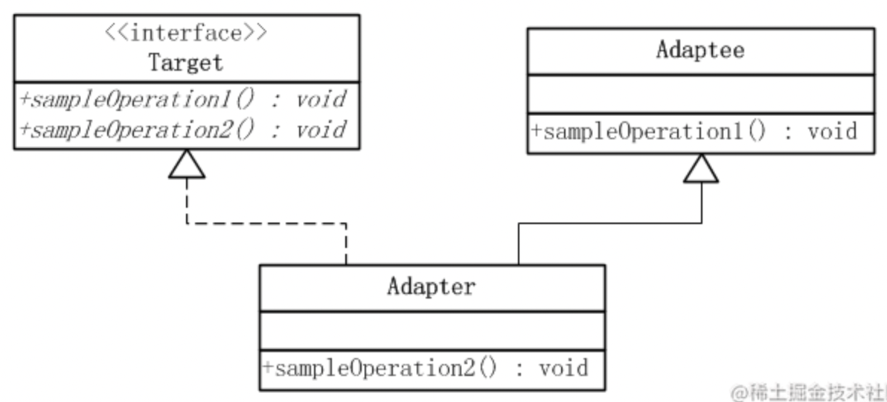
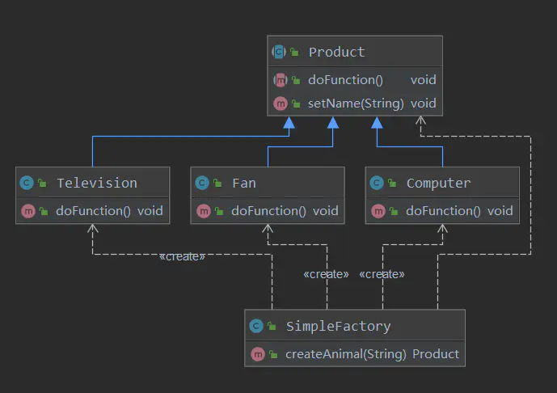
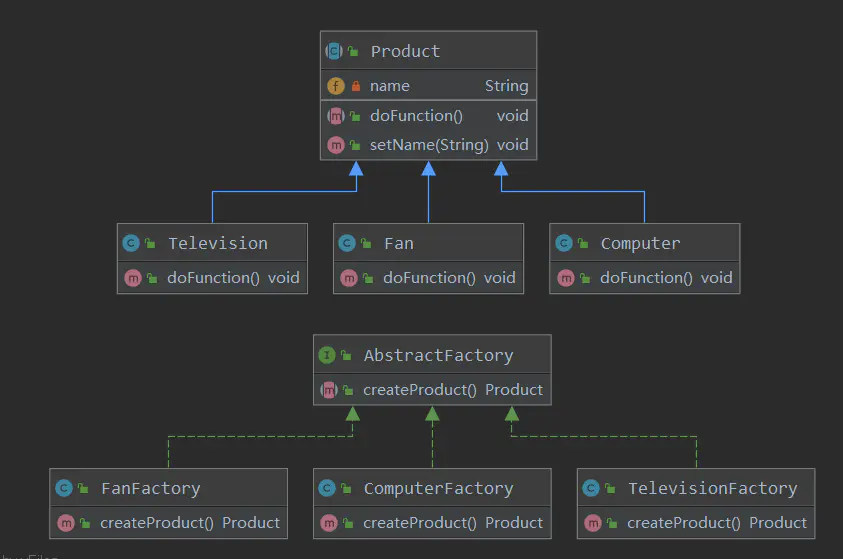
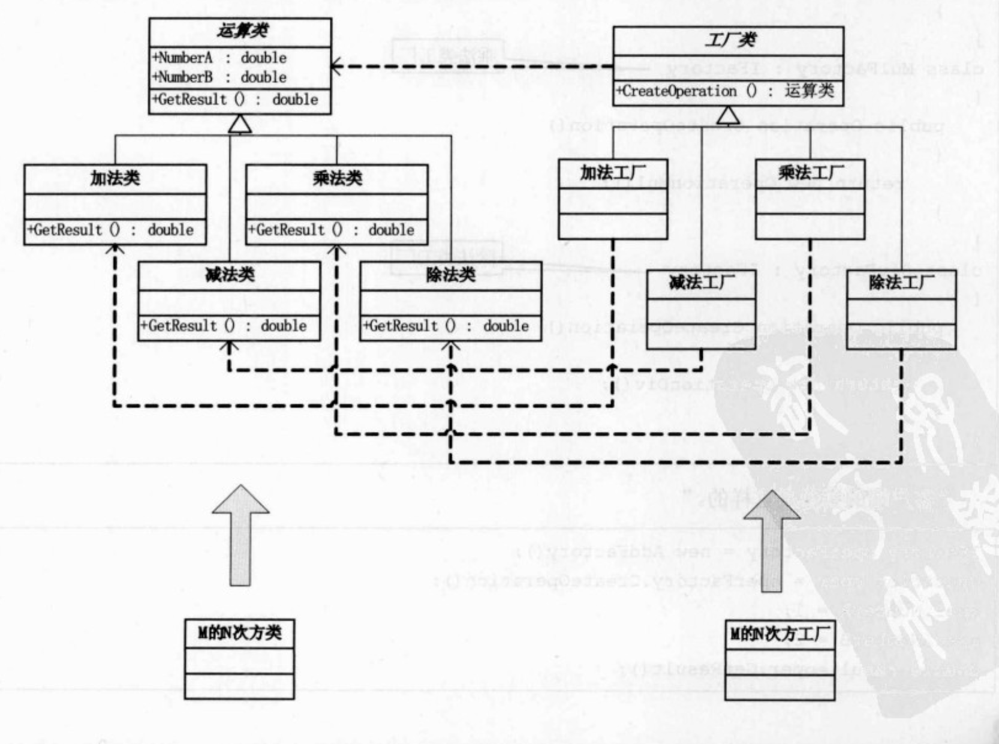
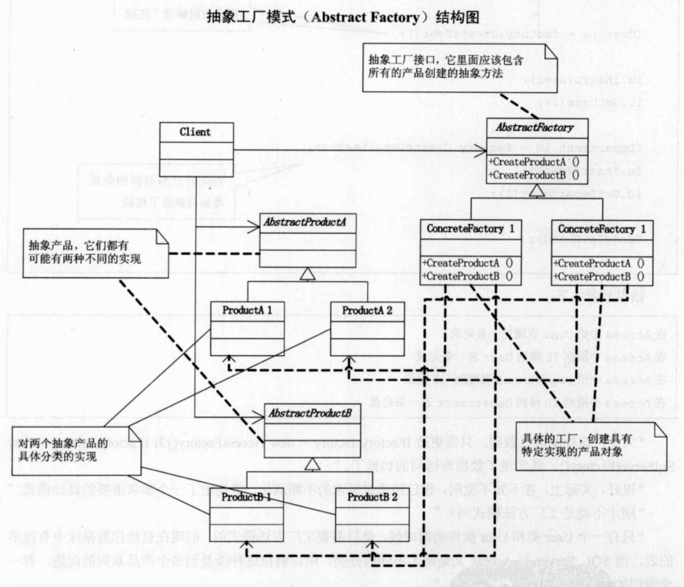

# 设计模式
开闭原则： 对于扩展是开放的，对于修改是封闭的
## 单例
一个类只有一个实例

为实例提供一个全局访问节点
## 适配器
适配器模式把一个**类的接口**变换成客户端所期待的**另一种接口**，从而使原本因接口不匹配而无法在一起工作的两个类能够在一起工作

客户想用微改的target，所以adapter结合了target和adaptee。客户最终调用adapter

## 工厂
### 简单工厂
创建的对象 = “产品” 【】

创建“产品”的对象 = “工厂”【新建类实例的地方】

如果只有**一个**“工厂” = 简单工厂模式

对于产品种类相对较少的情况，考虑使用简单工厂模式。使用简单工厂模式的客户端只需要传入工厂类的参数，不需要关心如何创建对象的逻辑，可以很方便地创建所需产品。

**优势**：
1. 工厂类包含必要的逻辑判断，可以决定在什么时候创建哪一个产品的实例。客户端可以免除直接创建产品对象的职责，很方便的创建出相应的产品。工厂和产品的职责区分明确。
2. 客户端无需知道所创建具体产品的类名，只需知道参数即可。
3. 也可以引入配置文件，在不修改客户端代码的情况下更换和添加新的具体产品类。

**缺点**：

1. 简单工厂模式的工厂类单一，负责所有产品的创建，职责过重，一旦异常，整个系统将受影响。且工厂类代码会非常臃肿，违背高聚合原则。
2. 使用简单工厂模式会增加系统中类的个数（引入新的工厂类），增加系统的复杂度和理解难度
3. 系统扩展困难，一旦增加新产品不得不修改工厂逻辑，在产品类型较多时，可能造成逻辑过于复杂
 
### 工厂方法（多态工厂模式）

提供一个接口去创造object 但是让**子工厂类决定**什么产品类被实例

“工厂方法模式”是对简单工厂模式的进一步抽象化  

在不修改原来代码的情况下引进新的产品，即满足开闭原则。
            
把产品的实例化推迟到子类

**主要角色**：
   - 抽象工厂（AbstractFactory）：提供了创建产品的接口，调用者通过它访问具体工厂的工厂方法 crateProduct() 来创建产品。
   - 具体工厂（FanFactory、ComputerFactory、TelevisionFactory）：主要是实现抽象工厂中的抽象方法，完成具体产品的创建。
   - 抽象产品（Product）：定义了产品的规范，描述了产品的主要特性和功能。
   - 具体产品（Television、Fan、Computer）：实现了抽象产品角色所定义的接口，由具体工厂来创建，它同具体工厂之间一一对应。

### 抽象工厂

提供一个接口去创造families of related or dependent objects 不指定具体的类

和工厂方式的区别就是，工厂方式指定单独的类，但是抽象工厂比较multiple

## 责任链

## 建造者
## 观察者
## 装饰器
