# js
## 原型链
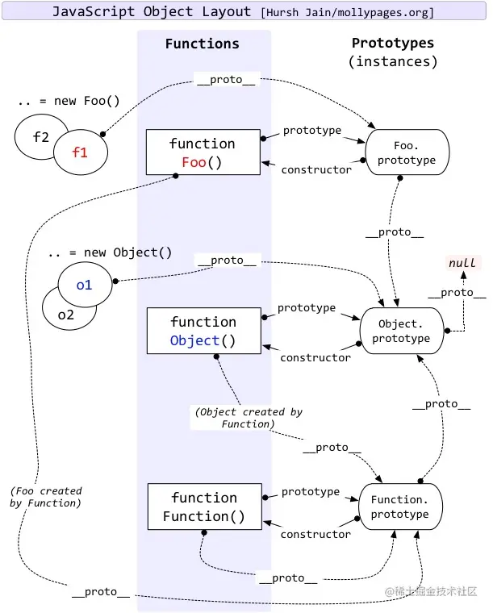
1. js分为**函数对象**和**普通对象**，每个对象都有`__proto__`属性，但是只有函数对象才有`prototype`属性
2. Object、Function都是js内置的函数, 类似的还有我们常用到的Array、RegExp、Date、Boolean、Number、String

- 属性`__proto__`是一个对象, 它有两个属性，`constructor`和`__proto__`
```javascript
{
    __proto__:{
        constructor,
        __proto__
    }
}
```
- 原型对象prototype有一个默认的constructor属性，用于记录实例是由哪个构造函数创建；
- 实例对象的`__proto__` = 实例对象构造函数的`prototype`
- 这里可以看出三者关系：
  - 实例.__proto__ === 原型(prototype) ；
  - 原型(prototype).constructor === 构造函数 ；
  - 构造函数.prototype === 原型 ；
#### Q:{}，new Object()和Object.create()的区别?
1. {}等价于new Object(), 都继承了Object原型链上(Object.prototype)的属性或者方法，eg：toString()；当创建的对象相同时，可以说 {} 等价于 new Object() 。
2. Object.create() 是将**创建的对象**继承到原型链上，而**本身没有继承** Object.prototype 的属性和方法。
## 继承
### 原型链继承
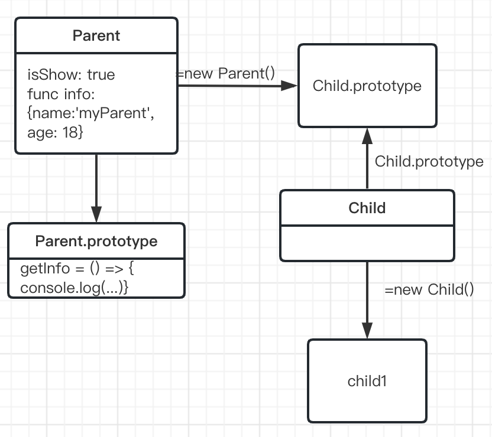
核心： 子类.prototype = 父类实例
```javascript
function Parent() {
   this.isShow = true
   this.info = {
       name: "mjy",
       age: 18,
   };
}
 
Parent.prototype.getInfo = function() {
   console.log(this.info);
   console.log(this.isShow);
}
 
function Child() {};
Child.prototype = new Parent();
 
let Child1 = new Child();
Child1.info.gender = "男";
Child1.getInfo(); // {name: 'mjy', age: 18, gender: '男'} true
 
let child2 = new Child();
child2.isShow = false
console.log(child2.info.gender) // 男
child2.getInfo(); // {name: 'mjy', age: 18, gender: '男'} false
Child1.getInfo(); // {name: 'mjy', age: 18, gender: '男'} true
//两个子实例修改互不影响
```
优点：写法方便简洁，容易理解。

缺点：
1. 新实例无法向父类构造函数传参。
2. 继承单一。无法实现多继承
3. 子类实例共享了父类构造函数的引用属性（原型上的引用属性是共享的，一个实例修改了引用属性，另一个实例的属性也会被修改！）【理解为继承的是指针，指针不更改，更改指向的东西，那必定会变】
### 借用构造函数继承
核心：借用父类的构造函数来增强子类实例，等于是复制父类的实例属性给子类

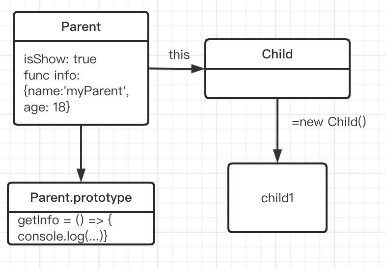

使用.call/.apply
```javascript
function Child(name,like){
　　Parent.call(this,name);//核心，拷贝了父类的实例属性和方法
　　this.like = like;
}
```
1. 只继承了父类构造函数的属性，**没有继承父类原型**的属性。
2. 解决了原型链继承缺点1、2、3。
3. 可以继承多个构造函数属性（call多个）。
4. 在子实例中可向父实例**传参**。

缺点：
1. 每个新实例都有父类构造函数的副本，臃肿。【也就是说每个实例的父类构造函数都是深拷贝得到的，所以怎么修改都互不影响】
2. 无法实现构造函数的复用。（每次用每次都要重新调用）
3. 只能继承父类构造函数的属性。

### 组合继承【构造函数+原型链】
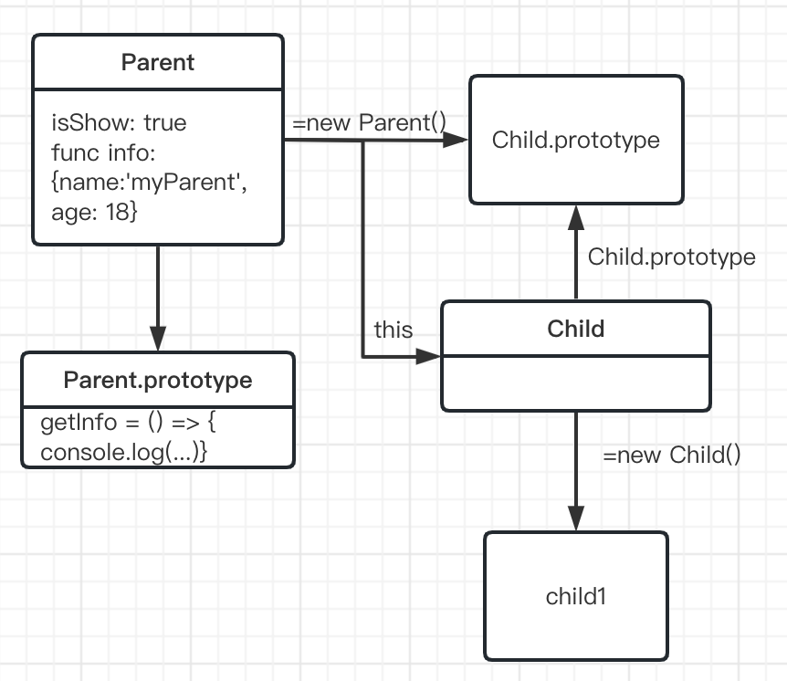

```javascript
function Parent(gender) {
   this.isShow = true
   this.info = {
       name: "mjy",
       age: 18,
       gender: gender
   };
}
 
Parent.prototype.getInfo = function() {
   console.log(this.info);
   console.log(this.isShow);
}
 
function Child(gender) {
    Parent.call(this, gender) //核心
};
Child.prototype = new Parent();//核心
```
优点：
1. 创造子类实例，可以向父类构造函数传参；
2. 不共享父类的引用属性
3. 父类的方法定义在父类的原型对象上，实现方法复用；

缺点： 
调用了两次父类的构造方法，会存放一份**多余的父类实例属性**

### 原型式继承
核心：用一个函数包装一个对象，然后返回这个函数的调用，这个函数就变成了个可以随意增添属性的实例或对象。object.create()就是这个原理。

类似于复制一个对象，用函数来包装，不需要单独创建构造函数。

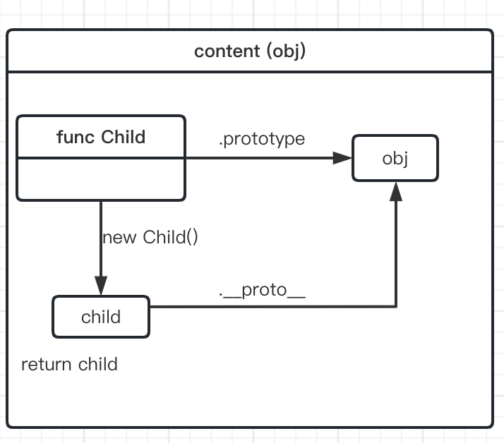

```javascript
function createObject(obj) {
  function Fun() {}
  Fun.prototype = obj
  return new Fun()
}
 
let person = {
  name: 'mjy',
  age: 18,
  hoby: ['唱', '跳'],
  showName() {
    console.log('my name is:', this.name)
  }
}
 
let child1 = createObject(person)
child1.name = 'xxxy'
child1.hoby.push('rap')
let child2 = createObject(person)
 
console.log(child1)
console.log(child2)
console.log(person.hoby) // ['唱', '跳', 'rap']
//也可以
var sup = new Person()
var sup = content(sup)
```

缺点：
1. 属性中包含的引用值始终会在相关对象间共享
2. 子类实例不能向父类传参

### 寄生
核心， 在原型式基础上套了个壳子
```javascript
function objectCopy(obj) {
  function Fun() { };
  Fun.prototype = obj;
  return new Fun();
}
 
function createAnother(obj) {
  let clone = objectCopy(obj);
  clone.showName = function () {
    console.log('my name is：', this.name);
  };
  return clone;
}
 
let person = {
     name: "mjy",
     age: 18,
     hoby: ['唱', '跳']
}
 
let child1 = createAnother(person);
child1.hoby.push("rap");
console.log(child1.hoby); // ['唱', '跳', 'rap']
child1.showName(); // my name is： mjy
 
let child2 = createAnother(person);
console.log(child2.hoby); // ['唱', '跳', 'rap']
```

### 寄生组合
寄生组合继承就是为了降低父类构造函数的开销而实现的。

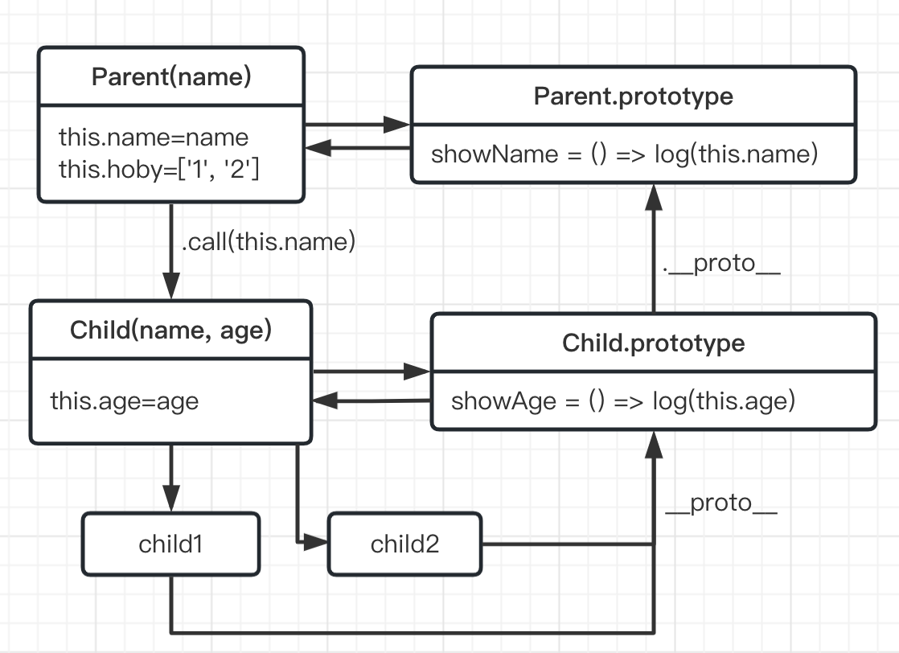

```javascript
//作用：让child.prototype的__proto__=Parent.prototype
function objectCopy(obj) {
  function Fun() { };
  Fun.prototype = obj;
  return new Fun();
}
 
function inheritPrototype(child, parent) {
  let prototype = objectCopy(parent.prototype);
  prototype.constructor = child;
  Child.prototype = prototype;
}
 
function Parent(name) {
  this.name = name;
  this.hoby = ['唱', '跳']
}
 
Parent.prototype.showName = function () {
  console.log('my name is：', this.name);
}
 
function Child(name, age) {
  Parent.call(this, name); //作用：可以给父类传参 但只能继承父类构造函数的属性。
  this.age = age;
}
 
inheritPrototype(Child, Parent);
Child.prototype.showAge = function () {
  console.log('my age is：', this.age);
}
 
let child1 = new Child("mjy", 18);
child1.showAge(); // 18
child1.showName(); // mjy
child1.hoby.push("rap");
console.log(child1.hoby); // ['唱', '跳', 'rap']
 
let child2 = new Child("yl", 18);
child2.showAge(); // 18
child2.showName(); // yl
console.log(child2.hoby); // ['唱', '跳']
```
优点：
1. 高效率只调用一次父构造函数，
2. 并且因此避免了在子原型上面创建不必要，多余的属性。
3. 与此同时，原型链还能保持不变；

### class实现继承[ES6]
```javascript
//父类
class Employee {
//构造函数
  constructor(name, dept) {
    this.name = name
    this.dept = dept
  }
  //静态方法
  //static只能修饰class的方法，而不能修饰属性。静态方法不在实例化对象的方法中，里面不能有this。
  //通过实例出来的对象可以，调用构造函数上面的方法。
  static fun() {
    console.log('static')
  }
  getName() {
    console.log(this.name)
  }
}

//子类
class Manager extends Employee {
  constructor(name, dept, reports) {
    super(name, dept)
    this.reports = reports
  }
  FunctionName() {
    /*写自己的逻辑*/
  }
}
```
特点：
1. 函数声明具有可提升性，虽然类本质上是函数，但是类的声明却不可提升，也就是说你一定要先声明类，才能创建对象。
2. 无法重写，无法重复声明
3. 不需要 function 关键字。
4. 必须使用new关键字。
## 基本数据类型
- String
- Number
- Boolean
- Object
- Null: 一种特殊的Object = 0 = false
- Undefined: 未定义/未初始化 = NaN = false
- Symbol(ES6): ~~唯一的姐~~ 唯一的值 就算参数一样也是两个东西，可以用description输出参数
- BigInt(ES10)

### 类型判断
- typeof: Number/String/Boolean/undefined/Object/Symbol 
  - 不能判断（Array, Error, null）-> Object
- instanceof: 判断数据是否是某个对象实例。是不是原型链上的
- Object.prototype.toString.call()
### 精度问题
javascript的浮点数运算就是采用了**IEEE 754的标准**。

 IEEE 754规定了四种表示浮点数值的方式：单精确度（32位）、双精确度（64位）、延伸单精确度（43比特以上，很少使用）与延伸双精确度（79比特以上，通常以80位实现）。

 其中javascript采用的是 **双精度（64位）浮点运算规则**。
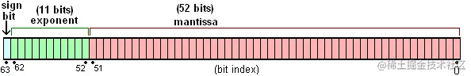
 IEEE754存储和运算规则：

 |数符 |阶码| 尾数|
 |----|----|----|
 |sign|exponent|fraction|
 |正负的符号位， 0表示正数，1表示负数|指数偏移值.指数值加上某个固定的值。固定值为：2^e - 1，其中e为存储指数的长度，比如32位的是8，64位的为11|可以理解为小数点部分。超出的部分自动进一舍零|

 一个浮点数在计算机中表示为：

Value = sign x exponent x function

- 0.1 + 0.2 为什么出现精度失真呢？
  - 十进制的0.1和0.2会被转换成二进制的，但是由于浮点数用二进制表示时是无穷的
  - `0.1 -> 0.0001 1001 1001 1001...(1100循环)`
  - `0.2 -> 0.0011 0011 0011 0011...(0011循环)`
  -  64 位双精度浮点数的小数部分最多支持53位二进制位
  -  相加之后得到二进制为`0.0100110011001100110011001100110011001100110011001100`
  -  点数小数位的限制而截断的二进制数字，再转换为十进制，就成了0.30000000000000004。所以在进行算术计算时会产生误差。

解决方式：
1. toFixed
  - 但是还是会有不精准的问题
  ```javascript
    1.35.toFixed(1) // 1.4 正确
    1.335.toFixed(2) // 1.33  错误
    1.3335.toFixed(3) // 1.333 错误
    1.33335.toFixed(4) // 1.3334 正确
    1.333335.toFixed(5)  // 1.33333 错误
    1.3333335.toFixed(6) // 1.333333 错误
  ```
2. 小数转化为整数再进行计算
    ```javascript
    function roundFractional(x, n) {
      return Math.round(x * Math.pow(10, n)) / Math.pow(10, n);
    }
    ```
3. 第三方库【bignumber.js/decimal.js/big.js】

## 创建变量
### var/ let /const
- var: 有**变量提升**
- let: 不能重复定义，可以修改值
- const: 不能重复定义，不能修改值（除了数组和对象）

### 变量提升/ 函数提升
```Javascript
   console.log(a) // undefined
   var a = 1
   console.log(a) //1
```
实际运行顺序

```Javascript
   var a
   console.log(a) // undefined
   a = 1
   console.log(a) //1
```
声明自动上提 = 变量提升

函数也一样

变量提升 > 函数提升

### 深拷贝/浅拷贝

##### 浅拷贝：

创造了一个引用/共享内存

实现方法：

1. `Object.assign()`: 方法可以把任意多个的源对象自身的可枚举属性拷贝给目标对象，然后返回目标对象。但是 Object.assign() 进行的是浅拷贝，**拷贝的是对象的属性的引用，而不是对象本身**。当object**只有一层**的时候，是**深拷贝**

2. 展开运算符`...`: 与 Object.assign ()的功能相同

   1. ```javascript
      let obj2= {... obj1}
      ```

##### 深拷贝：

创造了一个一摸一样的对象

实现方法:

1. 对象只有一层的话可以使用上面的：Object.assign()函数

2. 使用JSON

   1. 不支支持 **Date、正则、undefined、函数**

   2. ```javascript
      var obj1 = { body: { a: 10 } };
      var obj2 = JSON.parse(JSON.stringify(obj1));
      obj2.body.a = 20;
      console.log(obj1);
      // { body: { a: 10 } } <-- 沒被改到
      console.log(obj2);
      // { body: { a: 20 } }
      console.log(obj1 === obj2);
      // false
      console.log(obj1.body === obj2.body);
      // false
      ```

3. 使用`Object.create()`方法

   1. ```javascript
      var newObj = Object.create(oldObj)
      ```

      


## ==和===的区别
- `==` **值**相等。会先做类型转换，之后再判断值大小
- `===` **值**和**类型**都相等。
## 执行机制
JavaScript 的执行分为：解释和执行两个阶段

**解释阶段：**
    - 词法分析
    - 语法分析
    - 作用域规则确定

**执行阶段**：
    - 创建执行上下文
    - 执行函数代码
    - 垃圾回收

 javascript是一门**单线程**语言，任务分为同步和异步

 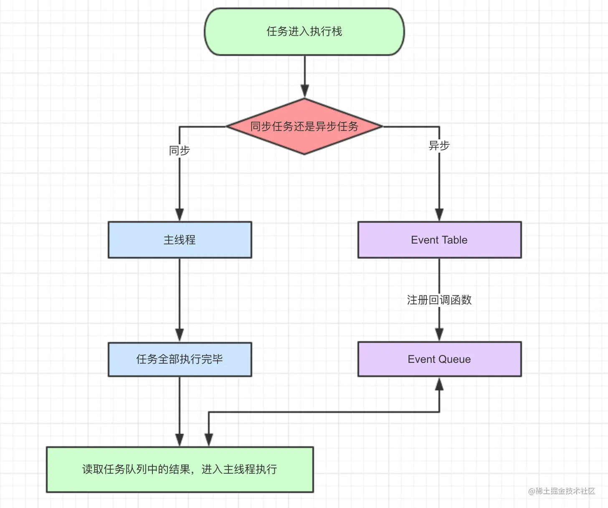

- 当指定的事情完成时，Event Table会将这个函数移入Event Queue。
- 主线程内的任务执行完毕为空，会去Event Queue读取对应的函数，进入主线程执行。
- 上述过程会不断重复，也就是常说的Event Loop(事件循环)。

```javascript
let data = [];
$.ajax({
    url:www.javascript.com,
    data:data,
    success:() => {
        console.log('发送成功!');
    }
})
console.log('代码执行结束');
```

- ajax进入Event Table， 注册回调函数`success`
- 执行`console.log('代码执行结束')`。
- ajax事件完成后，`success`进入**Event Queue**
- 主线程从**Event Queue**读取回调函数`success`并执行。

### 回调函数
函数 B 作为参数（函数引用）传递到另一个函数 A 中，并且这个函数 A 执行函数 B。我们就说函数 B 叫做回调函数。

当一个函数作为参数传入另一个参数中，并且它不会立即执行，只有当满足一定条件后该函数才可以执行，这种函数就称为回调函数。

**回调地狱：**
- 回调地狱就是为是实现代码顺序执行而出现的一种操作，它会造成我们的代码可读性非常差，后期不好维护
- 回调函数中嵌套回调函数的情况就叫做回调地狱

**解决方式：**
- promise
- async/await
### setTimeout
**异步** 可以延时执行
```javascript
setTimeout(() => {
    task()
},3000)

sleep(10000000)
```

此时task的时间远远超过三秒：
  - task() -> 进入Event Table 并注册，开始计时
  - 执行sleep()
  - 3s结束，task()进入Event Queue， 但要等sleep先完成
  - sleep()执行完，task()进入主线程执行

>**setTimeout(fn,0)**的含义是，指定某个任务在主线程最早可得的空闲时间执行，意思就是不用再等多少秒了，只要主线程执行栈内的同步任务全部执行完成，栈为空就马上执行

### setInterval
和`setTimeout`很像，不过`setInterval`这个是**循环执行**

`setInterval(fn,ms)`来说，我们已经知道不是每过ms秒会执行一次fn，而是每过ms秒，会有fn进入**Event Queue**。

如果`fn`执行时间超过了延迟时间`ms`，那么就完全看不出来有时间间隔了

### Promise(ES6)
所谓Promise对象，简单说就是一个容器，里面保存着某个未来才会结束的事件（通常是一个异步操作）的结果。

Promise 本身是同步的立即执行函数， 当在 executor 中执行 resolve 或者 reject 的时候, 此时是异步操作， 会先执行 then/catch 等，当主栈完成后，才会去调用 resolve/reject 中存放的方法执行。

**特点：**
  - 对象的状态不受外界影响。
    - 有三种状态：`pending`（进行中）、`fulfilled`（已成功）和`rejected`（已失败）
    - 只有异步操作的结果，可以决定当前是哪一种状态，任何其他操作都无法改变这个状态
  - 一旦状态改变，就不会再变，任何时候都可以得到这个结果。
    - `pending`->`fulfilled`
    - `pending`->`rejected`
    - 只要这两种情况发生，状态就凝固了，不会再变了，会一直保持这个结果，这时就称为 resolved（已定型）

**缺点：**
  - 无法中途取消
  - 如果不设置回调函数，内部的错误不会反应到外部
  - 当处于pending状态时，无法得知目前进展到哪一个阶段（刚刚开始还是即将完成）。

### 宏任务/微任务
- macro-task(宏任务)：包括**整体代码**script，setTimeout，setInterval
- micro-task(微任务)：Promise，process.nextTick


### async/await
```javascript
async function testAsync(){
   await getJSON();  
   console.log('数据拿到了');
}
```
1. `await` 后面的代码放在 async 创建的那个 `Promise` 里面去执行;
2. `await` 下面的代码放到前一个 创建的 Promise 对象的 `.then` 里面去执行。

```javascript
async function test() {
    let a = 2
    let c = 1
    await getContent()
    let d = 3
    await getPromise()
    let e = 4
    await getAsyncContent()
    return 2
}
相当于
function test() {
    return Promise.resolve().then(() => {
        let a = 2
        let c = 1
        return getContent()
    })
        .then(() => {
            let d = 3
            return getPromise()
        })
        .then(() => {
            let e = 4
            return getAsyncContent()
        })
        .then(() => {
            return 2
        })
}
```
[好文](https://juejin.cn/post/7122071393495154701)

## this
**执行上下文**最明显的就是 this 的指向是**执行时**确定的

**全局使用时：**
- this 总是指称为窗口（在 Node.js 中，全局对象是 global 。）
- 严格模式中：普通函数中的 this 绑定到 undefined 
  

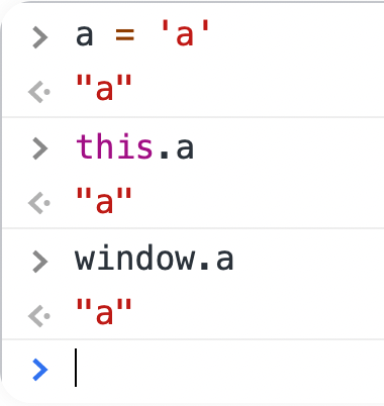

**在函数中：**
函数可以大致分为在全局中声明的**一般函数**和在**对象中声明的方法**。

- **一般函数**：指向窗口[窗口对象中的函数]
- **对象中声明的方法**：所有函数都在对象内部。this 指的是当前正在执行该函数的对象

**总结：**

- 在函数中/单独 ->全局对象
- 在对象中的函数中 ->对象
- this 指的是当前正在执行该函数的对象
### 普通函数和箭头函数
最大的区别在于 this 的指向问题：
- 箭头函数没有自己的 this

- 箭头函数**不能用 new**来创建构造函数的实例，普通函数可以（
  - 因为箭头函数创建的时候程序不会为它创建 construct 方法，也就是没有构造能力，用完就丢掉了，
  - 不像普通函数重复利用，因此也不需要构造函数原型，也就是不会自动生成 prototype 属性）

- 程序**不会**给箭头函数**创建 arguments 对象**

- 箭头函数中的 this 指向的是**紧紧包裹箭头函数的那个对象**（**定义时**决定的）。
  - 普通函数中的 this 是动态的，

- 箭头函数不能通过 bind、call、apply 来改变 this 的值，但依然可以调用这几个方法（只是 this 的值不受这几个方法控制）
#### 写法
```javascript
// 普通函数
let sum = function(a, b) {
	return a + b;
}
// 箭头函数
let sum1 = (a, b) => {
	return a + b;
}
//如果只有一个参数，那也可以不用括号。
// 有效
let sum = (x) => {
	return x;
};
// 有效
let sum1 = x => {
	return x;
};
// 没有参数需要括号
let sum2 = () => {
	return 1;
};
// 有多个参数需要括号
let sum3 = (a, b) => {
	return a + b;
};
//箭头函数也可以不用大括号，但这样会改变函数的行为。使用大括号就说明包含“函数体”，可以在一个函数中包含多条语句，跟常规的函数一样。
// 有效
let sum = (a, b) => {
	return a + b;
};
// 有效
let sum1 = (a, b) => a + b; // 相当于 return a + b;
// 无效的写法
let sum2 = (a, b) => return a + b;

//箭头函数简洁的语法非常适合嵌入函数的场景：
let arr = [1, 2, 3, 4, 5];
arr.map(val => val * 2); // [2, 4, 6, 8, 10]

```
### call()/apply()/bind()
- 第一个参数都是 this 要指向的对象
- 都是改变 this 指向的；
- 都可以利用后续参数传参；

**call()**和**apply()**相似，都会**直接调用**
```javascript
var example = function (a, b, c) {
  return a + b + c;
};
example(1, 2, 3);
example.call(null, 1, 2, 3);//一次放置
example.apply(null, [1, 2, 3]); //两个参数，第二个是数组
```

  - 当你想应用多个参数，但你想将它们作为**变量**而不是常量应用时，可以使用`apply()`。


**bind()**只改变函数指向的this，并**没有调用**
- 你定义了this然后复制那个函数来创建一个新函数并返回它

### 总结
this指向优先级

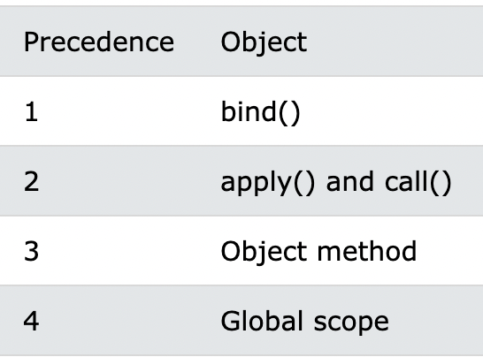

## scope作用域
ES6 之前 JavaScript 没有块级作用域,只有全局作用域和函数作用域

执行上下文在运行时确定，随时可能改变；作用域在定义时就确定，并且不会改变。


### **全局作用域和函数作用域**
在代码中任何地方都能访问到的对象拥有**全局作用域**，一般来说以下几种情形拥有全局作用域：
- 最外层函数 
- 在最外层函数外面定义的变量拥有全局作用域

    ```javascript
    var outVariable = "我是最外层变量"; //最外层变量
    function outFun() {
        //最外层函数
        var inVariable = "内层变量";
        function innerFun() {
            //内层函数
            console.log(inVariable);
        }
        innerFun();
    }
    console.log(outVariable); //我是最外层变量
    outFun(); //内层变量
    console.log(inVariable); //inVariable is not defined
    innerFun(); //innerFun is not defined
    ```
- 所有**末定义直接赋值**的变量**自动声明为拥有全局作用域**

    ```javascript
    function outFun2() {
        variable = "未定义直接赋值的变量";
        var inVariable2 = "内层变量2";
    }
    outFun2(); //要先执行这个函数，否则根本不知道里面是啥
    console.log(variable); //未定义直接赋值的变量
    console.log(inVariable2); //inVariable2 is not defined
    ```

- 所有 window 对象的属性拥有全局作用域

**函数作用域**,是指声明在函数内部的变量，和全局作用域相反，局部作用域一般只在固定的代码片段内可访问到，最常见的例如函数内部。

作用域是分层的，内层作用域可以访问外层作用域的变量，反之则不行。我们看个例子，用泡泡来比喻作用域可能好理解一点：

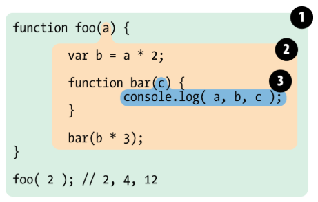

块语句（大括号“｛｝”中间的语句不像函数，它们不会创建一个新的作用域。
- if
- switch 条件语句
- for 和 while 循环语句

### 块级作用域
块级作用域可通过新增命令 `let` 和 `const` 声明

所声明的变量在指定块的**作用域外无法**被访问

**创建：**
- 在一个函数内部
- 在一个代码块（由一对花括号`{}`包裹）内部(if/switch)

因为`let` 和 `const`没有变量提升+花括号`{}`内是块级作用域

```javascript
function getValue(condition) {
    if (condition) {
        let value = "blue";
        return value;
    } else {
        // value 在此处不可用
        return null;
    }
    // value 在此处不可用
}
```

### 闭包
能在外部访问到内部信息

**优点**：变量长期驻扎在内存中，不会被内存回收机制回收，即延长变量的生命周期；

**缺点**：大量使用闭包，造成内存占用空间增大，有内存泄露的风险
#### 如何避免内存泄露
1. 在退出函数之前，将不使用的局部变量赋值为null;
2. 避免变量的循环赋值和引用。 
#### 常用的应用场景
##### 柯里化函数
```javascript
//普通函数
function getArea(w,h){
    return w * h;
}
const area1 = getArea(10,20);
const area2 = getArea(10,30);
const area3 = getArea(10,40);

//柯里化函数
function getArea(w){
    return function(h){
        return w * h;
    }
}
const getTenArea = getArea(10); //return 10*h

const area1 = getTenArea(20); //200
const area2 = getTenArea(30); //300
const area3 = getTenArea(40); //400
```
##### 通过闭包实现变量/方法的私有化/函数封装
例如封装一个防抖函数/log函数

下面这个例子有点像log
```javascript
function funOne(i){
    function getTwo(){
        console.log('参数：', i)
    }
    return getTwo;
}
const fa = funOne(100); 
const fb = funOne(200); 
const fc = funOne(300); 
```
##### 匿名自执行函数
```javascript
var funOne = (function(){
    var num = 0;
    return function(){
        num++;
        return num;
    }
})()

console.log(funOne());   // 1
console.log(funOne());   // 2
console.log(funOne());   // 3 
```
##### 缓存一些结果
```javascript
function parent(){
    let list = [];
    function son(i){
        list.push(i);
    }
    return son;
}

const fn = parent();

fn(1);
fn(2);
fn(3);
```
### 作用域链
自由变量 = 当前作用域没有定义的变量

作用域链 = 自由变量向上级作用域一层一层寻找的路

```javascript
var x = 10;
function fn() {
    console.log(x);
}
function show(f) {
    var x = 20(function() {
        f(); //10，而不是20
    })();
}
show(fn);
```
在 fn 函数中，取自由变量 x 的值时，要到哪个作用域中取？
- 要到**创建** fn 函数的那个作用域中取，无论 fn 函数将在哪里调用。

### 延长作用域
**1. try...catch**

对 catch 语句来说，会创建一个新的变量对象，其中包含的是被抛出的错误对象的声明。

**2. with**

对 with 语句来说，会将指定的对象添加到作用域链中。

```javascript
function buildUrl() {
    var qs = "?debug=true"; 
    with(location){
        var url = href + qs;
        //这里的href可以在location里查找
    }
    return url;
}
```

## 防抖
- 只执行最后一次。防抖是规定时间内发生抖动时不执行后续操作。
- 函数防抖就是法师发技能的时候要读条，技能读条没完再按技能就会重新读条。
```javascript
function myDebounce(fn,wait = 1000){
    //创建一个标记 用来放定时器的返回值
    let timeout = null;
    return function(){
        // 每当用户输入的时候把钱一个setTimeout clear掉
        clearTimeout(timeout);
        timeout = setTimeout(()=>{
            // 然后又创建一个新的setTimeout
            // 这样就能保证输入字符后的interval间隔内如果还有字符输入的话
            // 就不会执行fn
            fn.apply(this, arguments);
        }, 500);
    }
}
```
## 节流
- 控制执行次数。
  - e.g. 滚动条拉到合适的位置了，过 5ms，再进行改变。
- 函数节流就是fps游戏的射速，就算一直按着鼠标射击，也只会在规定射速内射出子弹。

```javascript
function throttle(fn,delay){
    //创建一个标记 用来放定时器的返回值
    let timer = null;
    return function(){
        if(!timer) {
            timer = setTimeout(()=>{
                fn.apply(this, arguments);
                timer = null;
            }, delay);
        }
    }
}
```

## 数组操作

### for
1. for..of(ES6):
   - 循环用来**遍历数组**
   - 允许遍历获得**键值**
   - 只遍历当前对象 ；
   - 返回数组下标对应的属性值
   - 对于普通对象，没有部署原生的 `iterator` 接口，直接使用 for...of 会报错
     - 只要有 iterator 接口的数据结构,都可以使用 for of循环。
       - 数组 Array
       - Map
       - Set
       - String
       - arguments对象
       - Nodelist对象, 就是获取的dom列表集合

1. for..in(ES5):
   - 适用于**遍历对象**而产生的，不适用于遍历数组。
   - 只能获得对象的**键名**，不能获得键值
   - 会遍历整个对象的原型链；
   - 返回数组中所有可枚举的属性名；

2. forEach
   - 无法中途跳出，`break` 命令或 `return` 命令都不能奏效

### 常见操作

|  方法   | 参数/使用 [可选] | 作用  |
|  ----  | ----  | ----  |
| `shift`  | - |**删除**原数组**第一项**，并**返回**删除元素的**值**；如果数组为空则返回 `undefined` |
| `unshift`  | (`要添加的东西`) |将**参数添加**到原数组**开头**，并返回**数组的长度** |
| `pop`  | - |**删除**原数组**最后一项**，并**返回**删除元素的**值**；如果数组为空则返回 undefined|
| `push`  | (`要添加的东西`) |将**参数添加**到原数组**末尾**，并返回数组的**长度** |
| `concat`  | `c = a.concat(b);` | 合并两个数组，如果是使用ES6语法也可以用扩展运算符 `…` 来代替 |
| `splice`  | (`start,[deleteCount],[val1,val2,…]`) |从**start位置**开始**删除deleteCount项**，并从**该位置起插入**。**原数组改变** |
| `reverse`  | - |将数组反序 |
| `sort`  | (`function`) |按指定的参数对数组进行**排序** |
| `join`  | (`separator`) |将**数组**的元素**组起一个字符串**，以 **separator 为分隔符**，省略的话则用**默认用逗号**为分隔符 |
| `slice`  | (`start,[end]`) |规定从何处开始选取，该参数为负数，则表示从原数组中的倒数第几个元素开始提取.[start,end) **原数组不改变** |
| `map()`  | 实例如下 | map 作用是映射调用此方法的数组。按照原始数组元素顺序依次处理元素。不会改变原始数组，返回新数组，长度和原始数组一致 |
``` javascript
Array.map((item,index,arr)=>{
 //item => 数组的每一项
 //index => 数组每一项的索引
 //arr => 原数组
})
实例：
let arr = [1,2,3]
let newArr = arr.map((item,index,arr)=>{
         return item+1
})
//newArr = [2,3,4]
```

## 字符串
### 数组转化字符串
- toString() 
- toLocalString()
- join()            指定分隔符:可以传递一个参数作为分隔符来连接每个元素。如果省略参数，默认使用逗号作为分隔符
- split()           方法是 String 对象方法，与 join() 方法操作正好相反。

## 事件
### 事件冒泡
就是点击最里面的元素，会触发父元素的方法。

```javascript
event.stopPropagation() //阻止事件的冒泡方法
event.preventDefault() //阻止默认事件的方法
```
### 事件委托
我们要给每一个按钮绑定一个事件，但是这样遍历，太消耗性能了，于是我们直接给父元素绑定即可完成。
### 事件捕获
当鼠标点击或者触发 dom 事件时（被触发 dom 事件的这个元素被叫作事件源），浏览器会从根节点 =>事件源（**由外到内**）进行事件传播。

在捕获的过程中，**最外层**（根）元素的事件**先被触发**，然后依次向内执行，直到触发最里面的元素（事件源)。
## 内存管理
### 内存回收
JS 有自动垃圾回收机制 ： 垃圾回收机制自动回收**不再使用**的内存

局部变量：一般函数运行结束，没有其他引用（闭包），那么该变量会被回收

全局变量：直至浏览器卸载页面才会结束，也就是说全局变量不会被当成垃圾回收。

### 内存泄漏
己动态分配的内存由于某种原因程序未释放或无法释放，造成系统内存的浪费，导致程序运行速度减慢甚至系统崩溃等严重后果。

#### 常见的内存泄露
1. 意外的全局变量（就是上面所说的全局变量不能被js垃圾回收机制回收）
   - 一个**未声明变量**的使用【也就是没有var/let/const】，会在全局对象中创建一个新的变量；在浏览器环境下，全局对象就是window
   - **解决**：变量使用完后将变量的内存释放/开严格模式
2. 计时器和回调函数
   - 定时器`setinterval`或者`settimeout`在不需要使用的时候，没有被clear，定时器无法被内存回收，导致定时器的回调函数及其内部依赖的变量都不能被回收，这就会造成内存泄漏。 
   - 如果你没有回收定时器，整个定时器依然有效, 不但定时器无法被内存回收， 定时器的**回调函数**和**回调函数中的依赖**也无法回收。在这个案例中定时器的回调函数和回调函数里面的的**依赖变量（serverData ）**也无法被回收。
   - **解决**：当不需要interval定时器或者timeout定时器的时候，调用`clearinterval`或者`cleartimeout`清除定时器
3. DOM: 将dom元素已经移除，但是对dom元素的引用没有清除，也会造成内存泄露
   - **解决：** 利用null释放内存
4. 闭包
   - 手动释放内存,设置为null 

### 堆内存/栈内存
**栈内存**：
- 主要用于存储各种**基本类型**的变量
  - 包括Boolean、Number、String、Undefined、Null，
  - 以及**对象变量的指针**，
  - 这时候栈内存给人的感觉就像一个线性排列的空间，每个小单元大小基本相等。
- 堆内存主要负责像对象Object这种变量类型的存储

**堆内存**：
- 主要负责像**对象Object**这种变量类型的存储

##### const
当我们定义一个const对象的时候，我们说的常量其实是指针，就是const对象对应的堆内存指向是不变的，但是堆内存中的数据本身的大小或者属性是可变的。

而对于const定义的基础变量而言，这个值就相当于const对象的指针，是不可变。

知道了const在内存中的存储，那么const、let定义的变量不能二次定义的流程也就比较容易猜出来了，每次使用const或者let去初始化一个变量的时候，会首先遍历当前的内存栈，看看有没有重名变量，有的话就返回错误。

##### new
new的对象是放在堆里的，返回一个指针

```javascript
// a b相当于两个指针，指向的不同的堆内存中的对象
var a = new String('123') 
var b = new String('123')
console.log(a==b, a===b)
>>> false false
```

## 存储问题
### localstorage/sessionstorage/cookies

#### 相同点
Cookie、SessionStorage和LocalStorage都是存储在浏览器本地的
#### 不同点
1. cookie是由**服务器端写入**的，而SessionStorage、 LocalStorage都是由**前端写入**的

2. cookie的生命周期是由服务器端在写入的时候就设置好的，LocalStorage是写入就一直存在，**除非手动清除**，SessionStorage是**页面关闭**的时候就会**自动清除**。
  
3. cookie的存储空间比较小大概4KB，SessionStorage、 LocalStorage存储空间比较大，大概5M。

4. Cookie、SessionStorage、 LocalStorage数据共享都遵循同源原则，SessionStorage 还**限制必须是同一个页面**。

5. 在前端给后端发送请求的时候**会自动携带Cookie中的数据**，但SessionStorage、 LocalStorage不会

6. 它们的应用场景也不同，Cookie一般用于存储登录验证信息SessionID或者token，LocalStorage常用于存储不易变动的数据，减轻服务器的压力，SessionStorage可以用来检测用户是否是刷新进入页面，如音乐播放器恢复播放进度条的功能。

#### 普通使用
```javascript
//！！！基础变量
// 当我们存基本变量时
localStorage.setItem('基本变量', '这是一个基本变量')
// 当我们取值时
localStorage.getItem('基本变量')
// 当我们删除时
localStorage.removeItem('基本变量')

//！！！引用变量
// 当我们存引用变量时
localStorage.setItem('引用变量', JSON.stringify(data))
// 当我们取值时
const data = JSON.parse(localStorage.getItem('引用变量'))
// 当我们删除时
localStorage.removeItem('引用变量')

//清空
localStorage.clear()
```

#### 命名规范
1. 比如我们存用户信息会使用user作为 key 来存储
2. 存储主题的时候用theme 作为 key 来存储
3. 存储令牌时使用token作为 key 来存储
其实这是很有问题的，咱们都知道，同源的两个项目，它们的localStorage是互通的。

我举个例子吧比如我现在有两个项目，它们在同源https://www.sunshine.com下，这两个项目都需要往localStorage中存储一个 key 为name的值，那么这就会造成两个项目的name互相顶替的现象，也就是互相污染现象：

```
项目名 + 当前环境 + 项目版本 + 缓存key
SUNSHINE_ADMIN_DEV_2.11_NAME
```
#### 时效性
咱们都知道localStorage、sessionStorage这两个的生命周期分别是

- localStorage：除非**手动清除**，否则一直存在
- sessionStorage：生命结束于当前**标签页的关闭**或**浏览器的关闭**

设置缓存key时，将value包装成一个对象，对象中有相应的时效时段，当下一次想获取缓存值时，判断有无超时，不超时就获取value，超时就删除这个缓存
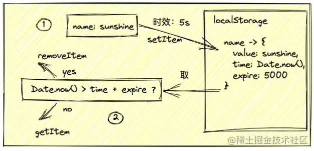
#### 隐秘性
其实这个好理解，你们想想，当咱们把咱们想缓存的东西，存在localStorage、sessionStorage中，在开发过程中，确实有利于咱们的开发，咱们想看的时候也是一目了然，点击Application就可以看到。

但是，一旦产品上线了，用户也是可以看到缓存中的东西的，而咱们肯定是会想：**有些东西可以让用户看到，但是有些东西我不想让你看到**

加密很简单，直接使用crypto-js进行对数据的加密，使用这个库里的encrypt、decrypyt进行加密、解密
## 跨域
### 同源策略
**同源策略**限制了从**同一个源加载的文档或脚本**如何与**来自另一个源的资源**进行交互。这是一个用于**隔离**潜在恶意文件的重要安全机制

简单来说，在一个域名地址下的网页，如果请求一个受到同源策略限制的另一个域名地址接口的时候，就会报错

同源策略不仅仅是浏览器这边做了限制，在服务端也是有限制的

>同源： 协议、主机、端口 一致

### JSONP
#### `src`和`href`属性
HTML的标签中有一个属性是可以请求外部地址的，那就是src和href属性。可以请求外部地址的js或者css，请求cdn服务器上的公共资源，并且不会出现问题，所以根据src的这一个特性，优秀的工程师们想到一个解决跨域的办法，俗称JSONP。

主要思路是生成一个`<script>`标签，里头src属性赋值为要请求的文件/资源

```html
<!doctype html>
<html lang="en">
<head>
  <meta charset="UTF-8">
  <title>JSONP</title>
  <script>
    function print(data) {
      console.log(`我叫${data.name}`);
      console.log(`我今年${data.age}岁`);
      let jsonpScript = document.getElementsByClassName('jsonpScript')[0];
      document.body.removeChild(jsonpScript);
    }
    function jsonpRequest(callback) {
      let jsonpScript = document.createElement('script');
      jsonpScript.src = `http://www.zhanwuzha.com/jsonp/js/index.js?callback=${callback}`;
      jsonpScript.className = 'jsonpScript';
      document.body.appendChild(jsonpScript);
    }
  </script>
</head>
<body>
  <button onclick="jsonpRequest('print')">发个JSONP请求</button>
</body>
</html>
```

```javascript
// jsonp/js/index.js
print({
    name: '前端战五渣',
    age: 18
  })

```
其实JSONP并不算真正意义上的AJAX请求，只是**请求了一个js文件并且执行**了，而且这种跨域方法只能进行**GET请求**

### CORS[跨域资源共享]
它允许浏览器向跨源服务器，发出 `XMLHttpRequest` 请求，从而克服了`AJAX`只能同源使用的限制。

#### 简单请求
只要满足以下条件的请求，就属于简单请求
1. 请求方法为**HEAD**、**GET**或者**POST**中的一种 
2. HTTP的头信息不超过以下几种字段Accept、Accept-Language、Content-Language、Last-Event-ID以及Content-Type的值只限于application/x-www-form-urlencoded、multipart/form-data、text/plain三个

对于简单请求来说，从浏览器发出请求的时候，浏览器会自动在请求头中添加一个字段Origin，值为发出请求网页的源地址


- 如果`Origin`的值**不在指定**的许可范围
   - 服务端返回一个正常的HTTP回应。
     - 这个回应的头信息没有包含`Access-Control-Allow-Origin`字段，就知道出错了，从而抛出一个错误，被`XMLHttpRequest`的`onerror`回调函数捕获。
     - 注意，这种错误无法通过状态码识别，因为HTTP回应的状态码有可能是200。 
- 如果`Access-Control-Allow-Origin`字段正好跟带过去的`Origin`的**值一样**，则返回对应的数据，完成一次请求。

总的来说，CORS实现跨域的方法就是根据**请求头**的`Origin`值和**响应头**的`Access-Control-Request-Headers`和`Access-Control-Request-Method`的值进行比对，通过了就可以请求成功，没通过就请求失败。
#### 非简单请求
非简单请求是那种对服务器有特殊要求的请求，比如请求方法是**PUT**或**DELETE**，或者`Content-Type`字段的类型是`application/json`。
#### option请求
在进行非简单请求之前，浏览器会在正式请求之前发送一次**预检请求**，这就是有时候我们会在控制台中看到的**option请求**，就是说，正式请求之前，浏览器会去问服务端我这个地址能不能访问你，如果可以，浏览器才会发送正式的请求，否则报错。

## Ajax
AJAX代表异步JavaScript和XML。

它是一组用于**异步显示数据**的相关技术。换句话说，它在不重新加载网页的情况下**发送和检索数据**。

```javascript
// 原生js
//创建 XMLHttpRequest 对象
var ajax = new XMLHttpRequest();
//规定请求的类型、URL 以及是否异步处理请求。
ajax.open('GET',url,true);
//发送信息至服务器时内容编码类型
ajax.setRequestHeader("Content-type", "application/x-www-form-urlencoded"); 
//发送请求
ajax.send(null);  
//接受服务器响应数据
ajax.onreadystatechange = function () {
    if (obj.readyState == 4 && (obj.status == 200 || obj.status == 304)) { 
    }
};
```
```javascript
// jQuery
$.ajax({				//交互方式 $.get，$.post，$.getJSON
	async:				//请求同步异步，默认true异步
	type:				//请求类型：GET/POST				
	url:				//请求的网站地址
	data:				//提交的数据，参数
	contentType:		//请求的MIME媒体类型：application/x-www-form-urlencoded（默认）、application/json;charset=UTF-8
	dataType:			//服务器返回MIME类型：xml/html/script/json/jsonp
	success: function(data){	//请求成功，回调函数，data封装网站返回的数据
		console.log( data );
	},
	error: function(e){		//请求失败回调函数，e封装错误信息
		console.log(e.status);			//状态码
		console.log(e.responseText);	//错误信息
	}
})

```
### XMLHttpRequest的属性
- `onReadyStateChange` - 只要readystate属性发生变化，就会调用它。
- `readyState` - 表示请求的状态。
- `responseText` - 它将响应作为文本返回。
- `responseXML` - 它以XML格式返回响应。
- `status` - 返回请求的状态编号。
- `statusText` - 返回状态的详细信息。

### XMLHttpRequest的重要方法是什么？
- `abort()` - 用于取消当前请求。
- `getAllResponseHeaders()` - 返回标题详细信息。
- `getResponseHeader()` - 返回特定的标题详细信息。
- `open()` - 用于打开请求。
  - `open(method,URL)` - 它打开指定get或post方法和URL的请求。
  - `open(method,URL,async)` - 它与上面相同但是指定异步或不指定。
  - `open(method,URL,async,userName,password)` - 与上面相同，但指定用户名和密码。
- `send()` - 用于发送请求。
  - `send()` - 它发送get请求
  - `send(string)` - 发送帖子请求。
- `setRequestHeader()` - 它添加了请求标头。
### AJAX有哪些安全问题？
- AJAX源代码是可读的
- 攻击者可以将脚本插入系统

### axios
Vue中封装了ajax并增强了它，在异步并发处理优于原生ajax。称为：axios（ajax input output system）

```javascript
//get请求方式一：
axios({
		// 默认请求方式为get
		method: 'get',
		url: 'api',
		// 传递参数
		params: {
			key: value
		},
		// 设置请求头信息
		headers: {
			key: value
		}
		responseType: 'json'
	}).then((response) => {
		// 请求成功
		let res = response.data;
		console.log(res);
	}).catch((error) => {
		// 请求失败，
		console.log(error);
});
//get请求方式二：
axios.get("api", {
	// 传递参数
	params: {
		key: value
	},
    // 设置请求头信息，可以传递空值
	headers: {
		key: value
	}
}).then((response) => {
	// 请求成功
	let res = response.data;
	console.log(res);
}).catch(error => {
	// 请求失败，
	console.log(error);
});

//post请求方式一：
// 注：post请求方法有的要求参数格式为formdata格式，此时需要借助 Qs.stringify()方法将对象转换为字符串
let obj = qs.stringify({
	key: value
});
axios({
	method: 'post',
	url: 'api',
	// 传递参数
	data: obj,
	// 设置请求头信息
	headers: {
		key: value
	},
	responseType: 'json'
}).then((response )=> {
	// 请求成功
	let res = response.data;
	console.log(res);
}).catch(error => {
	// 请求失败，
	console.log(error);
});
//post请求方式二：
let data = {
	key: value
},
headers = {
	USERID: "",
	TOKEN: ""
};
// 若无headers信息时，可传空对象占用参数位置
axios.post("api", qs.stringify(data), {
	headers
}
}).then((response) => {
	// 请求成功
	let res = response.data;
	console.log(res);
}).catch((error) => {
	// 请求失败，
	console.log(error);
});
```

- post请求的时候参数通过data进行传递
- get请求的时候参数通过params进行传递

>axios请求头的 Content-Type 默认是 application/json，而postman默认的是 application/x-www-form-urlencoded。

axios 是一个基于Promise 用于浏览器和 nodejs 的 HTTP 客户端，本质上也是对原生XHR的封装，只不过它是Promise的实现版本，符合最新的ES规范，它本身具有以下特征：
从浏览器中创建 XMLHttpRequest
- 支持 Promise API
- 客户端支持防止CSRF
  - 就是让你的每个请求都带一个从cookie中拿到的key，根据浏览器同源策略，假冒的网站是拿不到你cookie中得key的，这样，后台就可以轻松辨别出这个请求是否是用户在假冒网站上的误导输入，从而采取正确的策略。
- 提供了一些并发请求的接口（重要，方便了很多的操作）
- 从 node.js 创建
- http 请求 拦截请求和响应 转换请求和响应数据 取消请求
- 自动转换JSON数据