参考：[leetcode](https://leetcode.cn/leetbook/read/networks-interview-highlights/esegch/)
# 常见面试题
## TCP&UDP
### 区别和使用


类型 | TCP | UDP
--- | --- | ---
面向连接 | 是 | 否
传输可靠 | 是 | 否
传输形式 | 字节流 | 数据报文段
效率 | 慢 | 快
所需资源| 多 | 
首部字节 | 20-60 | 8
应用 | 文件/邮件 | 即时通讯、域名转换

**Q1.** TCP 是如何保证可靠性的
- 数据分块：应用数据被**分割**成 TCP 认为最适合发送的**数据块**。
- 序列号和确认应答：TCP 给发送的每一个包进行**编号**，在传输的过程中，每次***接收方***收到数据后，都会对传输方进行确认应答，即发送 ACK 报文，这个 ACK 报文当中带有对应的确认序列号，告诉发送方成功接收了哪些数据以及下一次的数据从哪里开始发。除此之外，接收方可以根据序列号对数据包进行**排序**，把有序数据传送给应用层，并**丢弃重复**的数据。
- 校验和： TCP 将保持它首部和数据部分的检验和。这是一个端到端的检验和，目的是检测数据在传输过程中的任何变化。如果收到报文段的检验和有差错，TCP 将丢弃这个报文段并且不确认收到此报文段。
* 流量控制： TCP 连接的双方都有一个固定大小的缓冲空间，发送方发送的数据量不能超过接收端缓冲区的大小。当接收方来不及处理发送方的数据，会提示发送方降低发送的速率，防止产生丢包。TCP 通过**滑动窗口**协议来支持流量控制机制。
- 拥塞控制： 当网络某个节点发生拥塞时，减少数据的发送。
- ARQ协议： 也是为了实现可靠传输的，它的基本原理就是每发完一个分组就停止发送，等待对方确认。在收到确认后再发下一个分组。
- 超时重传： 当 TCP 发出一个报文段后，它启动一个定时器，等待目的端确认收到这个报文段。如果超过某个时间还没有收到确认，将重发这个报文段。


**Q2.** TCP粘包、原因及解决方法

为什么会发生TCP粘包和拆包?

① 发送方写入的数据**大于**套接字缓冲区的大小，此时将发生拆包。

② 发送方写入的数据**小于**套接字缓冲区大小，由于 TCP 默认使用 Nagle 算法，只有当收到一个确认后，才将分组发送给对端，当发送方收集了多个较小的分组，就会一起发送给对端，这将会发生粘包。

③ 进行 MSS （最大报文长度）大小的 TCP 分段，当 TCP 报文的数据部分**大于** MSS 的时候将发生拆包。

④ 发送方发送的数据**太快**，接收方处理数据的速度赶不上发送端的速度，将发生粘包。

常见解决方法

① 在消息的头部添加**消息长度字段**，服务端获取消息头的时候解析消息长度，然后向后读取相应长度的内容。

② 固定消息数据的长度，服务端每次读取既定长度的内容作为一条完整消息，当消息不够长时，空位补上固定字符。但是该方法**会浪费网络资源**。

③ 设置消息边界，也可以理解为**分隔符**，服务端从数据流中按消息边界分离出消息内容，一般使用换行符。

什么时候需要处理粘包问题？

当接收端同时收到多个分组，并且这些分组之间毫无关系时，需要处理粘包；而当多个分组属于同一数据的不同部分时，并不需要处理粘包问题。


**Q3.** DNS过程，查询自己用过吗？
a记录？SRV?（没听过）

### TCP三次握手
  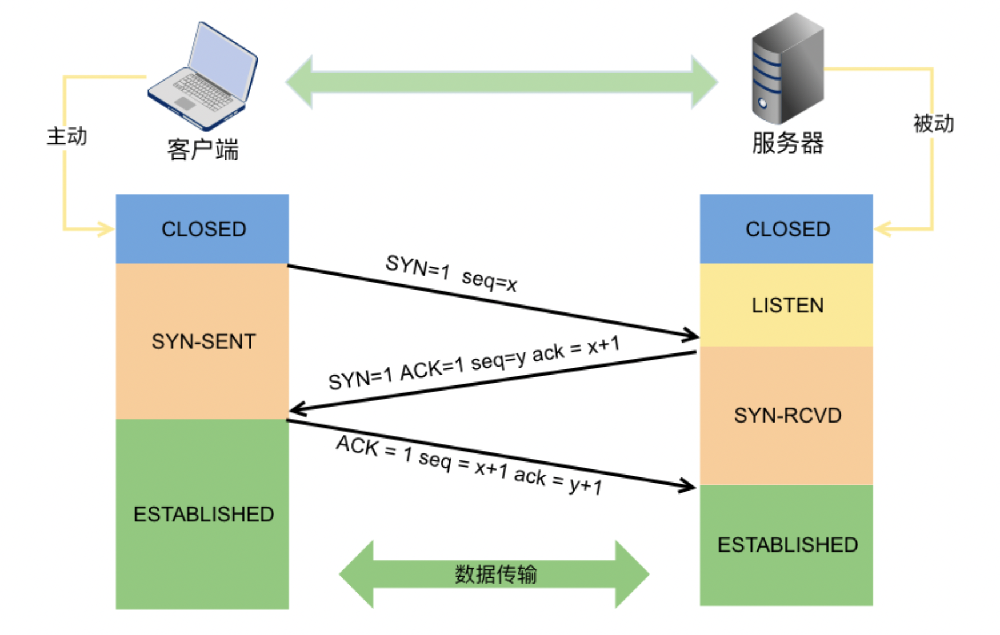

**过程：**

  初始状态：客户端【closed】服务端【listen】

  step1. 客户端发送【SYN=1，seq=x(一般为随机数)】-> 客户端变为【SYN-SENT】

  step2. 服务端收到信息后，返回【SYN=1，ACK=1,seq=y，ack=x+1】-> 服务端变为【SYN-Received】

  step3. 客户端收到信息后，返回【ACK=1，seq=x+1，ack=y+1】-> 客户端变为【ESTABLISHED】

  step4. 服务端接受信息后-> 服务端变为【ESTABLISHED】

**目的：**
1. 确认双方的收发能力都没有问题
2. 初始化序列号
3. 确认窗口大小即 MSS 等信息

**Q1.** 如果三次握手的时候每次握手信息对方没有收到会怎么样？
1. 若第一次握手服务器未接收到客户端请求建立连接的数据包时：
   - 服务器不会进行任何相应的动作，
   - 客户端因此会等待一段时间后重新发送 SYN 同步报文
   - 若仍然没有回应，则重复上述过程直到发送次数超过**最大重传次数限制**后，建立连接的系统调用会返回 -1。
2. 若第二次握手客户端未接收到服务器回应的 ACK 报文时：
   - 客户端会采取第一次握手失败时的动作，这里不再重复，
   - 而服务器端此时将阻塞在 accept() 系统调用处等待 client 再次发送 ACK 报文。
3. 若第三次握手服务器未接收到客户端发送过来的 ACK 报文
   - 同样会采取**类似于**客户端的超时重传机制，若重传次数超过限制后仍然没有回应，则 accept() 系统调用返回 -1，服务器端连接建立失败。
   - 但此时**客户端认为自己已经连接成功**了，因此开始向服务器端发送数据，但是服务器端的 accept() 系统调用已返回，此时没有在监听状态。因此服务器端接收到来自客户端发送来的数据时会发送 `RST 报文`给 客户端，消除客户端单方面建立连接的状态。

**Q2.** 第 2 次握手传回了 ACK，为什么还要传回 SYN?

- ACK 是为了告诉客户端发来的数据已经接收无误
- 而传回 SYN 是为了把自己的初始序列号（Seq）同步给客户端。

### ping
ping命令本身相当于一个应用程序，位于应用层，

ping使用的是网络层的ICMP协议。

ICMP协议是TCP/IP协议集中的一个子协议，属于网络层协议。
### TCP四次挥手
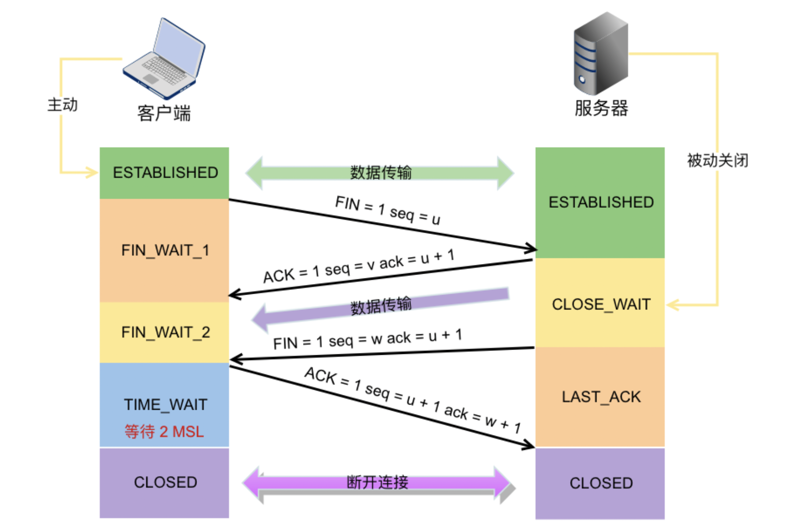
**过程：**

初始状态：客户端【ESTABLISHED】服务端【ESTABLISHED】

step1. 客户端发送【FIN=1，seq=u(一般为随机数)】-> 客户端变为【FIN-WAIT-1】即半关闭阶段 -> 并且停止向服务端发送通信数据。

step2. 服务端收到信息后，返回【ACK=1,seq=v，ack=u+1】-> 服务端变为【CLOSED-WAIT】-> 随后服务器开始准备释放服务器端到客户端方向上的连接。

step3. 客户端收到信息后-> 客户端变为【FIN-WAIT-2】

step4. 服务端发出信息后，会将遗留的待传数据传送给客户端，待传输完成后 -> 服务端发出【FIN=1，ACK=1，seq=w，ack=u+1】-> 服务端变为【LAST-ACK】-> 停止向客户端发送数据。

step5. 客户端收到信息后返回【ACK=1,seq=u+1，ack=w+1】-> 客户端变为【TIME-WAIT】-> 等待 2 MSL -> 客户端变为【CLOSED】
>MSL时间 ： windows 120s/linux 60s。所以time-wait时间（2*msl） 挺长的

step6. 服务端收到信息后-> 服务端变为【CLOSED】

**Q1**. **CLOSE-WAIT** 和 **TIME-WAIT** 的状态和意义？

* **CLOSE-WAIT** 状态就是为了保证服务器在关闭连接之前将待发送的数据发送完成。

* **TIME-WAIT** 
  1. 发生在第四次挥手，当客户端向服务端发送 ACK 确认报文后进入该状态，若取消该状态，即客户端在收到服务端的 FIN 报文后立即关闭连接，此时服务端相应的端口并没有关闭，若客户端在相同的端口立即建立新的连接，则有可能接收到上一次连接中残留的数据包，可能会导致不可预料的异常出现。
  2. 除此之外，假设客户端最后一次发送的 ACK 包在传输的时候丢失了，由于 TCP 协议的超时重传机制，服务端将重发 FIN 报文，若客户端并没有维持 TIME-WAIT 状态而直接关闭的话，当收到服务端重新发送的 FIN 包时，客户端就会用 RST 包来响应服务端，这将会使得对方认为是有错误发生，然而其实只是正常的关闭连接过程，并没有出现异常情况。
## 长连接/短连接
**短连接：** 每次请求一个资源就建立一次连接，完成后就关闭

**长连接：** 只建立一次连接，多次资源都复用该连接

**并行连接：** 并发的短连接
### Keepalive TCP长连接
**起源：**

长连接的环境下，进行一次数据交互后，很长一段时间内无数据交互时，客户端可能意外断电、死机、崩溃、重启，还是中间路由网络无故断开，这些TCP连接并未来得及正常释放，那么，连接的另一方并不知道对端的情况，它会一直维护这个连接，长时间的积累会导致非常多的半打开连接，造成端系统资源的消耗和浪费，且有可能导致在一个无效的数据链路层面发送业务数据，结果就是发送失败。

当客户端端等待超过一定时间后自动给服务端发送一个空的报文，如果对方回复了这个报文证明连接还存活着，如果对方没有报文返回且进行了多次尝试都是一样，那么就认为连接已经丢失，客户端就没必要继续保持连接了。如果没有这种机制就会有很多空闲的连接占用着系统资源。

A和B两边通过三次握手建立好TCP连接，然后突然间B就宕机了，之后时间内B再也没有起来。如果B宕机后A和B一直没有数据通信的需求，A就永远都发现不了B已经挂了，那么A的内核里还维护着一份关于A&B之间TCP连接的信息，浪费系统资源。于是在TCP层面引入了keepalive的机制，A会定期给B发空的数据包，通俗讲就是心跳包，一旦发现到B的网络不通就关闭连接。这一点在LVS内尤为明显，因为LVS维护着两边大量的连接状态信息，一旦超时就需要释放连接。

**作用：**
1. 探测连接的对端是否存活【对端可能断电/死机/崩溃｜中间网络中断】
2. 防止中间设备因为超时删除【连接相关的连接表】

**http中实现**

1. client发出的HTTP请求头需要增加Connection:keep-alive字段
2. Web-Server端要能识别Connection:keep-alive字段，并且在http的response里指定Connection:keep-alive字段，告诉client，我能提供keep-alive服务，并且"应允"client我暂时不会关闭socket连接

在**HTTP/1.0**里，为了实现client到web-server能支持长连接，必须在HTTP请求头里显示指定
`Connection:keep-alive`

在**HTTP/1.1**里，就默认是开启了keep-alive，要关闭keep-alive需要在HTTP请求头里显示指定
`Connection:close`

- HTTP协议的Keep-Alive意图在于TCP连接复用，同一个连接上串行方式传递请求-响应数据；
- TCP的Keepalive机制意图在于探测连接的对端是否存活。
# 协议层次
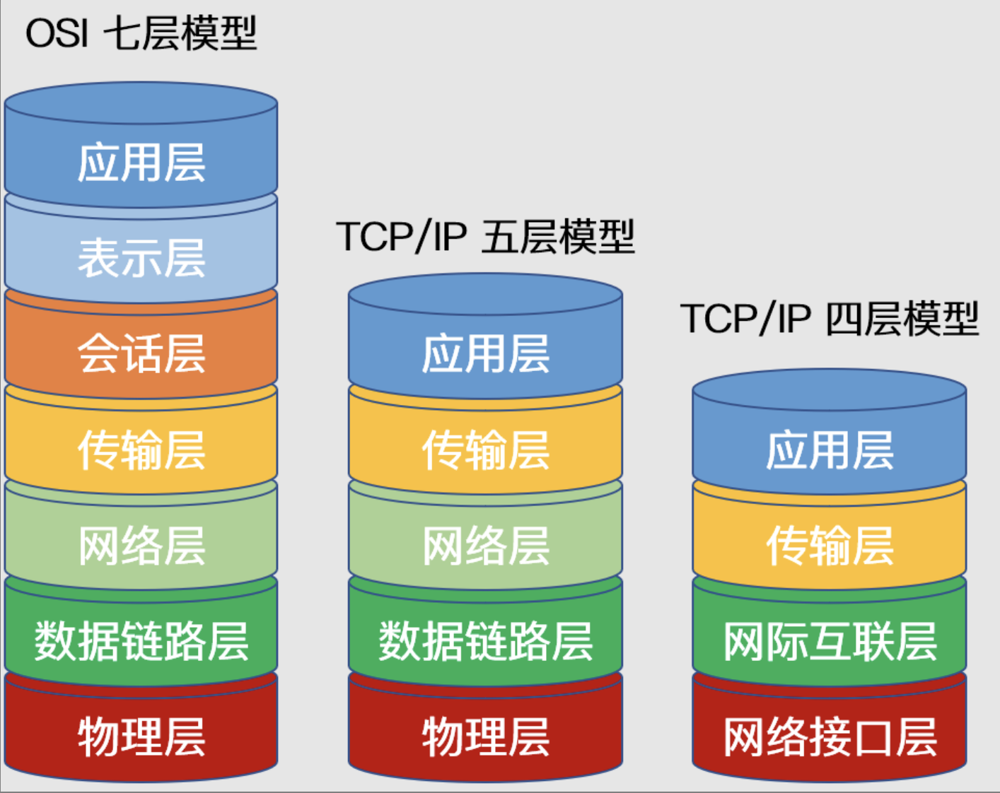
## OSI 七层
**1. 应用层**
  - 通过应用程序间的交互来完成特定的**网络应用**。该层协议定义了应用进程之间的**交互规则**，通过不同的应用层协议为不同的网络应用提供服务。
  - 例如域名系统 **DNS**，支持万维网应用的 **HTTP** 协议，电子邮件系统采用的 **SMTP** 协议等。
  - 在应用层交互的数据单元我们称之为**报文**。
  - 域名组成：主机名.结构名.网络名.顶级域名。

**2. 表示层**
  - 表示层的作用是使通信的应用程序能够**解释交换数据的含义**，其位于 OSI 参考模型的第六层，向上为应用层提供服务，向下接收来自会话层的服务。
  - 该层提供的服务主要包括**数据压缩**，**数据加密**以及**数据描述**。这使得应用程序**不必担心**在各台计算机中表示和存储的内部**格式差异**。

**3. 会话层**
  - 负责建立、管理和终止表示层实体之间的通信会话。
  - 提供了数据交换的定界和同步功能，包括了建立检查点和恢复方案的方法。

**4. 传输层**
  - 传输层的主要任务是为两台主机进程之间的通信提供服务。
  - 应用程序利用该服务传送应用层**报文**。
  - 该服务并不针对某一特定的应用，**多种应用可以使用同一个传输层服务。**
  - 由于一台主机可同时运行多个线程，因此传输层有复用和分用的功能。
  - 所谓**复用**就是指多个应用层进程可同时使用下面传输层的服务，
  - **分用**和复用相反，是传输层把收到的信息分别交付上面应用层中的相应进程。
  
**5. 网络层**
  - 两台计算机之间传送数据时其通信链路往往**不止一条**，所传输的信息甚至可能经过很多通信子网。 
  - 网络层的主要任务就是选择合适的**网间路由**和**交换节点**，确保数据按时成功传送
  - 在发送数据时，网络层把传输层产生的报文或用户数据报**封装成分组和包**向下传输到数据链路层
  - 在网络层使用的协议是无连接的网际协议（Internet Protocol）和许多路由协议，因此我们通常把该层简单地称为 **IP 层**。

**6. 数据链路层**
  - 两台主机之间的数据传输，总是在一段一段的链路上传送的，这就需要使用专门的链路层协议。
  - 在两个相邻节点之间传送数据时，数据链路层将网络层交下来的 IP 数据报组装成帧，在两个相邻节点间的链路上传送**帧**。
  - 每一帧包括数据和必要的控制信息。通过控制信息我们可以知道一个帧的起止比特位置，此外，也能使接收端检测出所收到的帧有无差错，如果发现差错，数据链路层能够简单的丢弃掉这个帧，以避免继续占用网络资源。

**7. 物理层**
  - 物理层的作用是实现计算机节点之间比特流的透明传送，尽可能屏蔽掉具体传输介质和物理设备的差异。
  - 使其上面的数据链路层不必考虑网络的具体传输介质是什么
  - 该层的主要任务是确定与传输媒体的接口的一些特性（机械特性、电气特性、功能特性，过程特性）。
## TCP/IP参考模型（4层）
而 TCP/IP 参考模型直接面向市场需求，实现起来也比较容易，因此在一经提出便得到了广泛的应用。基于 TCP/IP 的参考模型将协议分成四个层次，如上图所示，它们分别是：网络访问层、网际互联层、传输层、和应用层。

**1. 应用层**
  - TCP/IP 模型将 OSI 参考模型中的**会话层、表示层和应用层**的功能合并到一个应用层实现
  - 通过不同的应用层协议为不同的应用提供服务。例如：FTP、Telnet、DNS、SMTP 等。
  
**2. 传输层**
  - 该层对应于 OSI 参考模型的**传输层**
  - 传输层定义了两个主要协议：传输控制协议（TCP）和用户数据报协议（UDP）。

**3. 网际互联层**
  - 网际互联层对应 OSI 参考模型的**网络层**，主要负责相同或不同网络中计算机之间的通信。
  - 在网际互联层， IP 协议提供的是一个**不可靠**、**无连接**的数据报传递服务。该协议实现两个基本功能：**寻址**和**分段**。
  - 除了 IP 协议外，该层另外两个主要协议是互联网组管理协议（IGMP）和互联网控制报文协议（ICMP）。


**4. 网络接入层**
  - 对应于 OSI 参考模型中的**物理层**和**数据链路层**
  - 负责监视数据在主机和网络之间的交换

## 数据流动
应用数据报→传输层报文段→ip成组→链路层成帧→物理层比特流

OSI 七层网络模型 | TCP/IP 四层概念模型 | 对应的网络协议
--- | --- | ---
应用层（Application）|	应用层	|HTTP, TFTP, FTP, NFS, WAIS, SMTP, Telnet, DNS, SNMP
表示层（Presentation）| ~ |	TIFF, GIF, JPEG, PICT
会话层（Session）| ~ |	RPC, SQL, NFS, NetBIOS, names, AppleTalk
传输层（Transport）|	传输层	| TCP, UDP
网络层（Network）|	网络层	| IP, ICMP, ARP, RARP, RIP, IPX
数据链路层（Data Link）|	数据链路层	|FDDI, Frame Relay, HDLC, SLIP, PPP
物理层（Physical）| ~ |	EIA/TIA-232, EIA/TIA-499, V.35, 802.3

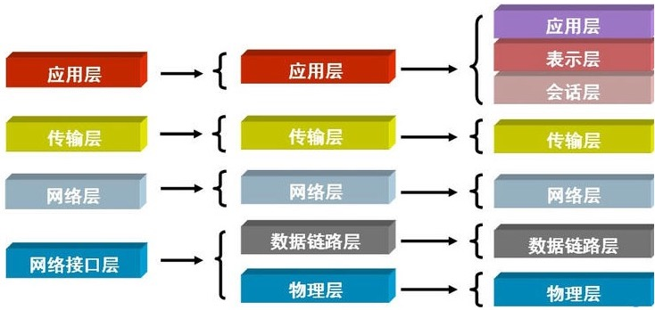
## 网络层

**Q1** 某学校获取到一个**B类地址段**,要给大家分开子网使用,鉴于现在上网设备急剧增多,管理员给每个网段进行划分的子网掩码设置为**255.255.254.0**,考虑每个网段需要有网关设备**占用一个地址**的情况下,每个网段还有多少可用的主机地址？

**IP地址=网络号+主机号**

根据子网掩码255.255.254.0，可以看出，前两段都已满，第三段二进制是1111 1110，最后一位可用，最后一段8位可用。
所以可用主机地址为：2^9=512。
全1和全0地址留作特殊用途，题目又说网关设备用一个地址，所以512-3=509

**Q2** IP地址200.23.16.0/23的网络掩码为

子网掩码位数等于网络位为1的位数，故等于23，即：11111111.11111111.11111110.00000000 等于255.255.254.0


## Ipv6
IPV6地址有128位二进制数组成。每四个二进制数组成一个十六进制数，有128/4=32个十六进制数

每四个十六进制数为一组，中间用冒号隔开。如XXXX:XXXX:XXXX:XXXX:XXXX:XXXX:XXXX:XXXX:XXXX

如果XXXX四位是全零，可以省略写成::形式

### 网页解析全过程【用户输入网址到显示对应页面的全过程】
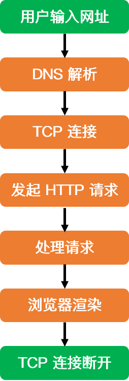
1. **DNS解析：**当用户输入一个网址并按下回车键的时候，浏览器获得一个域名，而在实际通信过程中，我们需要的是一个 IP 地址，因此我们需要**先把域名转换成相应 IP 地址**。
2. **TCP连接：**获取到 Web 服务器真正的 IP 地址后，便向 Web 服务器发起 TCP 连接请求，通过 TCP **三次握手**建立好连接后，浏览器便可以将 HTTP 请求数据发送给服务器了。
3. **发送HTTP请求：**HTTP 协议是建立在 TCP 协议之上的应用层协议，其本质是在建立起的TCP连接中，按照HTTP协议标准发送一个**索要网页**的请求。在这一过程中，会涉及到负载均衡等操作。
4. **处理请求并返回：**服务器获取到客户端的 HTTP 请求后，会根据 HTTP 请求中的内容来决定如何获取相应的文件，并将文件发送给浏览器。
5. **浏览器渲染：**首先解析 HTML 文件构建 DOM 树，然后解析 CSS 文件构建渲染树，等到渲染树构建完成后，浏览器开始布局渲染树并将其绘制到屏幕上。
6. **断开连接：**四次挥手

## HTTP和HTTPS

### HTTP
HTTP = 超文本传输协议[Hyper Text Transfer Protocol]

它是从**WEB服务器**传输**超文本标记语言(HTML)**到本地浏览器的传送协议。

1. **目的：**
设计HTTP最初的目的是为了提供一种发布和接收HTML页面的方法。

2. **原理：**

HTTP是一个基于TCP/IP通信协议来传递数据的协议，传输的**数据类型**为HTML 文件,、图片文件, 查询结果等。

HTTP协议一般用于B/S架构（）。浏览器作为HTTP客户端通过URL向HTTP服务端即WEB服务器发送所有请求。

3. **特点：**

  a. 客户端/服务端模式，请求/响应模式

  b. 简单快速：客户向服务器请求服务时，只需传送请求方法和路径。请求方法常用的有GET、HEAD、POST。

  c. 灵活：HTTP允许传输任意类型的数据对象。传输的类型由Content-Type加以标记。

  d. 无连接：限制每次连接只处理一个请求。服务器处理完请求，并收到客户的应答后，即断开连接，但是却不利于客户端与服务器保持会话连接，为了弥补这种不足，产生了两项记录http状态的技术，一个叫做Cookie,一个叫做Session。

  e. 无状态：无状态是指协议对于事务处理没有记忆，后续处理需要前面的信息，则必须重传。

4. **状态码**

101 切换协议
200 成功
206 断点续传
301 永久重定向/资源（网页等）被永久转移到其它URL
302 暂时重定向/临时跳转
400 语法错误Bad Request -
403 没有足够的权限Unauthorized
404 找不到对应的资源/请求资源不存在，可能是输入了错误的URL
500 服务器内部错误
502 网关错误 网络错误
503 服务不可用一段时间后可能恢复正常。

5. **请求方法**

- GET:请求指定的页面信息，并返回实体主体。**get多用来查询**，请求参数放在**url中**，不会对服务器上的内容产生作用。提交的数据**长度是有限制**的，因为URL长度有限制，具体的长度限制视浏览器而定
- POST:向指定资源提交数据进行处理请求（例如提交表单或者上传文件）。数据被包含在请求体中。POST请求可能会导致新的资源的建立和/或已有资源的修改。post用来提交，如把账号密码放入body中。
- HEAD:类似于get请求，只不过返回的响应中没有具体的内容，用于获取报头
- PUT:从客户端向服务器传送的数据取代指定的文档的内容。
- DELETE:请求服务器删除指定的页面。

6.**缺点**

请求信息明文传输，容易被窃听截取。

数据的完整性未校验，容易被篡改

没有验证对方身份，存在冒充危险

7. **1.1和2.0**

1) 多路复用
HTTP2.0使用了多路复用的技术，做到同一个连接**并发**处理多个请求，而且并发请求的数量比HTTP1.1大了好几个数量级。

HTTP1.1也可以多建立几个TCP连接，来支持处理更多并发的请求，但是创建TCP连接本身也是有开销的。

2） 头部数据
在HTTP1.1中，HTTP请求和响应都是由状态行、请求/响应头部、消息主体三部分组成。

HTTP1.1不支持header数据的压缩，HTTP2.0使用HPACK算法对header的数据进行压缩，这样数据体积小了，在网络上传输就会更快。


### HTTPS

为了解决上述HTTP存在的问题，就用到了HTTPS。

HTTPS 协议（HyperText Transfer Protocol over Secure Socket Layer）：一般理解为HTTP+SSL/TLS，通过**SSL证书**来验证服务器的**身份**，并为浏览器和服务器之间的通信进行**加密**。

1. **SSL[Secure Socket Layer，安全套接字层]**

位于 TCP/IP 协议与各种应用层协议之间，为数据通讯提供安全支持。

2. **TLS[Transport Layer Security，传输层安全]**

其前身是 SSL. 目前使用最广泛的是TLS 1.1、TLS 1.2

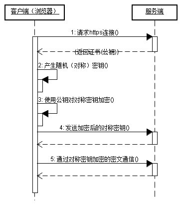

　　（1）客户使用https的URL访问Web服务器，要求与Web服务器建立SSL连接。

　　（2）Web服务器收到客户端请求后，会将网站的证书信息（证书中包含公钥）传送一份给客户端。

　　（3）客户端的浏览器与Web服务器开始协商SSL连接的安全等级，也就是信息加密的等级。

　　（4）客户端的浏览器根据双方同意的安全等级，建立会话密钥，然后利用网站的公钥将会话密钥加密，并传送给网站。

　　（5）Web服务器利用自己的私钥解密出会话密钥。

　　（6）Web服务器利用会话密钥加密与客户端之间的通信。

3. **缺点**

多次握手。加载时间延长50%

连接缓存不如http，增加数据开销和功耗

SSL证书要钱

SSL涉及安全算法会消耗cpu资源，对服务器资源消耗较大

4. **握手过程**
   


### 区别

HTTPS是HTTP协议的安全版本，HTTP协议的数据传输是明文的，是不安全的，HTTPS使用了SSL/TLS协议进行了加密处理。

http和https使用连接方式不同，默认端口也不一样，http是80，https是443。

# socket网络编程
## socket介绍
五层通信流程：

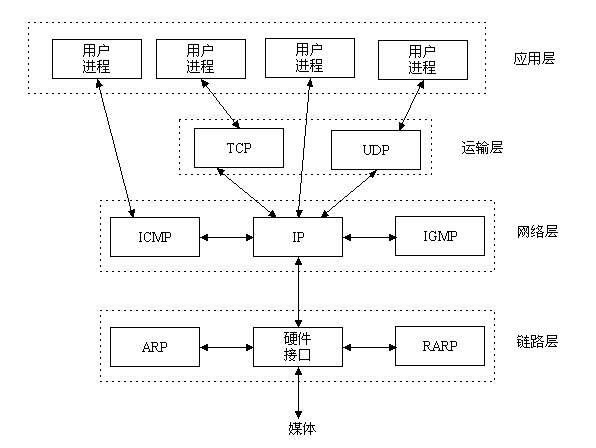

socket:

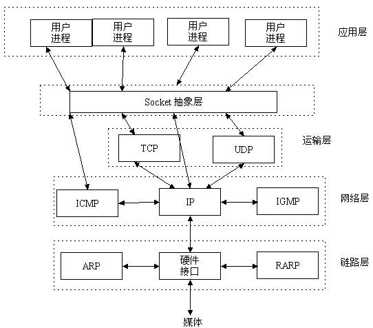

socket=套接字，是一组接口。

是[应用层]和[TCP/IP协议族]通信的**中间软件抽象层**

socket屏蔽了各个协议的通信细节，使得程序员无需关注协议本身，直接使用socket提供的接口来进行互联的不同主机间的进程的通信。
## 网络通信流程

- socket对象 = 一部电话
- 端口+IP = 电话卡
- bind(ip_port) = 插上电话卡

```python
# server
import socket
#创建一个socket对象
server = socket.socket()  #相当于创建了一部电话
ip_port = ('192.168.111.1',8001) #创建一个电话卡
server.bind(ip_port) #插上电话卡
server.listen(5) #监听着电话，我能监听5个，接到一个电话之后，后面还能有四个人给我打电话，但是后面这四个人都要排队等着，等着我第一个电话挂掉，再来第6个的时候，第六个人的手机会报错
print('11111')
#等着别人给我打电话，打来电话的时候，我就拿到了和对方的这个连线通道conn和对方的电话号码addr
conn,addr = server.accept()  #阻塞住,一直等到有人连接我，连接之后得到一个元祖，里面是连线通道conn和对方的地址(ip+端口)
print('22222')
print(conn)
print('>>>>>>>>>',addr)
while True:
    from_client_data = conn.recv(1024) #服务端必须通过两者之间的连接通道来收消息
    from_client_data = from_client_data.decode('utf-8')
    print(from_client_data)
    if from_client_data == 'bye':
        break
    server_input = input('明威说>>>>：')
    conn.send(server_input.encode('utf-8'))
    if server_input == 'bye':
        break
conn.close() #挂电话
server.close() #关手机

# test_server.py
```

```python
#_*_coding:utf-8_*_
import socket
import time

client = socket.socket()
server_ip_port = ('192.168.111.1',8001)

client.connect(server_ip_port)

while True:
    client_input = input('小文说>>>>：')
    client.send(client_input.encode('utf-8')) #给服务端发送消息
    if client_input == 'bye':
        break
    from_server_data = client.recv(1024)

    print('来自服务端的消息：',from_server_data.decode('utf-8'))
    if from_server_data.decode('utf-8') == 'bye':
        break
client.close() #客户端挂电话

# test_client.py
```
## TCP/UDP通讯流程区别
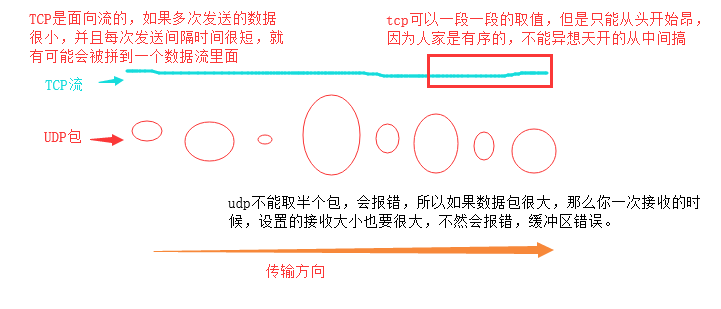

TCP和UDP下socket差异对比图：

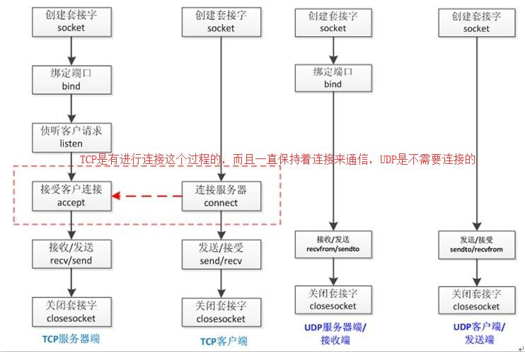

### TCP
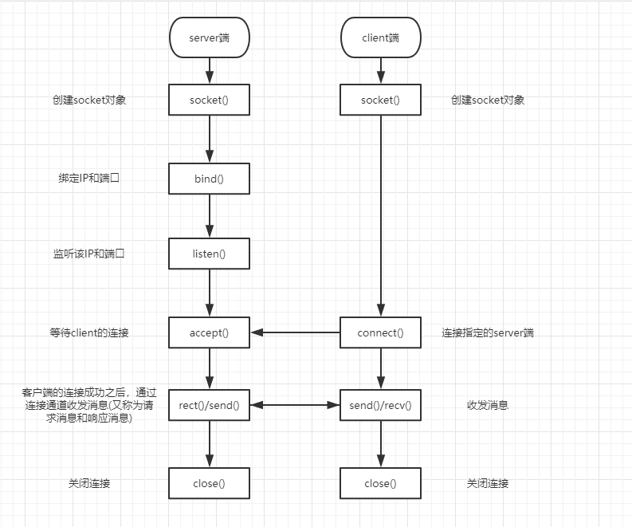
### UDP
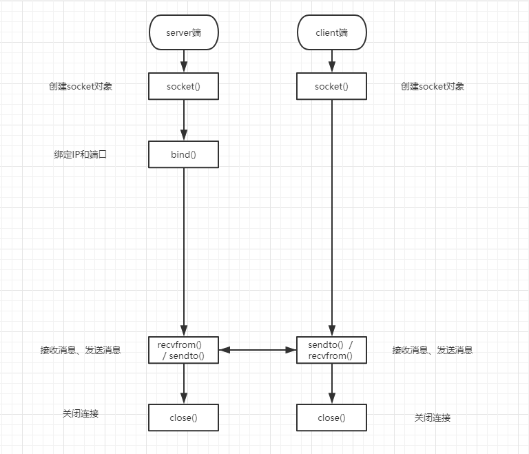

## 分类
套接字有两种（或者称为有两个种族）,分别是基于文件型的和基于网络型的。

### 1. 基于文件类型
  **AF_UNIX**

  unix一切皆文件，基于文件的套接字调用的就是底层的**文件系统**来取数据，两个套接字进程运行在**同一机器**，可以通过**访问同一个文件系统间接完成通信**

### 2. 基于网络类型
  **AF_INET**
  (还有AF_INET6被用于ipv6，还有一些其他的地址家族，不过，他们要么是只用于某个平台，要么就是已经被废弃，或者是很少被使用，或者是根本没有实现，所有地址家族中，AF_INET是使用最广泛的一个，python支持很多种地址家族，但是由于我们只关心网络编程，所以大部分时候我们只使用AF_INET)

## 粘包相关
所谓粘包问题主要还是因为接收方不知道消息之间的界限，不知道一次性提取多少字节的数据所造成的。
### 缓冲区

每个socket会被分配两个缓冲区，输入缓冲区+输出缓冲区[默认大小一般都是 `8K`, python可以通过 `getsockopt()` 函数获取]


`write()/send()` 并**不立即**向网络中传输数据
  1. 先将数据写入缓冲区中
  2. 再由TCP协议将数据**从缓冲区**发送到**目标机器**。
  3. 一旦将数据写入到缓冲区，函数就可以成功返回，不管它们有没有到达目标机器，也不管它们何时被发送到网络，这些都是TCP协议负责的事情。

`read()/recv()` 函数也是如此，也从输入缓冲区中读取数据，而不是直接从网络中读取。

**这些I/O缓冲区特性:**
1. I/O缓冲区在每个TCP套接字中**单独**存在；
2. I/O缓冲区在**创建**套接字时**自动生成**；
3. 即使**关闭**套接字也会继续传送**输出**缓冲区中遗留的数据；
4. 关闭套接字将**丢失输入**缓冲区中的数据。


### 粘包现象


1. 数据过大，拆包，有个包和别的包粘着
2. 数据小，多个小包一起发

> TCP会粘包，但UDP永远不会

1. TCP（transport control protocol，传输控制协议）是面向连接的，**面向流**的，提供高可靠性服务。收发两端（客户端和服务器端）都要有一一成对的socket，因此，发送端为了将多个发往接收端的包，更有效的发到对方，使用了优化方法（**Nagle**算法），**将多次间隔较小且数据量小的数据，合并成一个大的数据块，然后进行封包**。这样，接收端，就难于分辨出来了，必须提供科学的拆包机制。 即面向流的通信是无消息保护边界的。
2. UDP（user datagram protocol，用户数据报协议）是无连接的，**面向消息**的，提供高效率服务。不会使用块的合并优化算法，, 由于UDP支持的是一对多的模式，所以接收端的skbuff(套接字缓冲区）采用了链式结构来记录每一个到达的UDP包，在**每个UDP包中就有了消息头（消息来源地址，端口等信息**），这样，对于接收端来说，就容易进行区分处理了。 即面向消息的通信是**有消息保护边界**的。
3. tcp是基于数据流的，于是**收发的消息不能为空**，这就需要在客户端和服务端都添加**空消息的处理机制**，防止程序卡住，而udp是基于数据报的，即便是你输入的是**空内容**（直接回车），那**也不是空消息**，udp协议会帮你封装上消息头，实验略