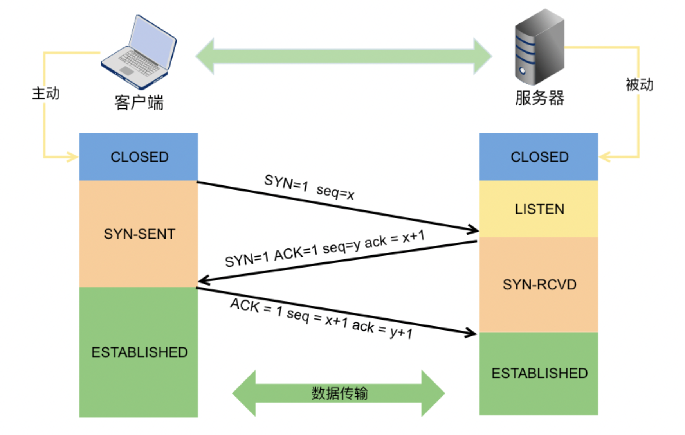
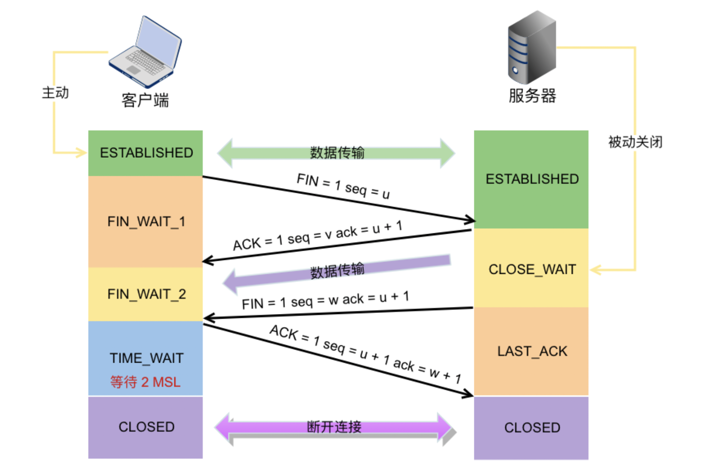
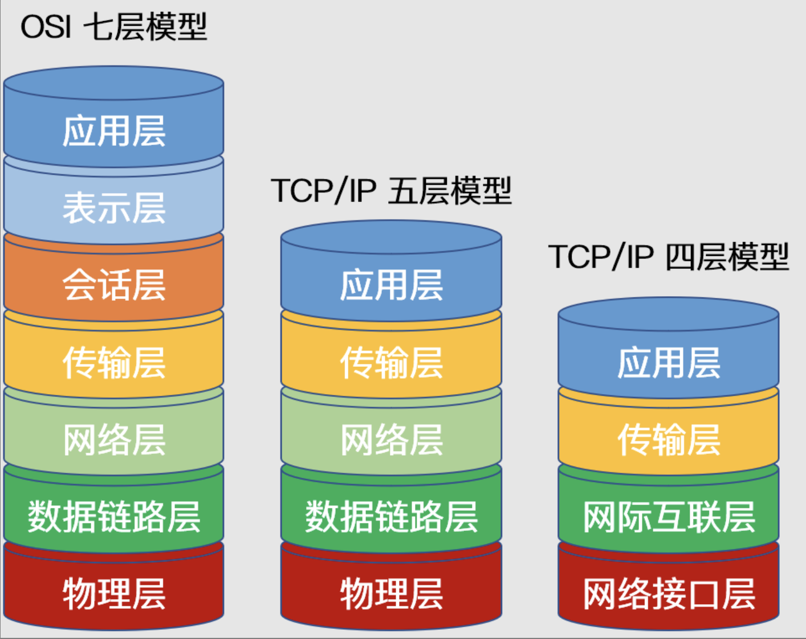

参考：[leetcode](https://leetcode.cn/leetbook/read/networks-interview-highlights/esegch/)
# 常见面试题
## TCP&UDP
### 区别和使用

类型 | TCP | UDP
--- | --- | ---
面向连接 | 是 | 否
传输可靠 | 是 | 否
传输形式 | 字节流 | 数据报文段
效率 | 慢 | 快
所需资源| 多 | 
首部字节 | 20-60 | 8
应用 | 文件/邮件 | 即时通讯、域名转换

**Q1.** TCP 是如何保证可靠性的
* 数据分块：应用数据被**分割**成 TCP 认为最适合发送的**数据块**。
* 序列号和确认应答：TCP 给发送的每一个包进行**编号**，在传输的过程中，每次***接收方***收到数据后，都会对传输方进行确认应答，即发送 ACK 报文，这个 ACK 报文当中带有对应的确认序列号，告诉发送方成功接收了哪些数据以及下一次的数据从哪里开始发。除此之外，接收方可以根据序列号对数据包进行**排序**，把有序数据传送给应用层，并**丢弃重复**的数据。
* 校验和： TCP 将保持它首部和数据部分的检验和。这是一个端到端的检验和，目的是检测数据在传输过程中的任何变化。如果收到报文段的检验和有差错，TCP 将丢弃这个报文段并且不确认收到此报文段。
* 流量控制： TCP 连接的双方都有一个固定大小的缓冲空间，发送方发送的数据量不能超过接收端缓冲区的大小。当接收方来不及处理发送方的数据，会提示发送方降低发送的速率，防止产生丢包。TCP 通过滑动窗口协议来支持流量控制机制。
* 拥塞控制： 当网络某个节点发生拥塞时，减少数据的发送。
* ARQ协议： 也是为了实现可靠传输的，它的基本原理就是每发完一个分组就停止发送，等待对方确认。在收到确认后再发下一个分组。
* 超时重传： 当 TCP 发出一个报文段后，它启动一个定时器，等待目的端确认收到这个报文段。如果超过某个时间还没有收到确认，将重发这个报文段。

**Q2.** TCP粘包、原因及解决方法

为什么会发生TCP粘包和拆包?

① 发送方写入的数据**大于**套接字缓冲区的大小，此时将发生拆包。

② 发送方写入的数据**小于**套接字缓冲区大小，由于 TCP 默认使用 Nagle 算法，只有当收到一个确认后，才将分组发送给对端，当发送方收集了多个较小的分组，就会一起发送给对端，这将会发生粘包。

③ 进行 MSS （最大报文长度）大小的 TCP 分段，当 TCP 报文的数据部分**大于** MSS 的时候将发生拆包。

④ 发送方发送的数据**太快**，接收方处理数据的速度赶不上发送端的速度，将发生粘包。

常见解决方法

① 在消息的头部添加**消息长度字段**，服务端获取消息头的时候解析消息长度，然后向后读取相应长度的内容。

② 固定消息数据的长度，服务端每次读取既定长度的内容作为一条完整消息，当消息不够长时，空位补上固定字符。但是该方法**会浪费网络资源**。

③ 设置消息边界，也可以理解为**分隔符**，服务端从数据流中按消息边界分离出消息内容，一般使用换行符。

什么时候需要处理粘包问题？

当接收端同时收到多个分组，并且这些分组之间毫无关系时，需要处理粘包；而当多个分组属于同一数据的不同部分时，并不需要处理粘包问题。

**Q3.** DNS过程，查询自己用过吗？
a记录？SRV?（没听过）

### TCP三次握手
  

**过程：**

  初始状态：客户端【closed】服务端【listen】

  step1. 客户端发送【SYN=1，seq=x(一般为随机数)】-> 客户端变为【SYN-SENT】

  step2. 服务端收到信息后，返回【SYN=1，ACK=1,seq=y，ack=x+1】-> 服务端变为【SYN-Received】

  step3. 客户端收到信息后，返回【ACK=1，seq=x+1，ack=y+1】-> 客户端变为【ESTABLISHED】

  step4. 服务端接受信息后-> 服务端变为【ESTABLISHED】

**目的：**
1. 确认双方的收发能力都没有问题
2. 初始化序列号
3. 确认窗口大小即 MSS 等信息

**Q1.** 如果三次握手的时候每次握手信息对方没有收到会怎么样？
1. 若第一次握手服务器未接收到客户端请求建立连接的数据包时：
   - 服务器不会进行任何相应的动作，
   - 客户端因此会等待一段时间后重新发送 SYN 同步报文
   - 若仍然没有回应，则重复上述过程直到发送次数超过**最大重传次数限制**后，建立连接的系统调用会返回 -1。
2. 若第二次握手客户端未接收到服务器回应的 ACK 报文时：
   - 客户端会采取第一次握手失败时的动作，这里不再重复，
   - 而服务器端此时将阻塞在 accept() 系统调用处等待 client 再次发送 ACK 报文。
3. 若第三次握手服务器未接收到客户端发送过来的 ACK 报文
   - 同样会采取**类似于**客户端的超时重传机制，若重传次数超过限制后仍然没有回应，则 accept() 系统调用返回 -1，服务器端连接建立失败。
   - 但此时**客户端认为自己已经连接成功**了，因此开始向服务器端发送数据，但是服务器端的 accept() 系统调用已返回，此时没有在监听状态。因此服务器端接收到来自客户端发送来的数据时会发送 `RST 报文`给 客户端，消除客户端单方面建立连接的状态。

**Q2.** 第 2 次握手传回了 ACK，为什么还要传回 SYN?

- ACK 是为了告诉客户端发来的数据已经接收无误
- 而传回 SYN 是为了把自己的初始序列号（Seq）同步给客户端。

### TCP四次挥手

**过程：**

初始状态：客户端【ESTABLISHED】服务端【ESTABLISHED】

step1. 客户端发送【FIN=1，seq=u(一般为随机数)】-> 客户端变为【FIN-WAIT-1】即半关闭阶段 -> 并且停止向服务端发送通信数据。

step2. 服务端收到信息后，返回【ACK=1,seq=v，ack=u+1】-> 服务端变为【CLOSED-WAIT】-> 随后服务器开始准备释放服务器端到客户端方向上的连接。

step3. 客户端收到信息后-> 客户端变为【FIN-WAIT-2】

step4. 服务端发出信息后，会将遗留的待传数据传送给客户端，待传输完成后 -> 服务端发出【FIN=1，ACK=1，seq=w，ack=u+1】-> 服务端变为【LAST-ACK】-> 停止向客户端发送数据。

step5. 客户端收到信息后返回【ACK=1,seq=u+1，ack=w+1】-> 客户端变为【TIME-WAIT】-> 等待 2 MSL -> 客户端变为【CLOSED】
>MSL时间 ： windows 120s/linux 60s。所以time-wait时间（2*msl） 挺长的

step6. 服务端收到信息后-> 服务端变为【CLOSED】

**Q1**. **CLOSE-WAIT** 和 **TIME-WAIT** 的状态和意义？

* **CLOSE-WAIT** 状态就是为了保证服务器在关闭连接之前将待发送的数据发送完成。

* **TIME-WAIT** 
  1. 发生在第四次挥手，当客户端向服务端发送 ACK 确认报文后进入该状态，若取消该状态，即客户端在收到服务端的 FIN 报文后立即关闭连接，此时服务端相应的端口并没有关闭，若客户端在相同的端口立即建立新的连接，则有可能接收到上一次连接中残留的数据包，可能会导致不可预料的异常出现。
  2. 除此之外，假设客户端最后一次发送的 ACK 包在传输的时候丢失了，由于 TCP 协议的超时重传机制，服务端将重发 FIN 报文，若客户端并没有维持 TIME-WAIT 状态而直接关闭的话，当收到服务端重新发送的 FIN 包时，客户端就会用 RST 包来响应服务端，这将会使得对方认为是有错误发生，然而其实只是正常的关闭连接过程，并没有出现异常情况。

TODO广播地址
TODO各个层
# 协议层次

## OSI 七层
**1. 应用层**
  - 通过应用程序间的交互来完成特定的**网络应用**。该层协议定义了应用进程之间的**交互规则**，通过不同的应用层协议为不同的网络应用提供服务。
  - 例如域名系统 **DNS**，支持万维网应用的 **HTTP** 协议，电子邮件系统采用的 **SMTP** 协议等。
  - 在应用层交互的数据单元我们称之为**报文**。

**2. 表示层**
  - 表示层的作用是使通信的应用程序能够**解释交换数据的含义**，其位于 OSI 参考模型的第六层，向上为应用层提供服务，向下接收来自会话层的服务。
  - 该层提供的服务主要包括**数据压缩**，**数据加密**以及**数据描述**。这使得应用程序**不必担心**在各台计算机中表示和存储的内部**格式差异**。

**3. 会话层**
  - 负责建立、管理和终止表示层实体之间的通信会话。
  - 提供了数据交换的定界和同步功能，包括了建立检查点和恢复方案的方法。

**4. 传输层**
  - 传输层的主要任务是为两台主机进程之间的通信提供服务。
  - 应用程序利用该服务传送应用层**报文**。
  - 该服务并不针对某一特定的应用，**多种应用可以使用同一个传输层服务。**
  - 由于一台主机可同时运行多个线程，因此传输层有复用和分用的功能。
  - 所谓**复用**就是指多个应用层进程可同时使用下面传输层的服务，
  - **分用**和复用相反，是传输层把收到的信息分别交付上面应用层中的相应进程。
  
**5. 网络层**
  - 两台计算机之间传送数据时其通信链路往往**不止一条**，所传输的信息甚至可能经过很多通信子网。 
  - 网络层的主要任务就是选择合适的**网间路由**和**交换节点**，确保数据按时成功传送
  - 在发送数据时，网络层把传输层产生的报文或用户数据报**封装成分组和包**向下传输到数据链路层
  - 在网络层使用的协议是无连接的网际协议（Internet Protocol）和许多路由协议，因此我们通常把该层简单地称为 **IP 层**。

**6. 数据链路层**
  - 两台主机之间的数据传输，总是在一段一段的链路上传送的，这就需要使用专门的链路层协议。
  - 在两个相邻节点之间传送数据时，数据链路层将网络层交下来的 IP 数据报组装成帧，在两个相邻节点间的链路上传送**帧**。
  - 每一帧包括数据和必要的控制信息。通过控制信息我们可以知道一个帧的起止比特位置，此外，也能使接收端检测出所收到的帧有无差错，如果发现差错，数据链路层能够简单的丢弃掉这个帧，以避免继续占用网络资源。

**7. 物理层**
  - 物理层的作用是实现计算机节点之间比特流的透明传送，尽可能屏蔽掉具体传输介质和物理设备的差异。
  - 使其上面的数据链路层不必考虑网络的具体传输介质是什么
  - 该层的主要任务是确定与传输媒体的接口的一些特性（机械特性、电气特性、功能特性，过程特性）。
## TCP/IP参考模型（4层）
而 TCP/IP 参考模型直接面向市场需求，实现起来也比较容易，因此在一经提出便得到了广泛的应用。基于 TCP/IP 的参考模型将协议分成四个层次，如上图所示，它们分别是：网络访问层、网际互联层、传输层、和应用层。

**1. 应用层**
  - TCP/IP 模型将 OSI 参考模型中的**会话层、表示层和应用层**的功能合并到一个应用层实现
  - 通过不同的应用层协议为不同的应用提供服务。例如：FTP、Telnet、DNS、SMTP 等。
  
**2. 传输层**
  - 该层对应于 OSI 参考模型的**传输层**
  - 传输层定义了两个主要协议：传输控制协议（TCP）和用户数据报协议（UDP）。

**3. 网际互联层**
  - 网际互联层对应 OSI 参考模型的**网络层**，主要负责相同或不同网络中计算机之间的通信。
  - 在网际互联层， IP 协议提供的是一个**不可靠**、**无连接**的数据报传递服务。该协议实现两个基本功能：**寻址**和**分段**。
  - 除了 IP 协议外，该层另外两个主要协议是互联网组管理协议（IGMP）和互联网控制报文协议（ICMP）。

**4. 网络接入层**
  - 对应于 OSI 参考模型中的**物理层**和**数据链路层**
  - 负责监视数据在主机和网络之间的交换

## 数据流动
应用数据报→传输层报文段→ip成组→链路层成帧→物理层比特流

OSI 七层网络模型 | TCP/IP 四层概念模型 | 对应的网络协议
--- | --- | ---
应用层（Application）|	应用层	|HTTP, TFTP, FTP, NFS, WAIS, SMTP, Telnet, DNS, SNMP
表示层（Presentation）| ~ |	TIFF, GIF, JPEG, PICT
会话层（Session）| ~ |	RPC, SQL, NFS, NetBIOS, names, AppleTalk
传输层（Transport）|	传输层	| TCP, UDP
网络层（Network）|	网络层	| IP, ICMP, ARP, RARP, RIP, IPX
数据链路层（Data Link）|	数据链路层	|FDDI, Frame Relay, HDLC, SLIP, PPP
物理层（Physical）| ~ |	EIA/TIA-232, EIA/TIA-499, V.35, 802.3

## 网络层

**Q1** 某学校获取到一个**B类地址段**,要给大家分开子网使用,鉴于现在上网设备急剧增多,管理员给每个网段进行划分的子网掩码设置为**255.255.254.0**,考虑每个网段需要有网关设备**占用一个地址**的情况下,每个网段还有多少可用的主机地址？

**IP地址=网络号+主机号**

根据子网掩码255.255.254.0，可以看出，前两段都已满，第三段二进制是1111 1110，最后一位可用，最后一段8位可用。
所以可用主机地址为：2^9=512。
全1和全0地址留作特殊用途，题目又说网关设备用一个地址，所以512-3=509

**Q2** IP地址200.23.16.0/23的网络掩码为

子网掩码位数等于网络位为1的位数，故等于23，即：11111111.11111111.11111110.00000000 等于255.255.254.0
