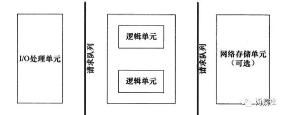

服务器程序通常需要处理三类事件:
 - I/O事件
 - 信号
 - 定时事件
---
有两种事件处理模式
1. **Reactor模式**：
   - 要求主线程（I/O处理单元）只负责监听文件描述符上**是否有事件发生（可读、可写）**
   - 若有，则立即通知工作线程（逻辑单元），将socket可读可写事件**放入请求队列**，交给工作线程处理
2. **Proactor模式**：
   - 将所有的**I/O操作都交给主线程和内核**来处理（进行读、写
   - **工作线程仅负责处理逻辑**，如主线程读完成后`users[sockfd].read()`，选择一个工作线程来处理客户请求`pool->append(users + sockfd)`。
---
同步（阻塞）I/O：
- 在一个线程中，CPU执行代码的速度极快
- 然而，一旦遇到IO操作，如读写文件、发送网络数据时，就需要等待IO操作完成，才能继续进行下一步操作。这种情况称为同步IO。

异步（非阻塞）I/O：
- 当代码需要执行一个耗时的IO操作时，它只发出IO指令，并**不等待**IO结果，然后就去执行其他代码了。
- 一段时间后，当IO返回结果时，再通知CPU进行处理。
---
Linux下有三种IO复用方式：`epoll`，`select`和`poll`，为什么用epoll
1. 文件描述符
- 对于`select`和`poll`来说，所有**文件描述符**都是在用户态被加入其文件描述符集合的，每次调用都需要将整个**集合拷贝到内核态**；
- `epoll`则将整个文件描述符集合**维护在内核态**，每次**添加文件描述符**的时候都需要**执行一个系统调用**。系统调用的开销是很大的，而且在有很多短期活跃连接的情况下，epoll**可能会慢于**select和poll由于这些大量的系统调用开销。
2. 描述文件描述符集合的结构
- `select`使用**线性表**描述文件描述符集合，文件描述符有上限；
- `poll`使用**链表**来描述；
-` epoll`底层通过**红黑树**来描述，并且维护一个**ready list**，将事件表中已经就绪的事件添加到这里，在使用epoll_wait调用时，仅观察这个list中有没有数据即可。
3. 文件描述符就绪
- `select`和`poll`的**最大开销**来自内核**判断是否有文件描述符就绪**这一过程：
  - 每次执行`select`或`poll`调用时，它们会采用**遍历的方式**，遍历整个文件描述符集合去判断各个文件描述符是否有活动；
- epoll则不需要去以这种方式检查，当有活动产生时，会**自动触发epoll回调函数**通知epoll文件描述符，然后内核将这些就绪的文件描述符放到之前提到的ready list中等待epoll_wait调用后被处理。
4. LT模式
- select和poll都只能工作在相对低效的LT模式下，
- epoll同时支持LT和ET模式。Epoll对文件操作符的操作有两种模式：LT（电平触发）和ET（边缘触发），二者的区别在于当你调用`epoll_wait`的时候内核里面发生了什么：
  - LT（电平触发）：类似select，LT会去**遍历**在epoll**事件表中每个文件描述符**，来观察**是否有我们感兴趣的事件发生**
    - 如果有（触发了该文件描述符上的回调函数），epoll_wait就会以非阻塞的方式返回。
    - 若该epoll事件没有被处理完（没有返回EWOULDLOCK），该事件还会被后续的epoll_wait再次触发。
  - ET（边缘触发）：ET在发现有我们感兴趣的事件发生后，立即返回，并且sleep这一事件的epoll_wait，不管该事件有没有结束

- 综上，当监测的**fd数量较小**，且各个**fd都很活跃**的情况下，建议使用select和poll；
- 当监听的**fd数量较多**，且**单位时间仅部分fd活跃**的情况下，使用epoll会明显提升性能。
---
线程池

主线程负责读写，工作线程（线程池中的线程）负责处理逻辑（HTTP请求报文的解析等等）

这个过程是：
1. 通过epoll_wait发现这个**connfd上有可读事件**了（EPOLLIN）
2. 主线程就将这个**HTTP的请求报文**读进这个**连接socket的读缓存**中`users[sockfd].read()`，
3. 然后将该**任务对象（指针）插入线程池**的**请求队列**中`pool->append(users + sockfd)`

线程池的实现还需要依靠**锁机制**以及**信号量**机制来实现线程**同步**，保证操作的原子性。
- 操作工作队列一定要加锁（locker），因为它被所有线程共享。
- 我们用信号量来标识请求队列中的请求数，通过m_queuestat.wait();来等待一个请求队列中待处理的HTTP请求，然后交给线程池中的空闲线程来处理

所谓线程池，就是一个pthread_t类型的普通**数组**，
1. 通过`pthread_create()`函数创建`m_thread_number`个线程
2. 用来执行`worker()`函数以执行每个请求处理函数（HTTP请求的process函数），
3. 通过`pthread_detach()`将线程设置成**脱离态**（detached）后，当这一线程运行结束时，它的**资源会被系统自动回收**，而不再需要在其它线程中对其进行 pthread_join() 操作。

最佳线程数 = CPU当前可使用的Cores数 * 当前CPU的利用率 * (1 + CPU等待时间 / CPU处理时间)

#  线程同步机制封装类
## RAII
- RAII全称是“*Resource Acquisition is Initialization*”，直译过来是“**资源获取**即**初始化**”.


- 在RAII的指导下，我们应该**使用类来管理资源**，将**资源和对象的生命周期绑定**
  - 因为C++的语言机制保证了，当一个对象创建的时候，自动调用构造函数，当对象超出作用域的时候会自动调用析构函数。
  - 在**构造函数**中申请**分配资源**，在**析构函数**中**释放资源**。

- RAII的**核心思想**是将**资源或者状态**与对象的**生命周期绑定**，通过C++的语言机制，实现资源和状态的安全管理,**智能指针**是RAII最好的例子

## 信号量
- 它只支持两种操作：等待(P)和信号(V).假设有信号量`SV`
  - `P`，如果`SV`的值**大于0**，则将其**减一**；若SV的**值为0**，则**挂起**执行
  - `V`，如果有其他进程因为等待SV而挂起，则唤醒；若没有，则将SV值加一
  - 总结： P +1 V -1

- 它只能取自然数值
  - 取值可以是任何**自然数**，最常用的，最简单的信号量是**二进制信号量**，只有0和1两个值.
    - sem_init函数用于**初始化**一个未命名的信号量
    - sem_destroy函数用于**销毁**信号量
    - sem_wait函数将以原子操作方式将信号量**减一**,信号量为0时,sem_wait阻塞 **P操作**
    - sem_post函数以原子操作方式将信号量**加一**,信号量大于0时,唤醒调用sem_post的线程 **V操作**
    - 成功返回0，失败返回errno
```c++
class sem{
    public:
        //构造函数
        sem()
        {
            //信号量初始化
            if(sem_init(&m_sem,0,0)!=0){
                throw std::exception();
            }
        }
        //析构函数
        ~sem()
        {
            //信号量销毁
            sem_destroy(&m_sem);
        }
    private:
        sem_t m_sem;
};
```
## 互斥量
- 互斥锁,也称互斥量,可以保护关键代码段,以确保**独占式访问**.
  - 当进入关键代码段,获得互斥锁将其加锁;
  - 离开关键代码段,唤醒等待该互斥锁的线程.

- pthread_mutex_init函数用于**初始化**互斥锁
- pthread_mutex_destroy函数用于**销毁**互斥锁
- pthread_mutex_lock函数以原子操作方式给互斥锁**加锁** **P操作**
- pthread_mutex_unlock函数以原子操作方式给互斥锁**解锁** **V操作**
- 成功返回0，失败返回errno


## 条件变量

提供了一种线程间的**通知机制**,当某个**共享数据达到某个值**时,**唤醒**等待这个共享数据的线程.

- pthread_cond_init函数用于**初始化**条件变量

- pthread_cond_destroy函数**销毁**条件变量

- pthread_cond_broadcast函数以广播的方式**唤醒所有等待目标条件变量的线程**

- pthread_cond_wait函数用于**等待目标条件变量**.
  - 该函数调用时需要传入 **mutex参数**(加锁的互斥锁) ,
  - 函数执行时,先把**调用线程**放入条件变量的**请求队列**,然后将**互斥锁mutex解锁**,
  - 当函数成功返回为0时,互斥锁会再次被锁上. 
  - 也就是说函数内部会有一次解锁和加锁操作.

```c++
//条件变量的使用机制需要配合锁来使用
//内部会有一次加锁和解锁
//封装起来会使得更加简洁
bool wait()
{
    int ret=0;
    pthread_mutex_lock(&m_mutex);
    ret=pthread_cond_wait(&m_cond,&m_mutex);
    pthread_mutex_unlock(&m_mutex);
    return ret==0;
}
bool signal()
{
    return pthread_cond_signal(&m_cond)==0;
}
```

# 半同步半反应堆线程池
## 服务器编程基本框架


主要由**I/O单元**，**逻辑单元**和**网络存储单元**组成
- I/O单元: 处理**客户端连接**，**读写网络数据**；
- 逻辑单元: 处理**业务逻辑**的线程；
- 网络存储单元: 指本地**数据库和文件**等。

其中每个单元之间通过**请求队列**进行**通信**，从而**协同完成任务**。

## 五种I/O模型
- 阻塞IO:调用者调用了某个函数，**等待**这个函数返回，**期间什么也不做**，不停的去检查这个函数有没有返回，必须等这个函数返回才能进行下一步动作
- 非阻塞IO:非阻塞等待，**每隔一段时间就去检测**IO事件是否就绪。**没有就绪就可以做其他事**。
  - 非阻塞I/O执行系统调用总是**立即返回**，不管事件是否已经发生，
  - 若事件没有发生，则返回-1，此时可以根据errno区分这两种情况，
    - 对于accept，recv和send，事件未发生时，errno通常被设置成eagain 
- 信号驱动IO:linux用**套接口**进行信号驱动IO，安装一个**信号处理函数**，进程继续运行并不阻塞，当IO时间**就绪**，进程**收到SIGIO信号**。然后处理IO事件。
- IO复用:linux用`select/poll`函数实现IO复用模型，这两个函数也会使进程阻塞，但是和阻塞IO所不同的是这两个函数可以**同时阻塞多个IO操作**。而且可以**同时对多个读操作、写操作的IO函数进行检测**。知道有**数据可读或可写时**，才真正**调用IO操作函数**
- 异步IO:linux中，可以调用`aio_read`函数告诉内核描述字**缓冲区指针**和**缓冲区的大小、文件偏移及通知的方式**，然后立即返回，当内核将数据拷贝到缓冲区后，再通知应用程序。

> 阻塞I/O，非阻塞I/O，信号驱动I/O和I/O复用都是同步I/O。
> 
> 同步I/O指内核向应用程序通知的是**就绪事件**，比如只通知有客户端连接，要求用户代码自行执行I/O操作
> 
> 异步I/O是指内核向应用程序通知的是**完成事件**，比如读取客户端的数据后才通知应用程序，由内核完成I/O操作。
>
## 事件处理模式
- reactor模式中，
  - 主线程(I/O处理单元)只负责**监听文件描述符**上是否**有事件发生**
    - 有的话立即通知**工作线程**(逻辑单元 )，读写数据、接受新连接及处理客户请求均在工作线程中完成。
    - 通常由**同步**I/O实现。

- proactor模式中，
  - **主线程**和**内核**负责处理**读写**数据、**接受新连接**等I/O操作，
  - **工作线程**仅负责**业务逻辑**，如**处理客户请求**。
  - 通常由**异步**I/O实现。

## 同步I/O模拟proactor模式

异步I/O并不成熟，实际中使用较少，这里将使用同步I/O模拟实现proactor模式

epoll_wait为例 工作流程：
- **主线程**往epoll内核事件表**注册**socket上的**读就绪事件**。 epoll.内核事件表.注册socket().read() 
  - **主线程**调用epoll_wait**等待**socket上**有数据可读**    epoll_wait -> 等socket.read()有数据可读
  - 当socket上有数据可读，epoll_wait**通知主线程**,           epoll_wait -> 通知主线程
  - 主线程从socket循环读取数据，**直到没有**更多数据可读，        主线程 -> socket.read()--> 直到没数据可读
  - 然后将读取到的数据**封装成一个请求对象**并插入**请求队列**。   请求队列.insert(所有读到的数据的封装)

- 睡眠在请求队列上某个**工作线程被唤醒**，它**获得**请求对象**并处理**客户请求，然后往epoll**内核事件表**中**注册该socket**上的写就绪事件   
  - 工作线程 in 请求队列
  - 工作线程唤醒
  - 工作线程 get(请求对象) -> 处理(客户请求)

- 然后往epoll**内核事件表**中**注册该socket**上的写就绪事件     epoll.内核事件表.注册socket().write()
  - 主线程调用epoll_wait等待socket可写。                     epoll_wait -> 等socket.write()有数据可写
  - 当socket上有数据可写， epoll_wait通知主线程。             epoll_wait -> 通知主线程
  - 主线程往socket上写入服务器处理客户请求的结果。              主线程 -> socket.write()--> 服务器处理请求的结果

## 并发编程模式
实现有**多线程**和**多进程**两种，但这里涉及的并发模式指**I/O处理单元与逻辑单元**的**协同完成任务**的方法。
### 半同步/半异步模式
半同步/半反应堆并发模式是半同步/半异步的变体，将半异步**具体化**为某种事件处理模式.

**并发模式**中的同步和异步：
- 同步指的是程序完全按照代码序列的**顺序执行**
- 异步指的是程序的执行需要由**系统事件驱动**

半同步/**半异步**模式**工作流程**：
- **同步线程**用于处理**客户逻辑**
- **异步线程**用于处理**I/O事件**
- **异步线程**监听到**客户请求**后，就将其**封装成请求对象**并插入请求队列中 
  - listen() -> 请求队列.insert(封装请求对象)
- **请求队列**将**通知**某个**工作在同步模式的工作线程**来读取并**处理**该请求对象

半同步/**半反应堆**模式**工作流程**：
- **主线程**充当**异步线程**，负责**监听**所有socket上的事件
  - 若有新请求到来，主线程接收之以得到新的连接socket，然后往**epoll内核事件表**中**注册该socket上的读写事件**
  - 如果连接socket上有**读写事件发生**，主线程从socket上接收数据，并将数据封装成请求对象**插入到请求队列**中
- 所有**工作线程**睡眠在**请求队列**上，当有任务到来时，通过**竞争（如互斥锁）获得任务**的接管权

### 领导者/追随者模式

## 线程池
空间换时间,浪费服务器的硬件资源,换取运行效率.

池是一组资源的集合,这组资源在服务器启动之初就被完全创建好并初始化,这称为静态资源.

当服务器进入正式运行阶段,开始处理客户请求的时候,如果它需要相关的资源,可以直接从池中获取,无需动态分配.

当服务器处理完一个客户连接后,可以把相关的资源放回池中,无需执行系统调用释放资源.

```c++
//线程池类定义
template<typename T>
class threadpool{
    public:
        //thread_number是线程池中线程的数量
        //max_requests是请求队列中最多允许的、等待处理的请求的数量
        //connPool是数据库连接池指针
        threadpool(connection_pool *connPool, int thread_number = 8, int max_request = 10000);
        ~threadpool();

        //像请求队列中插入任务请求
        bool append(T* request);

    private:
        //工作线程运行的函数
        //它不断从工作队列中取出任务并执行之
        static void *worker(void *arg);

        void run();

    private:
        //线程池中的线程数
        int m_thread_number;

        //请求队列中允许的最大请求数
        int m_max_requests;

        //描述线程池的数组，其大小为m_thread_number
        pthread_t *m_threads;

        //请求队列
        std::list<T *>m_workqueue;    

        //保护请求队列的互斥锁    
        locker m_queuelocker;

        //是否有任务需要处理
        sem m_queuestat;

        //是否结束线程
        bool m_stop;

        //数据库连接池
        connection_pool *m_connPool;  
};
```

```c++
//线程池构造函数：创建与回收
template<typename T>
threadpool<T>::threadpool( connection_pool *connPool, int thread_number, int max_requests) : m_thread_number(thread_number), m_max_requests(max_requests), m_stop(false), m_threads(NULL),m_connPool(connPool){

    if(thread_number<=0||max_requests<=0)
        throw std::exception();

    //线程id初始化
    m_threads=new pthread_t[m_thread_number];
    if(!m_threads)
        throw std::exception();
    for(int i=0;i<thread_number;++i)
    {
        //循环创建线程，并将工作线程按要求进行运行
        if(pthread_create(m_threads+i,NULL,worker,this)!=0){
            delete [] m_threads;
            throw std::exception();
        }

        //将线程进行分离后，不用单独对工作线程进行回收
        //将线程设置成**脱离态**（detached）后，当这一线程运行结束时，它的**资源会被系统自动回收**，而不再需要在其它线程中对其进行 pthread_join() 操作。
        if(pthread_detach(m_threads[i])){
            delete[] m_threads;
            throw std::exception();
        }
    }
}
```
```c++
//向请求队列中添加任务
template<typename T>
bool threadpool<T>::append(T* request)
{
    m_queuelocker.lock();

    //根据硬件，预先设置请求队列的最大值
    if(m_workqueue.size()>m_max_requests)
    {
        m_queuelocker.unlock();
        return false;
    }

    //添加任务
    m_workqueue.push_back(request);
    m_queuelocker.unlock();

    //信号量提醒有任务要处理
    m_queuestat.post();
    return true;
}
```
```c++
//线程处理函数
template<typename T>
void* threadpool<T>::worker(void* arg){

    //将参数强转为线程池类，调用成员方法
    threadpool* pool=(threadpool*)arg;
    pool->run();
    return pool;
}
```
```c++
//run执行任务
template<typename T>
void threadpool<T>::run()
{
    while(!m_stop)
    {    
        //信号量等待
        m_queuestat.wait();

        //被唤醒后先加互斥锁
        m_queuelocker.lock();
        if(m_workqueue.empty())
        {
            m_queuelocker.unlock();
            continue;
        }

        //从请求队列中取出第一个任务
        //将任务从请求队列删除
        T* request=m_workqueue.front();
        m_workqueue.pop_front();
        m_queuelocker.unlock();
        if(!request)
            continue;

        //从连接池中取出一个数据库连接
        request->mysql = m_connPool->GetConnection();

        //process(模板类中的方法,这里是http类)进行处理
        request->process();

        //将数据库连接放回连接池
        m_connPool->ReleaseConnection(request->mysql);
    }
}
```

# http连接

## epoll
### epoll_create函数
```c++
#include <sys/epoll.h>
int epoll_create(int size);
```

创建一个指示epoll**内核事件表**的**文件描述符**，该描述符将用作其他epoll系统调用的第一个参数，size不起作用。
### epoll_ctl函数
```c++
#include <sys/epoll.h>
int epoll_ctl(int epfd, int op, int fd, struct epoll_event *event);
```
操作内核事件表监控的文件描述符上的事件：注册、修改、删除

- epfd：为epoll_creat的句柄

- op：表示**动作**，用3个宏来表示：

  - EPOLL_CTL_ADD (**注册新**的fd到epfd)，

  - EPOLL_CTL_MOD (**修改**已经注册的fd的监听事件)，

  - EPOLL_CTL_DEL (从epfd**删除**一个fd)；

- event：告诉内核**需要监听**的事件
  - 上述event是epoll_event结构体指针类型，表示内核所监听的事件，具体定义如下：
  ```c++
  struct epoll_event {
    __uint32_t events; /* Epoll events */
    epoll_data_t data; /* User data variable */
  };
  ```
  - events描述事件类型，其中epoll事件类型有以下几种
    - EPOLLIN：表示对应的文件描述符**可以读**（包括对端SOCKET正常关闭）
    - EPOLLOUT：表示对应的文件描述符**可以写**
    - EPOLLPRI：表示对应的文件描述符**有紧急的数据可读**（这里应该表示有带外数据到来）
    - EPOLLERR：表示对应的文件描述符发生**错误**
    - EPOLLHUP：表示对应的文件描述符**被挂断**；
    - EPOLLET：将EPOLL设为边缘触发ET(Edge Triggered)模式，这是相对于水平触发LT(Level Triggered)而言的
    - EPOLLONESHOT：只监听一次事件，当监听完这次事件之后，如果还需要继续监听这个socket的话，需要再次把这个socket加入到EPOLL队列里
### epoll_wait函数
```c++
#include <sys/epoll.h>
int epoll_wait(int epfd, struct epoll_event *events, int maxevents, int timeout)
```
该函数用于**等待所监控文件描述符**上有事件的产生，**返回就绪**的文件描述符**个数**
- events：用来存内核得到事件的集合，
- maxevents：告之内核这个events有多大，这个maxevents的值不能大于创建epoll_create()时的size，
- timeout：是超时时间
  - -1：阻塞
  - 0：立即返回，非阻塞
  - \>0：指定毫秒
- 返回值：成功返回有多少文件描述符就绪，时间到时返回0，出错返回-1
### select/poll/epoll
|-   |select|poll|epoll|
|----|----  |----|---- |
|调用函数|一个|一个|一组|
|文件描述符数量|[线性表]有上限，一般是1024，但可以修改源码，重新编译内核，不推荐 |[链表]突破了文件描述符上限，最大可以打开文件的数目|[红黑树] 最大可以打开文件的数目，可以通过命令`ulimit -n number`修改，仅对当前终端有效|
|从用户传给内核|拷贝到内核态，每次调用都需要拷贝  |拷贝到内核态，每次调用都需要拷贝|epoll_create建立一棵红黑树 -> epoll_ctl将要监听的文件描述符注册到红黑树上|
|内核判断就绪|遍历文件描述符集合，判断哪个文件描述符上有事件发生  |- epoll_create时，内核除了帮我们在epoll文件系统里建了个红黑树用于存储以后epoll_ctl传来的fd外，还会再建立一个**list链表**，用于**存储准备就绪的事件**，当epoll_wait调用时，仅仅观察这个list链表里有没有数据即可。- 遍历文件描述符集合，判断哪个文件描述符上有事件发生|只有发生了事件的socket才会主动的去调用 callback函数，其他空闲状态socket则不会，若是就绪事件，插入list|
|应用程序索引就绪文件描述符|只返回发生了事件的文件描述符的个数  |只返回发生了事件的文件描述符的个数|返回的发生了事件的个数和结构体数组，结构体包含socket的信息，因此直接处理返回的数组即可|
|工作模式|在相对低效的LT模式  |在相对低效的LT模式|可以工作在ET高效模式，并且epoll还支持EPOLLONESHOT事件，该事件能进一步减少可读、可写和异常事件被触发的次数。 |
|应用场景|需要建立文件系统/当监测的fd数目较小，且各个fd都比较活跃 |需要建立文件系统/当监测的fd数目较小，且各个fd都比较活跃|当监测的fd数目非常大/且单位时间只有其中的一部分fd处于就绪状态/当所有的fd都是活跃连接|
### ET、LT、EPOLLONESHOT

**LT水平触发模式**
- epoll_wait检测到文件描述符有事件发生，则将其通知给应用程序，应用程序**可以不立即**处理该事件。
- 当下一次调用epoll_wait时，epoll_wait还会再次向应用程序报告此事件，直至被处理

**ET边缘触发模式**
- epoll_wait检测到文件描述符有事件发生，则将其通知给应用程序，应用程序**必须立即处理该事件**
- 必须要一次性将数据读取完，使用**非阻塞**I/O，读取到出现**eagain**

**EPOLLONESHOT**
- 一个线程读取某个socket上的数据后开始处理数据，在处理过程中该socket上又有新数据可读，此时另一个线程被唤醒读取，此时出现**两个线程处理同一个**socket
- 我们期望的是一个socket连接在任一时刻都只被一个线程处理，通过epoll_ctl对该文件描述符注册epolloneshot事件，一个线程处理socket时，其他线程将无法处理，当该线程处理完后，需要通过epoll_ctl重置epolloneshot事件

