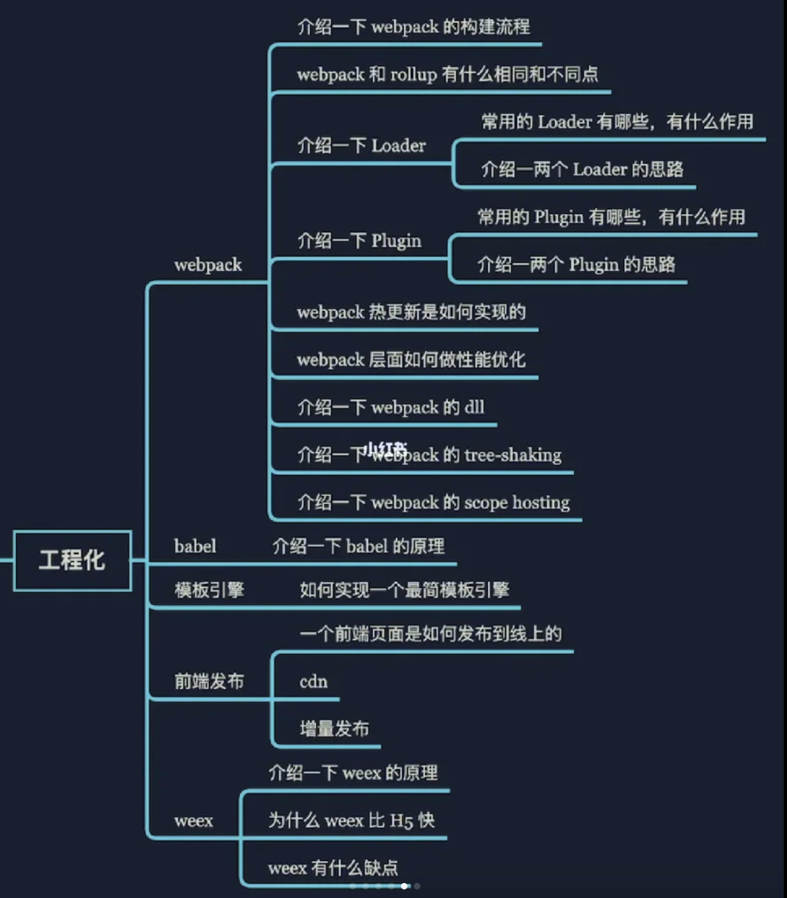
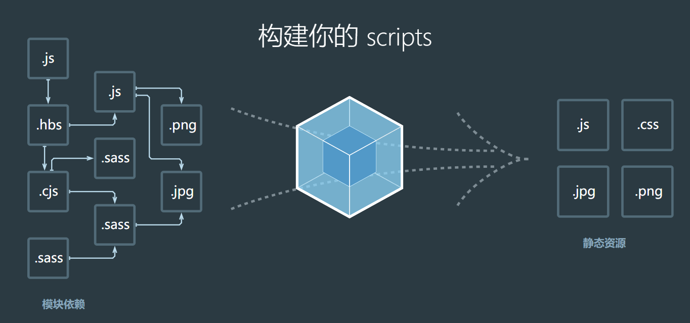

# Webpack
(https://webpack.docschina.org/concepts/modules/)
本质上，webpack是一个用于现代 JavaScript 应用程序的静态模块打包工具

当 webpack处理应用程序时，它会在内部从一个或多个入口点构建一个依赖图（dependency graph），然后将你项目中所需的每一个模块组合成一个或多个 bundles，它们均为静态资源，用于展示你的内容。Webpack认为一切都是模块，JS文件、CSS文件、jpg/png图片等等都是模块。

通俗来讲：找出模块之间的依赖关系，按照一定的规则把这些模块组织合并为一个JavaScript文件。



## loader
### webpack.config.js
```javascript
//node中自带的模块，用来处理文件路径
const path = require('path');//引入文件
const toml = require('toml');
const yaml = require('yamljs');
const json5 = require('json5');

 module.exports = {//导出
 //指定要处理的js（入口js文件）
   entry: './src/index.js',
   //指定文件输出的配置
   output: {
    //打包输出的文件名
     filename: 'bundle.js',
     //指定打包输出的路径
    //__dirname：Node.js中指向被执行js文件的绝对路径
     path: path.resolve(__dirname, 'dist'),
     //在每次构建前清理 /dist 文件夹，这样只会生成用到的文件
     clean: true
   },
   module: {
     rules: [
       {
         test: /\.css$/i,
         use: ['style-loader', 'css-loader'],
       },
       {
         test: /\.(png|svg|jpg|jpeg|gif)$/i,
         type: 'asset/resource',
       },
       {
         test: /\.(woff|woff2|eot|ttf|otf)$/i,
         type: 'asset/resource',
       },
       {
         test: /\.(csv|tsv)$/i,
         use: ['csv-loader'],
       },
       {
         test: /\.xml$/i,
         use: ['xml-loader'],
       },
    //    通过使用 自定义 parser 替代特定的 webpack loader，
    // 可以将任何 toml、yaml 或 json5 文件作为 JSON 模块导入。
      {
        test: /\.toml$/i,
        type: 'json',
        parser: {
          parse: toml.parse,
        },
      },
      {
        test: /\.yaml$/i,
        type: 'json',
        parser: {
          parse: yaml.parse,
        },
      },
      {
        test: /\.json5$/i,
        type: 'json',
        parser: {
          parse: json5.parse,
        },
      },
     ],
   },
 };
```

### 使用方式
1. 在配置文件webpack.config.js中配置：如上
2. 通过命令行参数方式
    `webpack --module-bind 'txt=raw-loader'`
3. 通过内联使用
   `import txt from 'raw-loader!./file.txt'`
### 常用loader
- 样式：style-loader、css-loader、less-loader、sass-loader等
- 文件：raw-loader、file-loader 、url-loader等
  - raw-loader: 可以将文件以字符串的形式返回
  - url-loader: 可以将小于配置limit大小的文件转换成内敛Data Url的方式，减少请求。
- 编译：babel-loader、coffee-loader 、ts-loader等
- 校验测试：mocha-loader、jshint-loader 、eslint-loader等

## Plugin
loader 用于转换某些类型的模块，而插件则可以用于执行范围更广的任务。包括：**打包优化，资源管理，注入环境变量**。

- 首先webpack内置`UglifyJsPlugin`，压缩和混淆代码。
- webpack内置`CommonsChunkPlugin`，提高打包效率，将**第三方库**和**业务代码**分开打包。
- `ProvidePlugin`：自动加载模块，代替require和import
  ```javascript
  new webpack.ProvidePlugin({
    $: 'jquery',
    jQuery: 'jquery'
  })复制代码
  ```
- `html-webpack-plugin`可以根据模板自动生成**html代码**，并**自动引用css和js文件**
- extract-text-webpack-plugin 将**js文件**中引用的样式**单独抽离成css文件**

### 使用方式
想要使用一个插件，你只需要 require() 它，然后把它添加到 plugins 数组中。
1. webpack.config.js
   ```javascript
    const HtmlWebpackPlugin = require('html-webpack-plugin');
    const webpack = require('webpack'); // 访问内置的插件
    const path = require('path');

    module.exports = {
      entry: './path/to/my/entry/file.js',
      output: {
        filename: 'my-first-webpack.bundle.js',
        path: path.resolve(__dirname, 'dist'),
      },
      module: {
        rules: [
          {
            test: /\.(js|jsx)$/,
            use: 'babel-loader',
          },
        ],
      },
      plugins: [
        //ProgressPlugin 用于自定义编译过程中的进度报告
        new webpack.ProgressPlugin(),
        //HtmlWebpackPlugin 将生成一个 HTML 文件，并在其中使用 script 引入一个名为 my-first-webpack.bundle.js 的 JS 文件。
        new HtmlWebpackPlugin({ template: './src/index.html' }),
      ],
    };
   ```
2. Node API 方式:在使用 Node API 时，还可以通过配置中的 plugins 属性传入插件。
   ```javascript
    const webpack = require('webpack'); // 访问 webpack 运行时(runtime)
    const configuration = require('./webpack.config.js');

    let compiler = webpack(configuration);

    new webpack.ProgressPlugin().apply(compiler);

    compiler.run(function (err, stats) {
      // ...
    });
   ```