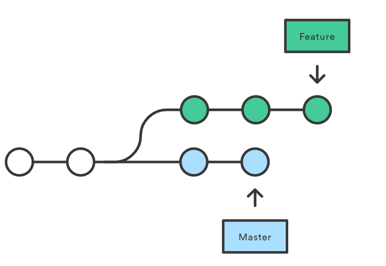
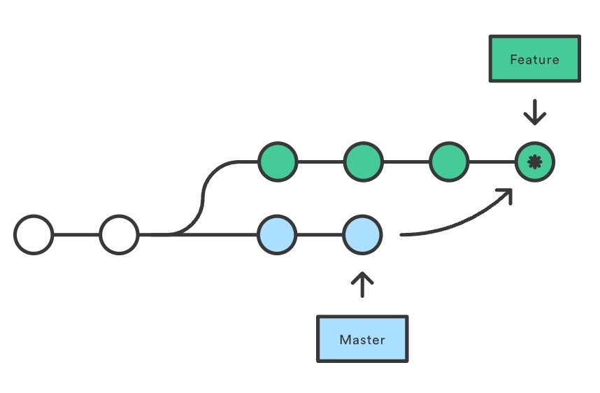
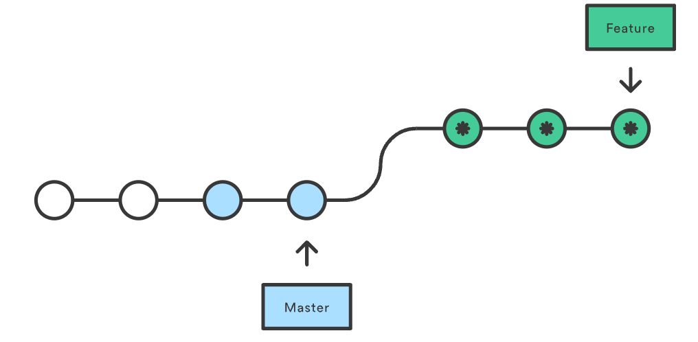

# Webpack
(https://webpack.docschina.org/concepts/modules/)
本质上，webpack是一个用于现代 JavaScript 应用程序的静态模块打包工具

当 webpack处理应用程序时，它会在内部从一个或多个入口点构建一个依赖图（dependency graph），然后将你项目中所需的每一个模块组合成一个或多个 bundles，它们均为静态资源，用于展示你的内容。Webpack认为一切都是模块，JS文件、CSS文件、jpg/png图片等等都是模块。

通俗来讲：找出模块之间的依赖关系，按照一定的规则**把这些模块组织合并为一个JavaScript文件**。(./img/2023-01-20-13-51-59.png)

我们也可以通过Webpack的预处理器loader和插件plugin等进行干预，把一个 **js文件变成JS、CSS和图片** 等资源。
## import
使用这种方式，导入模块后会执行模块内容，但是并不使用其对外提供的接口。

1. `import ... from '...'` 
2. `import {name, age, add} from './b.js'`

Webpack在打包的时候，碰到import()引入的模块的时候并不会立刻把该模块内容打包到当前文件里。
1. `import('./f.js')`

- Webpack支持ES6 Module、CommonJS和AMD等模块化方法，目前常用的是ES6 Module和CommonJS。
- ES6 Module通过export**导出**模块，import … from '…'或import '…'**导入**模块。
- CommonJS通过module.exports**导出**模块，require('…')**导入**模块。
- ES6 Module通过import()函数动态**导入**模块
- CommonJS通过require.ensure动态**导入**模块，现在推荐使用import()函数动态导入模块。
## context
- context在Webpack中表示资源入口entry是从哪个目录为起点的。context的值是一个字符串，表示一个绝对路径。
- 一般我们不会去设置context，在我们没有设置context的时候，它是当前工程的根目录。
## entry
Webpack资源入口，表示它是从哪个JS文件开始打包的。Webpack要找到这个文件，是通过context和entry这两个参数。

context是一个绝对路径，是基础目录的意思。entry是一个相对路径，它与context拼接起来，就是Webpack打包的入口文件了。
##### 1. entry是**字符串**形式
字符串形式的我们已经在之前使用过了，是最简单的形式，表示打包的入口JS文件。
##### 2. entry是**数组**形式
它表示的含义是数组最后一个文件是资源的入口文件，数组其余文件会预先构建到入口文件。
```javascript
module.exports = {
  entry: ['core-js/stable', 'regenerator-runtime/runtime', './a.js'],
};

//相当于
 // a.js
import 'core-js/stable';
import 'regenerator-runtime/runtime';
// webpack.config.js
module.exports = {
  entry: './a.js',
};
```
##### 3. entry是**对象**形式
入口entry是对象形式的又称之为**多入口**配置。之前我们讲的都是单入口的配置，本质上打包后生成一个JS文件。
每个入口文件各自寻找自己依赖的文件模块打包成一个JS文件，最终得到两个JS文件。

```javascript
  var path = require('path');  
  module.exports = {
    entry: {
      app: ['core-js/stable', 'regenerator-runtime/runtime', './a.js'],
      vendor: './vendor'
    },
    output: {
      path: path.resolve(__dirname, ''),
      filename: '[name].js'
    },
    mode: 'none'
  };
```
##### 4. entry是**对象**形式
函数形式的入口，Webpack取函数返回值作为入口配置，**返回值**是上述3种之一即可。

函数形式的entry，可以用来做一些额外的逻辑处理，不过在自己搭脚手架的很少使用。
## output 
其中output就是资源出口配置项。output是一个对象，它有几个重要的属性filename、path、publicPath和chunkFilename。
### Webpack的output.filename
filename是打包后生成的资源名称.

filename除了可以是一个文件名称，也可以是相对地址如`'./js/bundle.js'`。

最终打包输出的文件是`path`绝对路径与`filename`的拼接后的地址

### Webpack的output.path
path表示资源打包后输出的位置，该位置地址要是绝对路径。如果你不设置它，webpack4默认为dist目录。
### Webpack的output.publicPath
资源访问路径

资源输出位置表示的是本次打包完成后，资源存放的磁盘位置。
1. 相对路径
   1. 以"./"或"../"等开头，表示要访问的资源以当前**页面url**作为基础路径。
   2. 以"/"开头，表示要访问的资源以当前页面的**服务器**地址作为基础路径。
2. 绝对路径
   1. output.publicPath的值以HTTP协议名称开始。一般在使用CDN的时候，因为CDN的域名与我们自己服务器的域名不一样，我们会采用这种方式。
   2. 相对协议的形式，它以 // 开头，也就是省略了前面的https:或http:。

### Webpack的output.chunkFilename
chunkFilename也是用来表示打包后生成的文件名，那它和filename有什么区别呢？

它表示的是打包过程中非入口文件的chunk名称，通常在使用异步模块的时候，会生成非入口文件的chunk。
## hash、chunkhash和contenthash区别
Webpack在根据文件内容计算出一个特殊字符串的时候，使用的就是hash算法，这个特殊字符串一般叫做hash值。

我们一般取计算出的特殊字符串的前八位作为文件名的一部分，因为hash算法计算出的前八位基本可以保证唯一性了。

在Webpack里，我们通常用[hash:8]这种形式表示取hash值的前八位，例如在Webpack配置文件中，我们用 `filename: 'jQuery-[hash:8].js'`。

首先，hash、chunkhash和contenthash这三者都是根据文件内容计算出的hash值，只是它们所计算的文件不一样。
1. hash是根据打包中**所有的文件**计算出的hash值。在一次打包中，所有出口文件的filename获得的[hash]都是一样的。

2. chunkhash是根据打包过程中**当前chunk**计算出的hash值。如果Webpack配置是**多入口**配置，那么通常会**生成多个chunk**，每个chunk对应的出口filename获得的[chunkhash]是不一样的。这样可以保证打包后每一个JS文件名都不一样（这么说不太严谨，但有助于理解）。

3.contenthash有点像chunkhash，是根据打包时CSS内容计算出的hash值。一般在使用提取CSS的插件的时候，我们使用contenthash。
## loader
## 关键配置
配置loader是在Webpack配置项`module`里进行的
- Module配置项里最重要的一个配置子项就是`rules`了，它定义了loader的处理法则。
### webpack.config.js
```javascript
//node中自带的模块，用来处理文件路径
const path = require('path');//引入文件
const toml = require('toml');
const yaml = require('yamljs');
const json5 = require('json5');

 module.exports = {//导出
 //指定要处理的js（入口js文件）
   entry: './src/index.js',
   //指定文件输出的配置
   output: {
    //打包输出的文件名
     filename: 'bundle.js',
     //指定打包输出的路径
    //__dirname：Node.js中指向被执行js文件的绝对路径
     path: path.resolve(__dirname, 'dist'),
     //在每次构建前清理 /dist 文件夹，这样只会生成用到的文件
     clean: true
   },
   module: {
     rules: [
       {
         test: /\.css$/i,
         use: ['style-loader', 'css-loader'],
       },
       {
         test: /\.(png|svg|jpg|jpeg|gif)$/i,
         type: 'asset/resource',
       },
       {
        test: /\.jpg$/,
        use: 'file-loader'
       },
       {
         test: /\.(woff|woff2|eot|ttf|otf)$/i,
         type: 'asset/resource',
       },
       {
         test: /\.(csv|tsv)$/i,
         use: ['csv-loader'],
       },
       {
         test: /\.xml$/i,
         use: ['xml-loader'],
       },
    //    通过使用 自定义 parser 替代特定的 webpack loader，
    // 可以将任何 toml、yaml 或 json5 文件作为 JSON 模块导入。
      {
        test: /\.toml$/i,
        type: 'json',
        parser: {
          parse: toml.parse,
        },
      },
      {
        test: /\.yaml$/i,
        type: 'json',
        parser: {
          parse: yaml.parse,
        },
      },
      {
        test: /\.json5$/i,
        type: 'json',
        parser: {
          parse: json5.parse,
        },
      },
     ],
   },
 };
```

### 使用方式
1. 在配置文件webpack.config.js中配置：如上
2. 通过命令行参数方式
    `webpack --module-bind 'txt=raw-loader'`
3. 通过内联使用
   `import txt from 'raw-loader!./file.txt'`
### 常用loader
- 样式：style-loader、css-loader、less-loader、sass-loader等
- 文件：raw-loader、file-loader 、url-loader等
  - raw-loader: 可以将文件以字符串的形式返回
  - url-loader: 可以将小于配置limit大小的文件转换成内敛Data Url的方式，减少请求。
- 编译：babel-loader、coffee-loader 、ts-loader等
- 校验测试：mocha-loader、jshint-loader 、eslint-loader等
### rules 内参数
#### exclude && include
如果我们有一些文件不想被正则匹配到的loader处理，那么我们可以配置exclude项，exclude的中文意思是**排除**。

Exclude的值是**字符串**或**正则表达式**，字符串需要是**绝对路径**。

```javascript
//除了node_modules文件夹，对所有的以js为后缀名的文件模块使用babel-loader处理。
  rules: [{
    test: /\.js$/,
    use: ['babel-loader'],
    exclude: /node_modules/,
  }]
```
Include表示的意思正好与exclude相反，它表示只对匹配到的文件处理。

```javascript
//只对src目录下以js为后缀名的文件模块使用babel-loader处理。
  rules: [{
    test: /\.js$/,
    use: ['babel-loader'],
    include: /src/,
  }]
```
#### Enforce
后缀名类型的文件，我们可以使用多个loader处理，例如处理CSS时使用`['style-loader', 'css-loader']`，loader的处理顺序是数组项从后向前。

Webpack推荐使用的enforce项有两个，'pre'和'post'。

Pre表示这个loader在所有的loader之前执行，post表示这个loader在所有的loader执行后再执行。
```javascript
//这个配置表示在所有处理js文件模块loader之前执行eslint-loader，这样我们可以在js代码未被处理的时候就进行eslint代码规范校验。
  rules: [{
    test: /\.js$/,
    use: ['eslint-loader'],
    enforce: 'pre',
    exclude: /node_modules/,
  }]
```
#### resource与issuer
在Webpack中被加载的模块我们称之为resource，而实施加载的模块我们称之为issuer。

我们在一个JS模块里引入了CSS模块，那么JS模块就是issuer，CSS模块就是resource。

在我们之前使用过的loader配置里，其实已经使用了resource，那些test和exclude等配置是使用了默认resource。下面的配置是等效的

```javascript
//
  rules: [{
    test: /\.js$/,
    use: ['eslint-loader'],
    enforce: 'pre',
    exclude: /node_modules/,
  }]
// 下面的配置是等效的
   rules: [{
    use: ['style-loader', 'css-loader'],
    resource: {
      test: /\.css$/,
      exclude: /node_modules/
    }
  }]
```

如果想指定只有**src目录下的JS引用的CSS**可以被相应的loader处理，那么可以配置issuer，下面的配置是等效的。

```javascript
//
  rules: [{
    test: /\.css$/,
    use: ['style-loader', 'css-loader'],
    exclude: /node_modules/,
    issuer: {
      test: /\.js$/,
      include: /src/
    }
  }]
// 下面的配置是等效的
   rules: [{
    use: ['style-loader', 'css-loader'],
    resource: {
      test: /\.css$/,
      exclude: /node_modules/
    },
    issuer: {
      test: /\.js$/,
      include: /src/
    }
  }]
```
## Plugin
顾名思义，插件是用来扩展Webpack功能的

loader 用于转换某些类型的模块，而插件则可以用于执行范围更广的任务。包括：**打包优化，资源管理，注入环境变量**。

- 首先webpack内置`UglifyJsPlugin`，压缩和混淆代码。
- webpack内置`CommonsChunkPlugin`，提高打包效率，将**第三方库**和**业务代码**分开打包。
- `ProvidePlugin`：自动加载模块，代替require和import
  ```javascript
  new webpack.ProvidePlugin({
    $: 'jquery',
    jQuery: 'jquery'
  })复制代码
  ```
- `html-webpack-plugin`可以根据模板自动生成**html代码**，并**自动引用css和js文件**
- extract-text-webpack-plugin 将**js文件**中引用的样式**单独抽离成css文件**

### 使用方式
想要使用一个插件，你只需要 require() 它，然后把它添加到 plugins 数组中。

plugins是一个数组，每一个数组元素是一个插件。
1. webpack.config.js
   ```javascript
    const HtmlWebpackPlugin = require('html-webpack-plugin');
    const webpack = require('webpack'); // 访问内置的插件
    const path = require('path');

    module.exports = {
      entry: './path/to/my/entry/file.js',
      output: {
        filename: 'my-first-webpack.bundle.js',
        path: path.resolve(__dirname, 'dist'),
      },
      module: {
        rules: [
          {
            test: /\.(js|jsx)$/,
            use: 'babel-loader',
          },
        ],
      },
      plugins: [
        //ProgressPlugin 用于自定义编译过程中的进度报告
        new webpack.ProgressPlugin(),
        //HtmlWebpackPlugin 将生成一个 HTML 文件，并在其中使用 script 引入一个名为 my-first-webpack.bundle.js 的 JS 文件。
        new HtmlWebpackPlugin({ template: './src/index.html' }),
      ],
    };
   ```
2. Node API 方式:在使用 Node API 时，还可以通过配置中的 plugins 属性传入插件。
   ```javascript
    const webpack = require('webpack'); // 访问 webpack 运行时(runtime)
    const configuration = require('./webpack.config.js');

    let compiler = webpack(configuration);

    new webpack.ProgressPlugin().apply(compiler);

    compiler.run(function (err, stats) {
      // ...
    });
   ```
#### 1. clean-webpack-plugin
是一个清除文件
在每次打包后，磁盘空间会存有打包后的资源，在**再次打包**的时候，我们需要先把本地已有的打包后的资源清空，来减少它们对磁盘空间的占用。

配置该插件的时候通过 new CleanWebpackPlugin()就完成配置了，我们不传入任何参数，该插件会默认使用output.path目录作为需要清空的目录，会把该目录下的所有文件目录以及文件都清除。

#### 2.copy-webpack-plugin
在我们使用Webpack的时候，有一些本地资源，例如图片和音视频，在打包过程中没有任何模块使用到它们，但我们却想要把它们放在打包后的资源输出目录。

```javascript
  var path = require('path');
  var CopyPlugin = require("copy-webpack-plugin");
  module.exports = {
    entry: './a.js',
    output: {
      path: path.resolve(__dirname, 'dist'),
      filename: 'bundle.js'
    },
    plugins:[
     new CopyPlugin({
       patterns: [
         { 
          from: path.resolve(__dirname, 'src/img/'), 
          to: path.resolve(__dirname, 'dist/image/') 
          },
       ],
     }),
    ],
    mode: 'none'
  };
```
# git
## 常见简单操作
- git checkout name 切换分支

## HEAD
- HEAD == current branch
  - HEAD~1 / HEAD^  指这次更新的前一次
  - ~(tilde）可以指定HEAD之前的提交记录
  - 合并分支会有多个根节点，您可以用^(caret) 来指定使用哪个为根节点。


## stash
同时进行两个项目的话很实用

作用：还**未提交的修改**内容以及**新添加的文件**，**留在**索引区域或工作树的情况下， stash暂时保存修改内容后再checkout

- stash是临时保存文件修改内容的区域。
- stash可以暂时保存工作树和索引里还没提交的修改内容，您可以事后再取出暂存的修改，应用到原先的分支或其他的分支上。

## 合并分支 rebase & merge
关于 `git rebase` ，首先要理解的是它解决了和 `git merge` 同样的问题。这两个命令都旨在将更改从一个分支合并到另一个分支，但二者的合并方式却有很大的不同。

### merge
使用merge可以合并多个**历史记录**的流程。
- 最简单的方式是通过以下命令将 master 分支合并到 feature 分支中：
```
git checkout feature
git merge master

你可以将其浓缩为一行命令：
git merge feature master
```
这会在 feature 分支中创建一个新的 merge commit，它将两个分支的历史联系在一起，请看如下所示的分支结构：


使用 merge 是很好的方式，因为它是一种 **非破坏性的** 操作。**现有分支不会**以任何方式**被更改**。这避免了 rebase 操作所产生的潜在缺陷（下面讨论）。

这也意味着 feature 分支每次需要合并上游更改时，它都将产生一个**额外的合并提交**。

### Rebase
```
git checkout feature
git rebase master
```
- 会将整个 feature 分支移动到 master 分支的顶端，从而有效地整合了所有 master 分支上的提交。
- 但是，与 merge 提交方式不同，rebase 通过为原始分支中的每个提交创建全新的 commits 来 **重写** 项目历史记录。
- 没有了额外合并的提交


需要权衡其「安全性」和「可追溯性」
- rebase 会丢失合并提交的上下文， 你也就无法看到上游更改是何时合并到 feature 中的。

# Vite
# Babel
Babel是一个工具集，主要用于将ES6版本的JavaScript代码转为ES5等**向后兼容**的JS代码，从而可以运行在低版本浏览器或其它环境中。

Babel依赖Node.js

我们提到Babel版本的时候，通常是指@babel/core这个Babel核心包的版本。

- Babel**7**的npm包都是放在babel域下的，即在安装npm包的时候，我们是安装@babel/这种方式，例如@babel/cli、@babel/core等。
- 而在Babel**6**，我们安装的包名是babel-cli，babel-core等。
  
## polyfill
- 从babel7.4版本开始，Babel官方已经不推荐再使用@babel/polyfill，这也包括官方的polyfill.js库文件。@babel/polyfill本身其实就是两个npm包的集合：core-js与regenerator-runtime。
- 因此从2019年年中开始，我们的新项目都应该使用core-js和regenerator-runtime这两个包。
- 这两种方法，都是把两个npm包**全部**都引入到了我们的前端**打包后的文件**里了，对于部分引入的方法，我们将在后面两节进行讲解。
- 提到polyfill这个词，一般就是指我们开发过程需要对环境的缺失API特性提供支持。

### 4. 在前端工程的入口文件里引入core-js/stable与regenerator-runtime/runtime
该方法在分类上属于使用未构建的需要安装npm包@babel/polyfill的组合子包的一类，我们仍以目前业界最为流行的webpack构建工具为例，讲述该方法。后续默认是使用webpack。

该方法需要我们单独安装单独安装`core-js`与`regenerator-runtime`这两个**npm包**，这种方式`core-js`是默认是`3.x.x`版本。

需要注意的是，我们使用该方法的时候，不能再安装@babel/polyfill了。因为@babel/polyfill在安装的时候，会自动把core-js与regenerator-runtime这两个依赖安装上了，而@babel/polyfill使用的core-js已经锁死为2.x.x版本了。core-js的2.x.x版本里并没有stable文件目录，所以安装@babel/polyfill后再引入core-js/stable会报错。

```js
  import "core-js/stable";
  import "regenerator-runtime/runtime";
```
```
 npm install --save core-js regenerator-runtime
```
### 7. 在前端工程构建工具的配置文件入口里引入core-js/stable regenerator-runtime/runtime

webpack.config.js的entry项数组的前两项改为core-js/stable和regenerator-runtime/runtime。

```js
const path = require('path');
module.exports = {
  entry: ['core-js/stable', 'regenerator-runtime/runtime', './a.js'],
  output: {
    filename: 'b.js',
    path: path.resolve(__dirname, '')
  },
  mode: 'development'
};
```

## @babel/preset-env
@babel/preset-env是整个Babel大家族最重要的一个preset。不夸张地说，所有配置项仅需要它自己就可以完成现代JS工程所需要的所有转码要求。

@babel/preset-env的参数项，数量有10多个，但大部分我们要么用不到，要么已经或将要弃用。这里建议大家掌握重点的几个参数项，有的放矢。

重点要学习的参数项有targets、useBuiltIns、modules和corejs这四个

对于preset，当我们不需要对其设置参数的时候，其写法是只需要把该preset的名字放入presets对于的数组里即可，例如
```js
module.exports = {
  presets: ["@babel/env"],//@babel/env是@babel/preset-env的简写。
  plugins: []
}
```
- 如果需要对某个preset**设置参数**，应该再包裹一层数组
  1. 第一项是该preset字符串，
  2. 第二项是该preset的参数对象。
- 如果该preset没有参数需要设置，则数组第二项可以是空对象或者不写第二项。以下几种写法是等价的：

```js
module.exports = {
  presets: ["@babel/env"],
  plugins: []
}

module.exports = {
  presets: [["@babel/env", {}]],
  plugins: []
}

module.exports = {
  presets: [["@babel/env"]],
  plugins: []
}
```

我们的Babel也可以使用browserslist，如果你使用了@babel/preset-env这个预设，此时Babel就会读取browserslist的配置。

如果我们的@babel/preset-env不设置任何参数，Babel就会完全根据browserslist的配置来做语法转换。如果没有browserslist，那么Babel就会把所有ES6的语法转换成ES5版本。

## @babel/plugin-transform-runtime
@babel/plugin-transform-runtime有三大作用：

1. 自动移除语法转换后内联的辅助函数（inline Babel helpers），使用@babel/runtime/helpers里的辅助函数来替代；

2. 当代码里使用了core-js的API，自动引入@babel/runtime-corejs3/core-js-stable/，以此来替代全局引入的core-js/stable;

3. 当代码里使用了Generator/async函数，自动引入@babel/runtime/regenerator，以此来替代全局引入的regenerator-runtime/runtime

```js
  {
    "plugins": [
      "@babel/plugin-transform-runtime"
    ]
  }

    // 是上方的默认值
  { 
    "plugins": [
      [
        "@babel/plugin-transform-runtime",
        {
          "helpers": true, //设置是否要自动引入辅助函数包
          "corejs": false, //前端业务项目里，我们一般对corejs取false，即不对Promise这一类的API进行转换。而在开发JS库的时候设置为2或3
          "regenerator": true,
          "useESModules": false,//是否使用ES6的模块化用法.用webpack一类的打包工具的时候，我们可以设置为true，以便做静态分析。
          "absoluteRuntime": false, //用来自定义@babel/plugin-transform-runtime引入@babel/runtime/模块的路径规则
          "version": "7.0.0-beta.0"
        }
      ]
    ]
  }
```

1.要使用@babel/plugin-transform-runtime插件，其实只有一个npm包是必须要装的，那就是它自己@babel/plugin-transform-runtime。
对于@babel/runtime及其进化版@babel/runtime-corejs2、@babel/runtime-corejs3，我们只需要根据自己的需要安装一个。

如果你不需要对core-js做API转换，那就安装@babel/runtime并把corejs配置项设置为false即可。

如果你需要用core-js2做API转换，那就安装@babel/runtime-corejs2并把corejs配置项设置为2即可。

如果你需要用core-js3做API转换，那就安装@babel/runtime-corejs3并把corejs配置项设置为3即可。