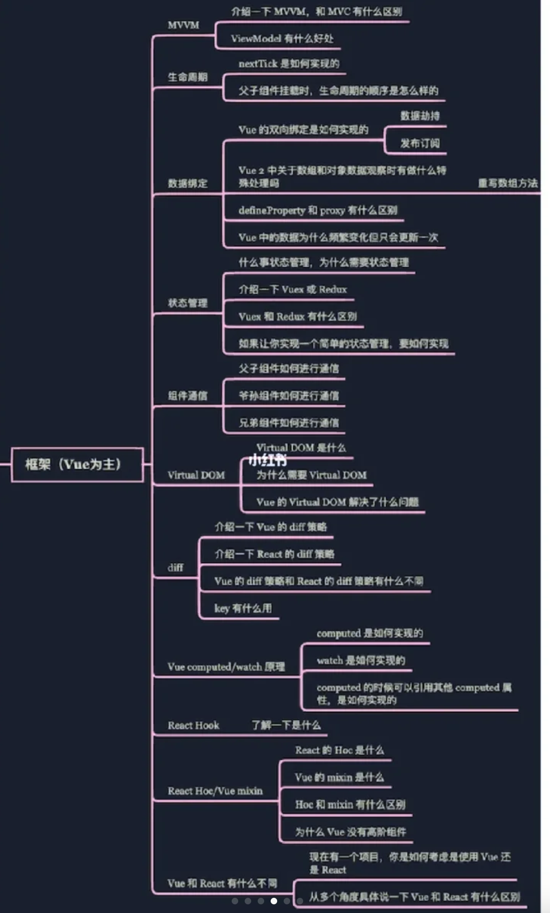
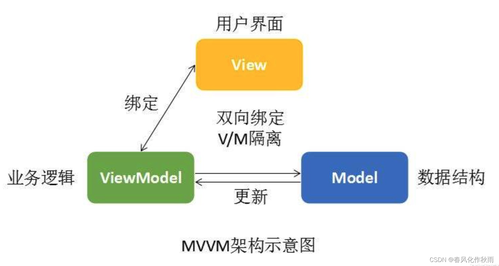
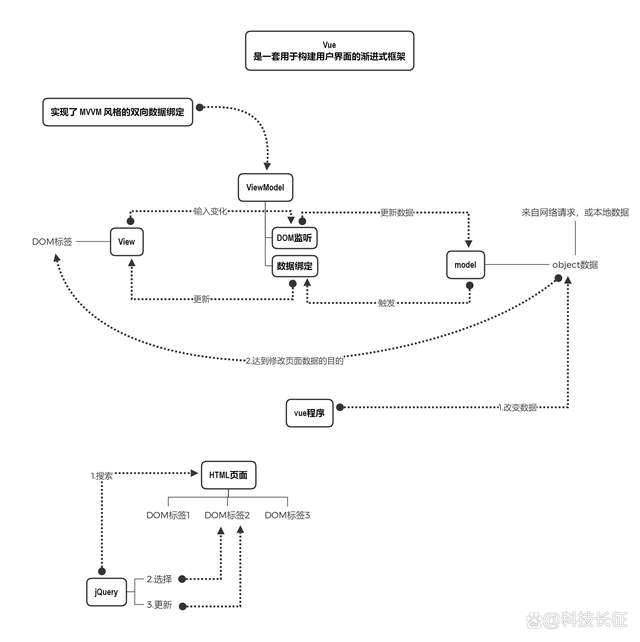
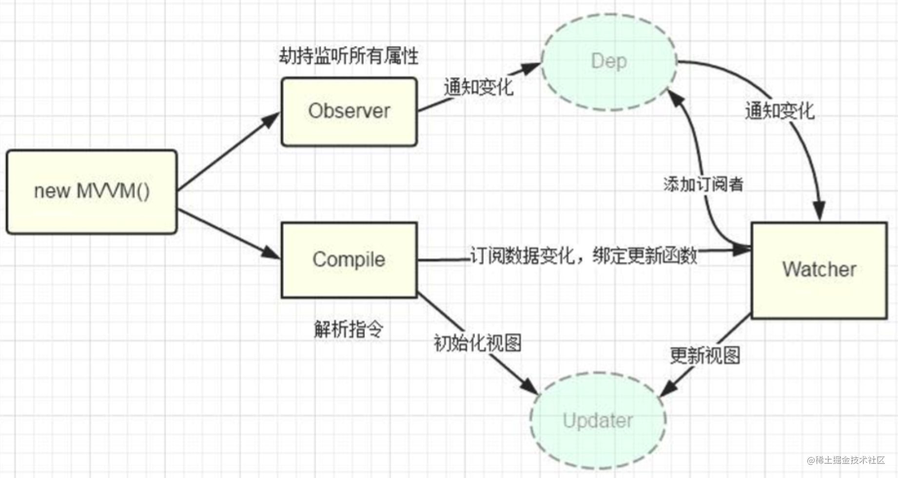
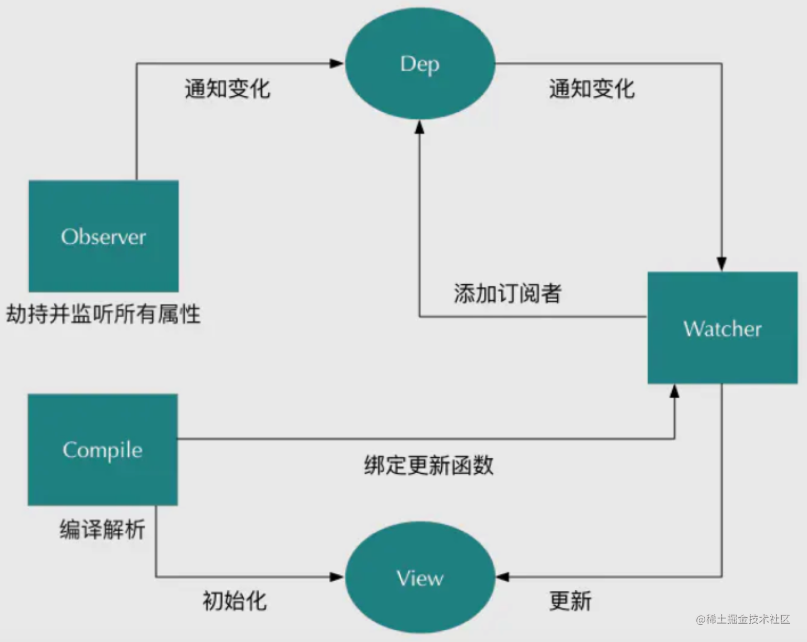
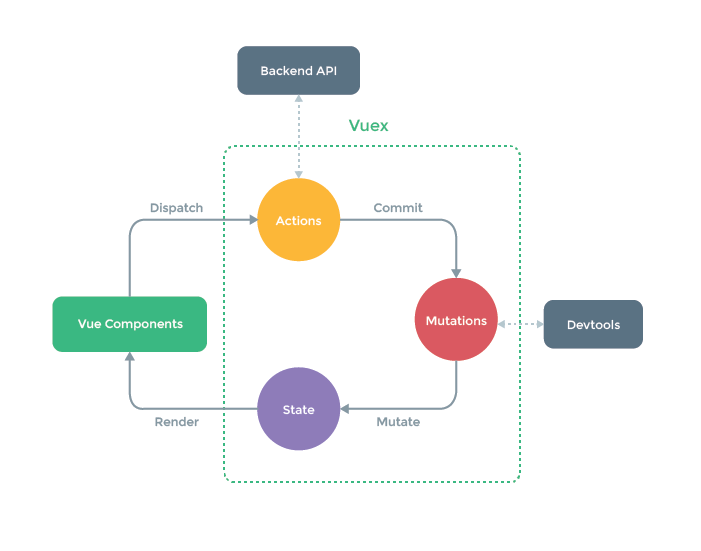
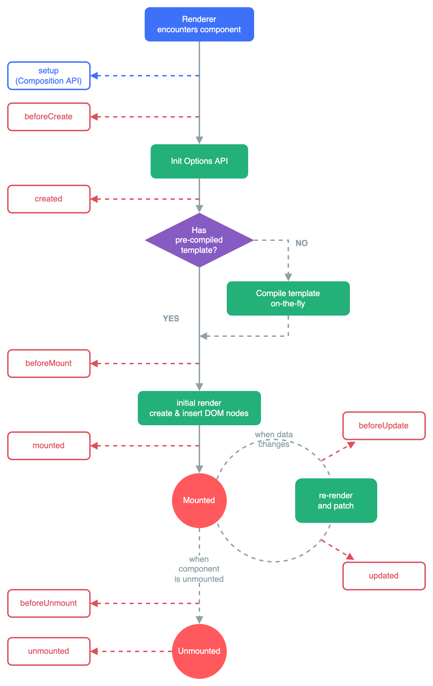

# vue

是js框架
const vm = new Vue()
## Vue.nextTick()

当数据更新了，在dom中渲染后，自动执行该函数，

Vue生命周期的created()钩子函数进行的DOM操作一定要放在Vue.nextTick()的回调函数中，原因是在created()钩子函数执行的时候DOM 其实并未进行任何渲染，而此时进行DOM操作无异于徒劳，所以此处一定要将DOM操作的js代码放进Vue.nextTick()的回调函数中。与之对应的就是mounted钩子函数，因为该钩子函数执行时所有的DOM挂载已完成。
## Options
1. 数据
   - data, props, propsData, computed, methods, watch
2. DOM
   - el 
     - 挂载点
     - 可以用$mount代替
   - template
   - render, renderError
3. 生命周期钩子
4. 资源
   - directives, filters, components

### 为什么data是函数？
1. 防止data复用：vue中组件是用来复用的，为了防止data复用，将其定义为函数。
2. data独立性：vue组件中的data数据都应该是相互隔离，互不影响的，组件每复用一次，data数据就应该被复制一次，之后，当某一处复用的地方组件内data数据被改变时，其他复用地方组件的data数据不受影响，就需要通过data函数返回一个对象作为组件的状态。
3. 作用域；
4. js的特性。

总结来说，如果data是一个函数的话，这样每复用一次组件，就会返回一份新的data(类似于给每个组件实例创建一个私有的数据空间，让各个组件实例维护各自的数据)。

当使用组件时，我们希望vue组件中的data数据都是互相隔离互不影响的。组件每复用一次，data数据就应该被复制一次。当我们将组件中的data写成一个函数，数据以函数返回值形式定义。这样每复用一次组件，就会返回一份新的data，拥有自己的作用域。

但是当我们组件的data单纯的写成对象形式，这些实例用的是同一个构造函数，由于JavaScript的特性所导致，所有的组件实例共用了一个data，就会造成一个变了全都会变的结果。

## keep-alive
[keep-alive文档](https://v2.cn.vuejs.org/v2/api/#keep-alive)
设计有A、B、C三个页面，试想这样一个场景需求：

- 离开B页面进入C页面，缓存B页面数据（keepAlive: true）
- 离开B页面进入A页面，不缓存B页面数据（keepAlive: false)

keep-alive 包裹动态组件时，会缓存不活动的组件实例，而不是销毁它们。和 transition 相似，keep-alive 是一个抽象组件：它自身不会渲染一个 DOM 元素，也不会出现在父组件链中。

当组件在 `<keep-alive> `内被切换，它的 activated 和 deactivated 这两个生命周期钩子函数将会被对应执行。

- Props：
  - include - 字符串或正则表达式。只有名称匹配的组件会被缓存。
  - exclude - 字符串或正则表达式。任何名称匹配的组件都不会被缓存。
  - max - 数字。最多可以缓存多少组件实例。

[keep-alive使用实例](https://zhuanlan.zhihu.com/p/372621917)

## 监听

### computed

### watch

```javascript
data () {
  food: 0
},
watch: {
 // 第一种方式：监听整个对象，每个属性值的变化都会执行handler
 // 注意：属性值发生变化后，handler执行后获取的 newVal 值和 oldVal 值是一样的
    food: {
        // 每个属性值发生变化就会调用这个函数
        handler(newVal, oldVal) {
            console.log('oldVal:', oldVal)
            console.log('newVal:', newVal)
        },
        // 立即处理 进入页面就触发
        immediate: true,
        // 深度监听 属性的变化
        //对象和数组都是引用类型，引用类型变量存的是地址，地址没有变，所以不会触发watch。这时我们需要进行深度监听，就需要加上一个属性 deep，值为 true
        deep: true
    },
    // 第二种方式：监听对象的某个属性，被监听的属性值发生变化就会执行函数
    // 函数执行后，获取的 newVal 值和 oldVal 值不一样
    'food.name'(newVal, oldVal) {
        console.log('oldVal:', oldVal)   // 冰激凌
        console.log('newVal:', newVal)   // 棒棒糖
    }
}
```

### computed watch对比

1. computed支持**缓存**，只有**依赖数据发生改变**,才会重新进行计算;而watch**不支持缓存**，**数据变,直接会触发**相应的操作
2. computed**不支持异步**，当computed内有异步操作时无效，无法监听数据的变化，而watch支持异步
3. computed属性值会默认走缓存，计算属性是基于它们的响应式依赖进行缓存的，也就是**基于data中声明过或者父组件传递的props中的数据通过计算得到的值**;而watch监听的函数接收两个参数，第一个参数是最新的值，第二个参数是输入之前的值
4. 如果一个属性是由其它属性计算而来的，这个属性依赖其它属性，多对一或者一对一，一般用computed；而当一个属性发生变化时，需要执行对应的操作，一对多，一般用watch

## 绑定

单向绑定 v-bind:
双向绑定 v-model@
事件绑定 v-on:click="methods"
## Class 与 Style 绑定
### Class
```html
<div
  class="static"
  :class="{ active: isActive, 'text-danger': hasError }"
></div>
```
active和‘text-danger’都是类名，是否绑定分别取决于isActive和hasError的布尔值

绑定的对象并不一定需要写成内联字面量的形式，也可以直接绑定一个**对象**：
```html
<div :class="classObject"></div>
```
```javascript
data() {
  return {
    classObject: {
      active: true,
      'text-danger': false
    }
  }
}

```

我们也可以绑定一个返回对象的**计算属性**。

```javascript
data() {
  return {
    isActive: true,
    error: null
  }
},
computed: {
  classObject() {
    return {
      active: this.isActive && !this.error,
      'text-danger': this.error && this.error.type === 'fatal'
    }
  }
}
```
也可以绑定**数组**
```html
<div :class="[activeClass, errorClass]"></div>
```
```javascript
data() {
  return {
    activeClass: 'active',
    errorClass: 'text-danger'
  }
}

```
渲染的结果： `<div class="active text-danger"></div>`

也可以使用**三元表达式**
```html
<div :class="[isActive ? activeClass : '', errorClass]"></div>
```
`errorClass` 会一直存在，但 `activeClass` 只会在 `isActive` 为真时才存在

因此也可以在**数组中嵌套对象**：
```html
<div :class="[{ active: isActive }, errorClass]"></div>
```
### style
```html
<div :style="{ color: activeColor, fontSize: fontSize + 'px' }"></div>
```
```javascript
data() {
  return {
    activeColor: 'red',
    fontSize: 30
  }
}
```
也可以
```html
<div :style="{ 'font-size': fontSize + 'px' }"></div>
```

也能直接绑定一个样式**对象**
```html
<div :style="styleObject"></div>
```
```javascript
data() {
  return {
    styleObject: {
      color: 'red',
      fontSize: '13px'
    }
  }
}
```
也可以使用返回样式对象的计算属性

我们还可以给 :style 绑定一个包含多个样式对象的数组。这些对象会被合并后渲染到同一元素上：
```html
<div :style="[baseStyles, overridingStyles]"></div>
```
## 双向绑定实现

### MVVM


是一个软件架构设计模式
Model-View-ViewModel的简写，是M-V-VM三部分组成.

它本质上是MVC的改进版本

能够实现**前端开发**和**后端业务逻辑的分离**，

- model指数据模型，负责后端业务逻辑处理，
- view指视图层，负责前端整个用户界面的实现，
- viewModel则负责**view层和model层的交互**

关注model的变化，让MVVM框架利用自己的机制**自动更新DOM**，也就是所谓的**数据-视图分离**，数据不会影响视图。



### 实现mvvm的双向绑定



- 数据监听器Observer，能够对数据对象的所有**属性进行监听**，如有变动可拿到最新值并**通知订阅者**
- 指令解析器Compile，对每个**元素节点**的指令进行扫描和解析，根据指令模板**替换数据**，以及绑定相应的更新函数
- Watcher，作为连接Observer和Compile的桥梁，能够订阅并收到每个属性变动的通知，执行指令绑定的相应回调函数，从而更新视图
- mvvm入口函数，整合以上三者


### 原理概述

常见的基于数据劫持的双向绑定有两种实现

1. 一个是目前Vue在用的 `Object.defineProperty`
2. 一个是ES2015中新增的 `Proxy`，而在**Vue3.0版本**后加入Proxy从而代替Object.defineProperty

数据劫持: vue.js 则是采用数据劫持结合发布者-订阅者模式的方式，通过Object.defineProperty() 来劫持各个属性的 `setter`，`getter`，在数据变动时发布消息给订阅者，触发相应的监听回调。

### observer.js

```javascript
 /**
  * 把一个对象的每一项都转化成可观测对象
  * @param { Object } obj 对象
  */
 function observable (obj) {
  if (!obj || typeof obj !== 'object') {
         return;
     }
  let keys = Object.keys(obj);
  keys.forEach((key) =>{
   defineReactive(obj,key,obj[key])
  })
  return obj;
 }
 /**
  * 使一个对象转化成可观测对象
  * @param { Object } obj 对象
  * @param { String } key 对象的key
  * @param { Any } val 对象的某个key的值
  */
 function defineReactive (obj,key,val) {
  let dep = new Dep();
  Object.defineProperty(obj, key, {
   get(){
    dep.depend();
    console.log(`${key}属性被读取了`);
    return val;
   },
   set(newVal){
    val = newVal;
    console.log(`${key}属性被修改了`);
    dep.notify()                    //数据变化通知所有订阅者
   }
  })
 }
 class Dep {
  
  constructor(){
   this.subs = []
  }
  //增加订阅者
  addSub(sub){
   this.subs.push(sub);
  }
        //判断是否增加订阅者
  depend () {
      if (Dep.target) {
        this.addSub(Dep.target)
      }
  }

  //通知订阅者更新
  notify(){
   this.subs.forEach((sub) =>{
    sub.update()
   })
  }
  
 }
 Dep.target = null;

```

### watcher.js

```javascript
 class Watcher {
  constructor(vm,exp,cb){
      this.vm = vm;
      this.exp = exp;
      this.cb = cb;
      this.value = this.get();  // 将自己添加到订阅器的操作
  }
  get(){
   Dep.target = this;  // 缓存自己
         let value = this.vm.data[this.exp]  // 强制执行监听器里的get函数
         Dep.target = null;  // 释放自己
         return value;
  }
  update(){
   let value = this.vm.data[this.exp];
         let oldVal = this.value;
         if (value !== oldVal) {
                this.value = value;
                this.cb.call(this.vm, value, oldVal);
   }
 }
}

```

[Vue双向绑定原理及实现](https://www.cnblogs.com/wangjiachen666/p/9883916.html)

## **组件间通信**

### 父子组件通信

**1. props/$emit**

- `props`: 从 父组件接受数据
- `$emit`: 向父组件传送数据

```javascript
// Father.vue -->
  <Child :FatherMsg="data"  @ListenChild="ListenChild"></Child>
//
import Child from './Child';
export default {
    data() {
        return {
            data: 'I am your father',
            ChildMsg: '',
        }
    },
    components: {
        Child
    },
    methods: {
        ListenChild(data) {
            console.log("子组件传递过来的值：" , data);
            this.ChildMsg = data;
        }
    }
}
//
```

```javascript
// Child.vue -->
 <button @click="send">子组件将值传递给父组件</button>
export default {
    data() {
        return {
            data: 'I am your children',
        }
    },
    props: ['FatherMsg'],
    methods: {
      send() {
        this.$emit('ListenChild', this.data);
      }
    }
}

```

**2. ref**
父组件调用子组件中的事件方法

```javascript
// Child.vue -->
export default {
    methods: {
    childFun() {
      console.log('我是子组件的方法 childFun');
      this.msg = '我的方法被调用了'
    },
  },
}

```

```javascript
// Father.vue -->
    <Child ref="child" />
//
import Child from './Child';
export default {
    components: {
        Child
    },
    methods: {
        handleClick() {
            this.$refs.child.childFun();
        },
    },

}
//
```

除此之外，父组件还可以通过ref来引用和访问子组件。同样的，还可以使用$parent、$children、$root等 API 来分别获取父实例、子实例和根实例。
**3. $parent / $child**

this.$children 是一个数组类型，它包含所有子组件对象。父访问子

this.$parent 子访问父

### 祖孙$attrs/ $listeners

`$attrs`

1. 包含了父作用域中不被 prop 所识别 (且获取) 的特性绑定 (class 和 style 除外);
2. 当一个组件没有声明任何 prop 时，这里会包含所有父作用域的绑定 (class 和 style 除外)，并且可以通过 v-bind=“$attrs” 传入内部组件。通常配合 interitAttrs 选项一起使用。
`$listeners`
1. 包含了父作用域中的 (不含 .native 修饰器的) v-on 事件监听器。
2. 它可以通过 v-on=“$listeners” 传入内部组件。
简单来说：`$attrs` 与`$listeners`是两个对象，`$attrs`里存放的是父组件中绑定的非 Props 属性，`$listeners` 里存放的是父组件中绑定的非原生事件

```HTML
    //爷组件
    <div id="app">
      <Home :msg="msg"></Home>
    </div>
    //父组件(父组件的操作最简单，但不做就会传不过去)

    <div class="home">
      <Sun v-bind="$attrs"></Sun>
    </div>
    //孙组件

    <div class="sun">
      {{ msg }}
    </div>
    //props直接接受 
    props:{ msg:String, }

//
```

```HTML
    //爷组件
    <div id="app">
      <Home @setVal="setVal">></Home>
    </div>
    methods:{ setVal(val){ this.msg = val; } }
    //父组件(父组件的操作最简单，但不做就会传不过去)

    <div class="home">
      <Sun v-on="$listeners"></Sun>
    </div>

    //孙组件
    <div class="sun">
      <button @click="toVal">点我</button>
    </div>
    methods:{ toVal(){ this.$emit("setVal",this.msg) } }
```

### 兄弟组件

通过eventBus来做中间的桥梁，传输方通过中间组件调用 emit 传数据，接收方通过on 接受数据，两者之间的自定义属性名保持一致。

```javascript
// 传输方组件调用方式
import Bus from '@/EventBus.js'
Bus.$emit('pass-value', this.say);

// 接收方接受参数
import Bus from '@/EventBus.js'

created() {
  Bus.$on('pass-value', val => {
     this.sibilingValue = val;
  })
}
```

### 全局事件管理

### vuex



1. **State** 数据

- 读取时最好在computed中
- Vuex 通过 Vue 的插件系统将 store 实例从根组件中“注入”到所有的子组件里。
  - 子组件能通过 `this.$store.state` 访问到
  - 也可以使用`mapState`

    ``` javascript
    // 在单独构建的版本中辅助函数为 Vuex.mapState
    import { mapState } from 'vuex'

    export default {
      // ...
      computed: mapState({
        // 箭头函数可使代码更简练
        count: state => state.count,

        // 传字符串参数 'count'等同于 `state => state.count`
        countAlias: 'count',

        // 为了能够使用 `this` 获取局部状态，必须使用常规函数
        countPlusLocalState(state) {
          return state.count +  this.localCount
        }
      })
    }
    ```

    与局部计算属性混合使用时用对象展开运算符

    ``` javascript
        computed: {
          localComputed () { /* ... */ },
          // 使用对象展开运算符将此对象混入到外部对象中
          ...mapState({
            // ...
          })
        }
    ```

2. **Getter** 查询数据

- Getter 接受 `state` 作为其第一个参数，也可以接受其他 `getters` 作为第二个参数
- Getter 会暴露为 store.getters 对象，你可以以属性的形式访问这些值

    ```javascript
    const store = createStore({
      state: {
        todos: [
          { id: 1, text: '...', done: true },
          { id: 2, text: '...', done: false }
        ]
      },
      getters: {
        doneTodos (state) {
          return state.todos.filter(todo => todo.done)
        }
      }
    }) 
    ```

- 你也可以通过让 getter 返回一个函数，来实现给 getter 传参。在你对 store 里的数组进行查询时非常有用。

    ```javascript
    getters: {
      // ...
      getTodoById: (state) => (id) => {
        return state.todos.find(todo => todo.id === id)
      }
    }

    store.getters.getTodoById(2) // -> { id: 2, text: '...', done: false }
    ```

- mapGetters 辅助函数仅仅是将 store 中的 getter 映射到局部计算属性：

  ```javascript
    import { mapGetters } from 'vuex'

    export default {
    // ...
    computed: {
    // 使用对象展开运算符将 getter 混入 computed 对象中
        ...mapGetters([
        'anotherGetter',
        //如果你想将一个 getter 属性另取一个名字
        doneCount: 'doneTodosCount', 
        // ...
        ])
    }
    }
  ```

3. **Mutations** 改动State的方法

- 每个 mutation 都有一个字符串的事件类型 (type)和一个回调函数 (handler)。接受 state 作为第一个参数
- 不能直接调用一个 mutation 处理函数。需要以相应的 type 调用 store.commit 方法
- 一条重要的原则就是要记住 mutation 必须是**同步函数**。
- 可以向 store.commit 传入额外的参数，即 mutation 的载荷（**payload**）：

    ```javascript
    mutations: {
    increment (state, n) {
        state.count += n
    }
    }

    store.commit('increment', 10)

    //在大多数情况下，载荷应该是一个对象，这样可以包含多个字段并且记录的 mutation 会更易读：

    mutations: {
    increment (state, payload) {
        state.count += payload.amount
    }
    }

    store.commit('increment', {
    amount: 10
    })

    //另一种方式是直接使用包含 type 属性的对象
    store.commit({
    type: 'increment',
    amount: 10
    })

    //在组件中提交 Mutation
    // 1. this.$store.commit('xxx') 提交 mutation
    // 2.使用 mapMutations 辅助函数将组件中的 methods 映射为 store.commit 调用（需要在根节点注入 store）。

    import { mapMutations } from 'vuex'

    export default {
    // ...
    methods: {
        ...mapMutations([
        'increment', 
        // 将 `this.increment()` 映射为 `this.$store.commit('increment')`

        // `mapMutations` 也支持载荷：
        'incrementBy' 
        // 将 `this.incrementBy(amount)` 映射为 `this.$store.commit('incrementBy', amount)`
        ]),
        ...mapMutations({
        add: 'increment' 
        // 将 `this.add()` 映射为 `this.$store.commit('increment')`
        })
    }
    }
    ```

4. **Actions** 组件调用Mutations操作数据的动作

- Action **提交的是 mutation**，而不是直接变更状态。
- Action 可以包含任意**异步操作**。

    ```javascript
    const store = createStore({
      state: {
        count: 0
      },
      mutations: {
        increment (state) {
          state.count++
        }
      },
      actions: {
        increment (context) {
          context.commit('increment')
        }
      }
    })

    //实践中，我们会经常用到 ES2015 的参数解构来简化代码（特别是我  们需要调用 commit 很多次的时候）：

    actions: {
      increment ({ commit }) {
        commit('increment')
      }
    }

    // Action 通过 store.dispatch 方法触发：我们可以在 action   内部执行异步操作
    actions: {
      incrementAsync ({ commit }) {
        setTimeout(() => {
          commit('increment')
        }, 1000)
      }
    }

    // 以载荷形式分发
    store.dispatch('incrementAsync', {
      amount: 10
    })

    // 以对象形式分发
    store.dispatch({
      type: 'incrementAsync',
      amount: 10
    })


    //组件中
    import { mapActions } from 'vuex'

    export default {
      // ...
      methods: {
        ...mapActions([
          'increment', 
          // 将 `this.increment()` 映射为 `this.$store. dispatch('increment')`

          // `mapActions` 也支持载荷：
          'incrementBy' 
          // 将 `this.incrementBy(amount)` 映射为 `this.    $store.dispatch('incrementBy', amount)`
        ]),
        ...mapActions({
          add: 'increment' 
          // 将 `this.add()` 映射为 `this.$store.dispatch   ('increment')`
        })
      }
    }

    // 假设 getData() 和 getOtherData() 返回的是 Promise

    actions: {
      async actionA ({ commit }) {
        commit('gotData', await getData())
      },
      async actionB ({ dispatch, commit }) {
        await dispatch('actionA') // 等待 actionA 完成
        commit('gotOtherData', await getOtherData())
      }
    }
    ```

## 生命周期


TODO

**组件生命周期**
**Vue2.x：**

- beforeCreate: 在组件实例初始化完成之后立即调用。实例初始化完成、props 解析之后、data() 和 computed 等选项处理之前
- created: 响应式数据、计算属性、方法和侦听器设置完成。挂载阶段还未开始，因此 `$el` 属性仍不可用
- beforeMount: 组件已经完成了其响应式状态的设置, 但还**没有创建 DOM 节点**
- mounted: 在组件被挂载之后调用。
  - 其自身的**DOM 树已经创建完成**并插入了父容器中。注意仅当根容器在文档中时，才可以保证组件 DOM 树也在文档中。
  - 所有同步子组件都已经被挂载。(不包含异步组件或 <Suspense> 树内的组件)
- beforeUpdate: 在组件即将因为一个**响应式状态变更**而**更新其 DOM 树****之前调用**。
- updated: 这个钩子会在组件的任意 DOM 更新后被调用，这些更新可能是由不同的状态变更导致的。
- beforeUnmount: 在一个组件实例被卸载之前调用。
- unmounted: 在一个组件实例被卸载之后调用。
- activated: 若组件实例是 <KeepAlive> 缓存树的一部分，当组件被插入到 DOM 中时调用。
- deactivated: 若组件实例是 <KeepAlive> 缓存树的一部分，当组件从 DOM 中被移除时调用。
- errorCaptured: 在捕获了后代组件传递的错误时调用。

**Vue3.x：**

- setup
- onBeforeMount
- onMounted
- onBeforeUpdate
- onUpdate
- onBeforeUnmout
- onUnmounted
- onActivated
- onDeactivated
- onErrorCaptured
- onRenderTriggered: 在一个响应式依赖被组件触发了重新渲染之后调用。这个钩子仅在开发模式下可用，且在服务器端渲染期间不会被调用。
- onRenderTracked

**指令生命周期**

**Vue2.x：**
bind
inserted
update
componentUpdated
unbind

**Vue3.x：**
beforeMount
mounted
beforeUpdate
updated
beforeUnmount
unmounted

## 文件目录

```
project
└───src
│   │   app.vue    // 主页面
│   │   main.js    // 主入口
|   |   router.js  // 所有路由
│   │
│   |____assets    // css、image、svg等资源
│   |   |____css   // 所有sass资源
|   |   |    |  reset.scss       // 兼容各浏览器
|   |   |    |  global.scss      // 全局css
|   |   |    |  variable.scss    // sass变量和function等
│   |   |____img   // image图标库
|   |   |____svg   // svg图标库
|   |
|   |____components    // 组件
│   |   |____common    // common自注册组件
│   |        |____base // 原子组件(如果是引入第三方，该文件夹可省略)
│   |        |   ...   // 业务公用组件
│   |   |____entity    // entity页面组件
│   |   |____about     // about页面组件
|   |
|   |____pages     // UI层(原则：轻page，重component)
|   |   |____entity
|   |   |    |  list.vue      // 列表页
|   |   |    |  create.vue    // 新增页
|   |   |    |  edit.vue      // 修改页
|   |   | main.vue
|   |
|   |____plugins   // 自己或第三方插件
|   |   | index.js       // 插件入口文件
|   |   | directives.js  // 所有Vue指令
|   |   | filters.js  // 所有Vue过滤
|   |
|   |____server    // 接口层
|   |   | index.js   // 所有接口
|   |   | http.js  // axios二次封装
|   |
|   |____store     // vuex数据
|   |   | index.js
|   |
|   |____utils     // 工具层
|   |   | config.js// 配置文件，包括常量配置
|
└───public         // 公用文件，不经过webpack处理
│   │   favicon.ico
│   │   index.html
│   vue.config.js  // vue-cli3主配置
│   babel.config.js// babel配置
│   .eslintrc.js   // eslint配置
│   .prettierrc.js // perttier配置
│   package.json   // npm配置
│   README.md      // 项目说明

```

### SFC 单文件组件结构

## 虚拟DOM
虚拟dom本质上是一个js对象，用来描述视图的**界面结构**，在vue中，每个组件都有一个`render`函数，每个render函数都会返回一个虚拟dom树，这意味着**每个组件都对应着一颗虚拟dom树**

### render函数
render函数的作用就是返回一个虚拟dom，将该虚拟dom渲染成真实的dom

返回的参数是Vnode：即虚拟节点，也就是我们要渲染的节点

createElement是render函数返回的参数，它本身也是一个函数，并且有3个参数：

1. 第一个参数（必填）：可以为String|Object|Function
  - String：表示的是**HTML 标签名**；
  - Object ：一个含有数据的**组件选项对象**；
  - Function ：返回了一个含有标签名或者组件选项对象的async函数。
2. 第二个参数（选填）：可为Class|Style|attrs|domProps|on
  - class：控制类名；
  - style ：样式；
  - attrs ：用来写正常的 html 属性 id src 等；
  - domProps ：用来写原生的dom 属性；
  - on：用来写原生方法；
3. 第三个参数（选填）：代表**子级虚拟节点**，由 createElement() 构建而成，正常来讲接收的是一个字符串或者一个数组，一般数组用的是比较多的

#### Q1. 为什么需要虚拟dom？
在vue中，**渲染视图**会调用`render`函数

这种渲染发生在
1. 组件创建的时候
2. 视图依赖的数据更新的时候
   
如果在渲染时，直接使用真实dom，由于真实dom的创建，更新，插入会带来大量的性能消耗，从而就会极大地降低渲染效率，因此，vue在渲染时，使用虚拟dom来替代真实dom主要是解决渲染效率的问题

#### Q2. 虚拟dom是如何转换为真实dom的？
每个组件实例首次被渲染时，首先会生成虚拟dom树，然后根据虚拟dom树创建真实dom，再把真实dom挂载到页面合适的地方，此时，**每个虚拟dom树对应一个真实dom**

当组件受**响应式数据变化**的影响，需要重新渲染，就会重新调用render函数，**生成一个新的虚拟dom树**，然后用新的虚拟dom树跟旧的虚拟dom树做比较，**通过对比，vue会找到最小更新量**，然后**更新必要的虚拟dom节点**，其中用于比较的算法就叫 **Diff 算法**

最后，这些更新过的虚拟dom节点，会去修改它们对应的真实dom，这样一来，就保证了真实dom的达到了最小的改动

### Diff算法
当组件发生更新时会重新执行 render 方法生成新的 vnode 节点，而当 新旧 vnode 都是 一组节点 时，为了以最小的性能开销完成 更新操作，需要比较两组子节点，其中用于比较的算法就叫 Diff 算法。

#### 简单diff算法
新旧 两组子节点的更新时，去遍历新旧子节点中**长度较短**的一组，目的是为了尽可能多的调用 `pacth` 函数进行更新

##### 理想状态
**理想状态** 指新旧一组节点中 新旧节点**前后位置**没有发生变化.

在这个前提下新的一组节点可以比旧的一组子节点多、少或相等：
- 取 新旧 一组节点的中 **较短** 的一组长度，作为**公共长度** `commonLength`
- 通过以 `commonLength` 作为循环结束的条件，通过 `patch` 函数对当前遍历到的 新旧 进行 pacth **更新**操作
- 若 新旧 一组节点的**长度一致**，那么意味着其**全部是 更新操作**
- `commonLength` 长度后的，就代表是属于其他多余的节点，这个多余的节点会根据 新旧 的具体情况进行不同的处理：
  - 新的 一组子节点有剩余，则代表有**新的节点需要 挂载**，通过 `patch` 函数进行挂载操作
  - 旧的 一组子节点有剩余，则代表有**旧的节点需要 卸载**，通过 `unmount` 进行卸载操作

##### 非理想状态
非理想状态 指的是 新旧 一组子节点中相 **同位置** 的 **节点不相同.**

简单 diff 算法仍然会以 `commonLength` 进行遍历，并通过 `patch(n1, n2)` 的方式去**更新**
- !!但在 pacth 函数中由于 n1、n2 节点**不是相同节点**，此时会直接将 **旧节点** 进行 **卸载**，然后将 **新节点** 进行 **挂载** 操作，
- 哪怕是当前 新旧 一组节点中在**不同位置**有相同的**节点可复用**，但**简单 diff 算法完全不知道**是否有可复用的节点，它完全是依赖于 pacth 来判断当前新旧节点是否是相同的节点。

##### 小结
显然，简单 diff 算法下可通过减少 DOM 操作的次数，提升了一定的更新性能，但在非理想状态下，其更新方式和简单直接的更新方式一致：即卸载旧节点、挂载新节点，这意味着它仍然有被优化的空间。

#### 基于 key 的简单 diff 算法
上述算法的缺陷在于 非理想状态 的 diff 的过程仍然比较固定，即只能比较同位置的节点是否一致，那么优化的方式也是显而易见，只需要引入 key 用来标识 新旧一组子节点中 是否存在相同 key 的节点，若存在则复用 真实 DOM 节点，即更新和移动 DOM 节点即可。

- 通过**遍历 新的一组** 子节点中的节点，去 **旧的一组** 子节点中**基于 key 寻找**可复用的节点，找到可复用节点进行 **patch 更新**
- 根据 lastIndex 决定是否要进行 移动
- 当 **find 变量为 false【没找到】** 时认为当前节点是需要进行 **挂载**
- 最后在通过 遍历旧节点，依次查找新节点中是否还存在，通过 has 变量判断是否需要进行 **卸载**

#### 双端Diff
同时对新旧两组子节点的两个端点进行比较的算法.

**核心**：
- 只要以下 四种假设，则可以直接通过 `patch()` 进行 **更新**
  - 旧的头结点 等于 新的头结点，不需移动
  - 旧的尾节点 等于 新的尾节点，不需移动
  - 旧的头结点 等于 新的尾结点，需要移动
  - 旧的尾节点 等于 新的头节点，需要移动
- 若 不能命中 这四种假设，那么仍然需要**基于 key** 通过遍历找到 当前新节点 在 老的一组子节点 中的位置索引：
  - 若在老的一组子节点中 找到 当前新节点
    - 且 **是** 同一节点，则通过 pacth() 进行 **更新**
    - 且 **不是** 同一节点（key 相同，但节点类型不同），则**视为新元素**，并进行 **挂载** 操作
  - 若在老的一组子节点中 没有找到 当前新节点，则意味着当前新节点需要进行 **挂载** 操作
- 当 老节点 或者 新节点 被遍历完了，就需要对剩余的节点进行操作：
  - oldStartIdx > oldEndIdx 表示 **老节点遍历完成**，若 新节点有剩余，则说明剩余的节点是新增的节点，需要进行挂载 操作
  - newStartIdx > newEndIdx 表示 **新节点遍历完成**，若 老节点有剩余，则说明剩余部分节点需要被删除，需要进行 卸载 操作 

相当于先比较端点再进行key比较


#### 快速 Diff 算法

Vue.js 3 借鉴了 ivi 和 inferno 这两个框架中使用的算法：快速 Diff 算法，这个算法的性能优于 Vue.js 2 中所采用的 双端 Diff 算法.

##### 节点预处理
###### 前置节点
通过开启一个 while 循环，**从前往后** 依次遍历新旧两组子节点：
- 若当前新旧节点 相同，则通过 patch 进行 更新
- 若当前新旧节点 不同，则终止循环，即前置节点处理结束

###### 后置节点
通过开启一个 while 循环，**从后往前** 依次遍历新旧两组子节点：

- 若当前新旧节点 相同，则通过 patch 进行 更新
- 若当前新旧节点 不同，则终止循环，即后置节点处理结束

##### 处理剩余已知公共序列的节点

当完成 节点预处理 后，很可能出现以下两种情况，而这些剩余节点是很容易根据已处理过的前后节点推断出它们的具体位置的：

- 旧节点遍历完成，新节点有剩余，此时意味着有新节点需要挂载，通过 patch 将剩余新节点依次进行 挂载
- 新节点遍历完成，旧节点有剩余，此时意味着有旧节点需要卸载，通过 unmount 将剩余旧节点依次进行 卸载

##### 处理剩余未知序列的节点
```
旧节点：  [i ... e1 + 1]   =>   a b [c d e] f g
新节点：  [i ... e2 + 1]   =>   a b [e d c h] f g
当前索引： i = 2,  e1 = 4,  e2 = 5
```
其中，经过 节点预处理 后的剩余节点，即 [c d e] 和 [e d c h] 的部分是乱序的，针对这部分节点的处理是很关键的：
- 通过 `toBePatched` 保存新节点的数量，即 `toBePatched = e2 - s2 + 1`
- 基于 `newChildren` 的剩余节点，构造基一个形如 key: index 的 keyToNewIndexMap 索引映射，本质是一个 Map 对象
- 遍历旧节点中，未处理的节点
  - if keyToNewIndexMap.has(当前遍历的老节点) -> 通过patch更新并且通过 patched 记录下当前已 被更新/被复用 的节点数
  - if !keyToNewIndexMap.has(当前遍历的老节点) -> 则说明当前的老节点通过 unmount 进行卸载
  - if patched >= toBePatched，则说明**所有**剩余的新节点都已经在剩余旧节点中找到并**更新完成**，此时**需要对旧节点**中剩余老节点通过 unmount 进行**卸载**
  - 若当前老节点对应新节点中的索引 小于 上一次记录的索引值，则说明当前节点需要**移动**，将 moved 变量标识为 true，便于后续基于 最长递增子序列 进行 移动 操作
- 通过以上操作后，可以通过构造一个 **最长的稳定子序列** 用于后续节点的 移动 操作，即 最长递增子序列算法
  - 通过构建 newIndexToOldIndexMap 数组，用于存储 **当前新节点** 在 **老节点中** 的**索引值**
  - 基于 newIndexToOldIndexMap 数组通过 getSequence(newIndexToOldIndexMap) 得到最长递增子序列，其中相关算法感兴趣的可自行研究
  - 从后往前 遍历，其中索引 i 指向新的一组子节点的最后一个节点，而索引 j 指向的是最长递增子序列中的最后一个元素
    - 若当前新节点对应老节点中的索引为 0，则说明当前节点需要进行 **挂载**
    - 若 moved 为 true 则说明当前新节点需要进行 **移动**

## 2.xx与3.xx比较
### 双向数据绑定原理不同
- vue2：vue2的双向数据绑定是利用ES5的一个API `Object.defineProperty()` 对数据进行劫持，结合发布订阅模式的方式来实现的。
  - 不能监听以下情况
    - 数组
      - 直接通过下标赋值  arr[i] = value
      - 直接修改数组长度 arr.length = newLen
    - 对象
      - 属性的新增和删除
      - obj.newKey=newValue
      - delete obj.key
  - 替代做法
    - 数组
      - arr.splice(index, 1, new)
      - Vue.set(arr, index, newValue)
      - arr.splice(newLen)  修改数组长度
      - 调用数组的pop、push、shift、unshift、splice、sort、reverse等方法时是可以监听到数组的变化的vue内部相当于重写了数组的原型，劫持了这七个方法
    - 对象
      -  Vue.set(obj, newKey, newValue)
      -  vm.$set(obj, newKey, newValue)
      -  obj = Object.assign({}, obj, {newKey1: newValue1, newKey2: newValue2})
      -  Vue.delete(obj, key)
      -  vm.$delete(obj, key)
   -  Object.defineProperty()针对的是对象的某个属性，而且这个操作在vue的**初始化阶段**就完成了，所以新增的属性无法监听，通过set方法新增对象就相当于初始化阶段的数据响应式处理

- vue3：vue3中使用了ES6的`Proxy` API对数据代理。使用proxy的优势如下：
    - defineProperty只能监听某个属性，不能对全对象监听
    - vue 3是通过proxy直接代理整个对象来实现的，而不是像Object.defineProperty针对某个属性。所以，只需做一层代理就可以监听同级结构下的所有属性变化，包括新增属性和删除属性
    - 可以省去for in，闭包等内容来提升效率(直接绑定整个对象即可)
    - 可以监听数组，不用再去单独的对数组做特异性操作vue3.x可以检测到数组内部数据的变化。
### 碎片
vue2：vue2不支持碎片。

vue3：vue3支持碎片（Fragments），就是说可以拥有多个根节点。
### API类型
vue2：vue2使用options api，选项型api在代码里分割了不同的属性
  - methods，computed，watch，data中等等定义属性和方法，共同处理页面逻辑
  - 一个功能需要在不同的vue配置项中定义属性和方法，比较**分散**，项目小还好，清晰明了，但是项目大了后，一个methods中可能包含20多个方法，你往往分不清哪个方法对应着哪个功能，这个是深有体会

vue3：vue3使用Composition api，新的合成型api能让我们使用方法来分割，相比于旧的api使用属性来分组，这样代码会更加简便和整洁。提高**可读性**和**可维护性**
  - 这样做，即时项目很大，功能很多，我们都能快速的定位到这个功能所用到的所有API，而不像vue2 Options API 中一个功能所用到的API都是分散的，需要改动功能，到处找API的过程是很费劲的。
  - 基于函数组合的 API 更好的重用逻辑代码

#### 定义数据变量和方法不同
vue2：vue2是把数据放入data中，在vue2中定义数据变量是data(){}，创建的方法要在methods:{}中。

vue3：，vue3就需要使用一个新的setup()方法，此方法在组件初始化构造的时候触发。使用以下三个步骤来建立反应性数据： 
  - 从vue引入reactive；
  - 使用reactive() 方法来声明数据为响应性数据；
  - 使用setup()方法来返回我们的响应性数据，从而template可以获取这些响应性数据


## 手写v-model
```html
<!DOCTYPE html>
<html lang="en">
 
<head>
  <meta charset="UTF-8">
  <meta http-equiv="X-UA-Compatible" content="IE=edge">
  <meta name="viewport" content="width=device-width, initial-scale=1.0">
  <title>input双向绑定</title>
</head>
 
<body>
  <input  type="text" id="input" />
  <div id="box"></div>
  <script>
    let input = document.getElementById('input')
    let box = document.getElementById('box')
    var obj = {
      targetValue:null
    }
    input.addEventListener('input', function (e) {
      obj.targetValue = e.target.value
      box.innerHTML=e.target.value
    })
    Object.defineProperty(obj, 'targetValue', {
      get(val) {
        return obj.targetValue = input.value
      },
      set(val) {
        box.innerHTML=input.value = val
      }
    })
 
  </script>
</body>
 
</html>
```
# React和Vue

## 共同点
### 1. 数据驱动视图
而Vue和React 解决了这一痛点，采用数据驱动视图方式，隐藏操作DOM的频繁操作。所以我们在开发时，只需要关注数据变化即可，但是二者实现方式不尽相同。

### 2.组件化
React与Vue都遵循组件化思想，它们把注意力放在UI层，将页面分成一些细块，这些块就是组件，组件之间的组合嵌套就形成最后的网页界面。

所以在开发时都有相同的套路，比如都有父子组件传递， 都有数据状态管理、前端路由、插槽等。

### 3.虚拟DOM
Vue与React都使用了 Virtual DOM + Diff算法
- Vue的Template模板+options api写法
- React的Class或者Function写法

最后都是生成render函数，而render函数执行返回VNode(虚拟DOM的数据结构，本质上是棵树)。

## 不同点
### 核心思想
- Vue
  - 灵活易用的渐进式框架
  - 进行数据拦截/代理,它对侦测数据的变化更敏感、更精确。
- React
  - 函数式编程（纯组件）
  - 数据不可变
  - 单向数据流

### 组件写法
- Vue
  -  template 的单文件组件格式
     - 即 html,css,JS 写在同一个文件(vue也支持JSX写法)
- React
  - JSX + inline style
    - HTML 和 CSS 全都写进 JavaScript 中,即 all in js
### diff算法
#### React中diff
1. react首先对新集合进行遍历，for( name in nextChildren)。

2. 通过唯一key来判断老集合中是否存在**相同的节点。**
   1. 如果**没有**的话**创建**
   2. 如果**有**的话，if (preChild === nextChild )
      1. 会将节点在新集合中的**位置**和在老集合中lastIndex进行比较
      2. 如果if (child._mountIndex < lastIndex) 进行移动操作，否则不进行移动操作。

3. 如果遍历的过程中，发现在新集合中没有，但在老集合中有的节点，会进行删除操作

#### Vue中diff

vue2.x采用双端diff
vue3.x 加上了预处理

### 响应式原理不同
- Vue
  - Vue依赖收集，自动优化，数据可变。
  - Vue递归监听data的所有属性,直接修改。
  - 当数据改变时，自动找到引用组件重新渲染。

- React
  - React基于状态机，手动优化，数据不可变，需要setState驱动新的state替换老的state。
  - 当数据改变时，以组件为根目录，默认全部重新渲染, 所以 React 中会需要 shouldComponentUpdate 这个生命周期函数方法来进行控制

# Vue-Router
```javascript
// 1. 定义路由组件.
// 也可以从其他文件导入
const Home = { template: '<div>Home</div>' }
const About = { template: '<div>About</div>' }

// 2. 定义一些路由
// 每个路由都需要映射到一个组件。
// 我们后面再讨论嵌套路由。
const routes = [
  { path: '/', component: Home },
  { path: '/about', component: About },
]

// 3. 创建路由实例并传递 `routes` 配置
// 你可以在这里输入更多的配置，但我们在这里
// 暂时保持简单
const router = VueRouter.createRouter({
  // 4. 内部提供了 history 模式的实现。为了简单起见，我们在这里使用 hash 模式。
  history: VueRouter.createWebHashHistory(),
  routes, // `routes: routes` 的缩写
})

// 5. 创建并挂载根实例
const app = Vue.createApp({})
//确保 _use_ 路由实例使
//整个应用支持路由。
app.use(router)

app.mount('#app')

// 现在，应用已经启动了！
```

### `$router`和`$route`的区别

`$router`是用来**操作路由**，`$route`是用来**获取路由信息**

通过调用 `app.use(router)`，我们可以在任意组件中以 `this.$router` 的形式**访问**它，并且以 `this.$route` 的形式**访问当前路由**：

`this.$router` 与直接使用通过 `createRouter` 创建的 `router` 实例完全相同。我们使用 `this.$router` 的原因是，我们不想在每个需要操作路由的组件中都导入路由。

#### `$router`使用
```javascript
//常规跳转连接方法
this.$router.push("/login");
//使用对象的形式 不带参数
this.$router.push({ path:"/login" });
//使用对象的形式，参数为地址栏上的参数
this.$router.push({ path:"/login",query:{username:"jack"} }); 
//使用对象的形式 ，参数为params 不会显示在地址栏
//但是要注意：如果提供了 path， params 会被忽略
this.$router.push({ name:'user' , params: {id:123} });

//在 history 记录中向前或者后退多少步，类似window.history.go(n)
this.$router.go(n)

//想要导航到不同的 URL，则使用 router.push 方法。这个方法会向 history栈添加一个新的记录，
//所以，当用户点击浏览器后退按钮时，则回到之前的 URL。
this.$router.push("/login");

//router.replace(location) 跟 router.push 很像，唯一的不同就是，它不会向 history添加新记录，而是跟它的方法名一样 —— 替换掉当前的 history 记录。
this.$router.replace(location)
```               
##### query和param
1. 传参可以使用params和query两种方式。
2. 使用`params`传参只能用`name`来引入路由，即`push`里面只能是`name:’xxxx’`,不能是`path:’/xxx’`,因为`params`只能用name来引入路由，如果这里写成了`path`，接收参数页面会是`undefined！！！`。
3. 使用 `query` 传参使用 `path` 来引入路由。
4. params是路由的一部分,必须要在路由后面添加参数名。query是**拼接在url**后面的参数，没有也没关系。
5. 二者还有点区别，直白的来说query相当于get请求，页面跳转的时候，可以在地址栏看到请求参数，而params相当于post请求，参数不会再地址栏中显示

#### `$route`使用
```javascript
//主要的属性有：
//字符串，等于当前路由对象的路径，会被解析为绝对路径，如/home/ews
this.$route.path 
 
//对象，包含路由中的动态片段和全匹配片段的键值对，不会拼接到路由的url后面
this.$route.params 
 
//对象，包含路由中查询参数的键值对。会拼接到路由url后面
this.$route.query 
 
//路由规则所属的路由器
this.$route.router
 
//当前路由的名字，如果没有使用具体路径，则名字为空
this.$route.name 

//数组，包含当前匹配的路径中所包含的所有片段所对应的配置参数对象。
this.$route.matched
```
## 使用路由守卫进行权限管理
### 完整的导航解析流程
1. 导航被触发。
2. 在失活的组件里调用 beforeRouteLeave 守卫。
3. 调用全局的 beforeEach 守卫。
4. 在重用的组件里调用 beforeRouteUpdate 守卫(2.2+)。
5. 在路由配置里调用 beforeEnter。
6. 解析异步路由组件。
7. 在被激活的组件里调用 beforeRouteEnter。
8. 调用全局的 beforeResolve 守卫(2.5+)。
9. 导航被确认。
10. 调用全局的 afterEach 钩子。
11. 触发 DOM 更新。
12. 调用 beforeRouteEnter 守卫中传给 next 的回调函数，创建好的组件实例会作为回调函数的参数传入。

## 自定义指令
### 全局自定义指令
用`Vue.directive`来注册。
```javascript
// 注册一个全局自定义指令 `v-focus`
Vue.directive('focus', {
  // 当被绑定的元素插入到 DOM 中时……
  inserted: function (el) {
    // 聚焦元素
    el.focus()
  }

```
### 局部自定义指令
通过在组件内设置directives属性
```javascript
directives: {
  focus: {
    // 指令的定义
    inserted: function (el) {
      el.focus()
    }
  }
}
```

