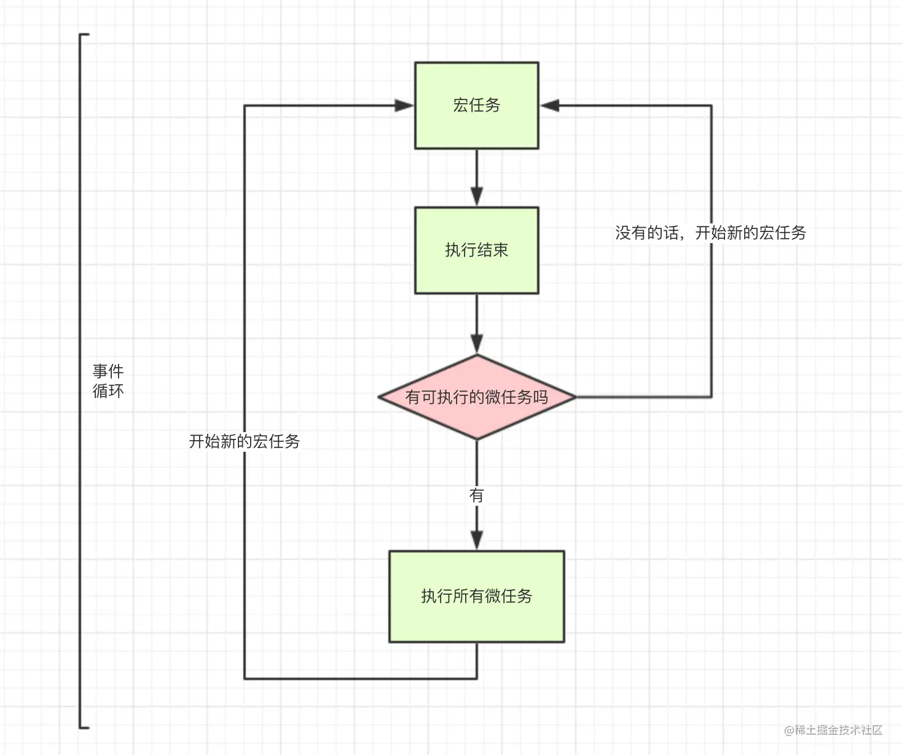
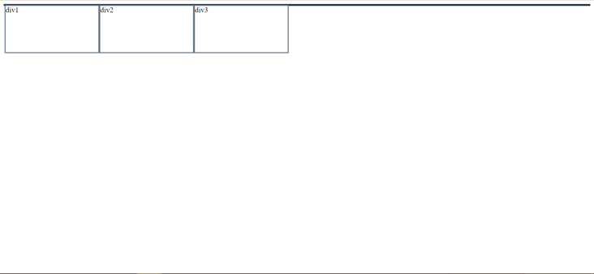

# vue
## 文件目录
```
project
└───src
│   │   app.vue    // 主页面
│   │   main.js    // 主入口
|   |   router.js  // 所有路由
│   │
│   |____assets    // css、image、svg等资源
│   |   |____css   // 所有sass资源
|   |   |    |  reset.scss       // 兼容各浏览器
|   |   |    |  global.scss      // 全局css
|   |   |    |  variable.scss    // sass变量和function等
│   |   |____img   // image图标库
|   |   |____svg   // svg图标库
|   |
|   |____components    // 组件
│   |   |____common    // common自注册组件
│   |        |____base // 原子组件(如果是引入第三方，该文件夹可省略)
│   |        |   ...   // 业务公用组件
│   |   |____entity    // entity页面组件
│   |   |____about     // about页面组件
|   |
|   |____pages     // UI层(原则：轻page，重component)
|   |   |____entity
|   |   |    |  list.vue      // 列表页
|   |   |    |  create.vue    // 新增页
|   |   |    |  edit.vue      // 修改页
|   |   | main.vue
|   |
|   |____plugins   // 自己或第三方插件
|   |   | index.js       // 插件入口文件
|   |   | directives.js  // 所有Vue指令
|   |   | filters.js  // 所有Vue过滤
|   |
|   |____server    // 接口层
|   |   | index.js   // 所有接口
|   |   | http.js  // axios二次封装
|   |
|   |____store     // vuex数据
|   |   | index.js
|   |
|   |____utils     // 工具层
|   |   | config.js// 配置文件，包括常量配置
|
└───public         // 公用文件，不经过webpack处理
│   │   favicon.ico
│   │   index.html
│   vue.config.js  // vue-cli3主配置
│   babel.config.js// babel配置
│   .eslintrc.js   // eslint配置
│   .prettierrc.js // perttier配置
│   package.json   // npm配置
│   README.md      // 项目说明

```
## 双向绑定

# js
## 基本数据类型
- String
- Number
- Boolean
- Object
- Null: 一种特殊的Object = 0 = false
- Undefined: 未定义/未初始化 = NaN = false
- Symbol(ES6): ~~唯一的姐~~ 唯一的值 就算参数一样也是两个东西，可以用description输出参数
- BigInt(ES10)
### 类型判断
- typeof: Number/String/Boolean/undefined/Object/Symbol 
  - 不能判断（Array, Error, null）-> Object
- instanceof: 判断数据是否是某个对象实例。是不是原型链上的
- Object.prototype.toString.call()

## 创建变量
### var/ let /const
- var: 有**变量提升**
- let: 不能重复定义，可以修改值
- const: 不能重复定义，不能修改值（除了数组和对象）

### 变量提升/ 函数提升
```Javascript
   console.log(a) // undefined
   var a = 1
   console.log(a) //1
```
实际运行顺序

```Javascript
   var a
   console.log(a) // undefined
   a = 1
   console.log(a) //1
```
声明自动上提 = 变量提升

函数也一样

变量提升 > 函数提升

## 执行机制
 javascript是一门**单线程**语言，任务分为同步和异步

 

- 当指定的事情完成时，Event Table会将这个函数移入Event Queue。
- 主线程内的任务执行完毕为空，会去Event Queue读取对应的函数，进入主线程执行。
- 上述过程会不断重复，也就是常说的Event Loop(事件循环)。

```javascript
let data = [];
$.ajax({
    url:www.javascript.com,
    data:data,
    success:() => {
        console.log('发送成功!');
    }
})
console.log('代码执行结束');
```

- ajax进入Event Table， 注册回调函数`success`
- 执行`console.log('代码执行结束')`。
- ajax事件完成后，`success`进入**Event Queue**
- 主线程从**Event Queue**读取回调函数`success`并执行。

### setTimeout
**异步** 可以延时执行
```javascript
setTimeout(() => {
    task()
},3000)

sleep(10000000)
```

此时task的时间远远超过三秒：
  - task() -> 进入Event Table 并注册，开始计时
  - 执行sleep()
  - 3s结束，task()进入Event Queue， 但要等sleep先完成
  - sleep()执行完，task()进入主线程执行

>**setTimeout(fn,0)**的含义是，指定某个任务在主线程最早可得的空闲时间执行，意思就是不用再等多少秒了，只要主线程执行栈内的同步任务全部执行完成，栈为空就马上执行
### setInterval
和`setTimeout`很像，不过`setInterval`这个是**循环执行**

`setInterval(fn,ms)`来说，我们已经知道不是每过ms秒会执行一次fn，而是每过ms秒，会有fn进入**Event Queue**。

如果`fn`执行时间超过了延迟时间`ms`，那么就完全看不出来有时间间隔了

### Promise(ES6)
所谓Promise对象，简单说就是一个容器，里面保存着某个未来才会结束的事件（通常是一个异步操作）的结果。

Promise 本身是同步的立即执行函数， 当在 executor 中执行 resolve 或者 reject 的时候, 此时是异步操作， 会先执行 then/catch 等，当主栈完成后，才会去调用 resolve/reject 中存放的方法执行。

**特点：**
  - 对象的状态不受外界影响。
    - 有三种状态：`pending`（进行中）、`fulfilled`（已成功）和`rejected`（已失败）
    - 只有异步操作的结果，可以决定当前是哪一种状态，任何其他操作都无法改变这个状态
  - 一旦状态改变，就不会再变，任何时候都可以得到这个结果。
    - `pending`->`fulfilled`
    - `pending`->`rejected`
    - 只要这两种情况发生，状态就凝固了，不会再变了，会一直保持这个结果，这时就称为 resolved（已定型）

**缺点：**
  - 无法中途取消
  - 如果不设置回调函数，内部的错误不会反应到外部
  - 当处于pending状态时，无法得知目前进展到哪一个阶段（刚刚开始还是即将完成）。

### 宏任务/微任务
- macro-task(宏任务)：包括**整体代码**script，setTimeout，setInterval
- micro-task(微任务)：Promise，process.nextTick



### async/await
```javascript
async function testAsync(){
   await getJSON();  
   console.log('数据拿到了');
}
```
1. `await` 后面的代码放在 async 创建的那个 `Promise` 里面去执行;
2. `await` 下面的代码放到前一个 创建的 Promise 对象的 `.then` 里面去执行。

```javascript
async function test() {
    let a = 2
    let c = 1
    await getContent()
    let d = 3
    await getPromise()
    let e = 4
    await getAsyncContent()
    return 2
}
相当于
function test() {
    return Promise.resolve().then(() => {
        let a = 2
        let c = 1
        return getContent()
    })
        .then(() => {
            let d = 3
            return getPromise()
        })
        .then(() => {
            let e = 4
            return getAsyncContent()
        })
        .then(() => {
            return 2
        })
}
```
[好文](https://juejin.cn/post/7122071393495154701)


# CSS
## 选择器
id 选择器（#myid）

类选择器（.myclass）

属性选择器（a[rel="external"]）

伪类选择器（a:hover, li:nth-child）

标签选择器（div, h1,p）

相邻选择器（h1 + p）

子选择器（ul > li）

后代选择器（li a）

通配符选择器（*）

!important >行内样式> ID 选择器「如：#header」> 类选择器「如：.foo」> 标签选择器「如：h1」 > 通配符选择器（*）

## 布局

### position
- fixed: 
  - 相对于浏览器窗口是固定的，即使窗口滚动。 
  - 脱离文档流，和其他元素重叠
- relative: 
  - 这个相对是相对的元素本身。
  - 它所在的行不能再出现其他元素。
  - 不设置偏移量的时候 对元素没有任何影响，
  - 设置了偏移量，则基于自身初始的位置进行偏移。
  - 可以提升层级关系
- absolute: 
  - 从文档流完全删除。元素定位后生成一个块级框，而不论原来它在正常流中生成何种类型的框。
  - 元素位置相对于最近的**已定位【相对绝对都可以】祖先元素**， 如果元素没有已定位的祖先元素，它的位置相对于**最初的包含块【可能是浏览器】**。会出现覆盖的情况，可以用z-index控制覆盖的顺序。
- sticky: 
  - 粘性定位可以被认为是相对定位和固定定位的混合。
  - 须指定 top right bottom 或 left 四个阈值其中之一，才可使粘性定位生效。否则其行为与相对定位相同。
  - 定位~relative, 当父容器超出视角，sticky粘粘也会不见咯
- static: 
  - 默认值。没有定位，元素出现在正常的流中（忽略 top, bottom, left, right 或者 z-index 声明

>父相对子绝对
### float
float在英文中是“漂浮”的意思，它可以让元素漂浮并重新排列！
咖啡漂浮物是一种饮料，上面漂浮着冰块，对吧？
想象一下，这个冰 = 元素。

当用吸管或勺子接触时，漂浮的冰淇淋会移动。float 属性是完全相同的概念。


`float: none;`


`float: left;`


`float: right;`


**特性**

- 不参与高度计算
- 会有包裹性的特点：e.g.宽度很大（实际上其宽度为父元素的100%），但是高度只有一个p标签的高度。
- 会自动变成block元素

**浮动塌陷:**

如果对div1，div2，div3都设置float: left，但是父元素div-outer没有设置宽度和高度，页面如图所示


因为都是float，父元素计算的高度为0

**解决方案：**
1. clear: both
   1. 使用伪类:after[在元素后自动加上]：
      1. content，height，overflow这三个属性是为了保证该伪类不会显示出任何东西，而将其设置为block是为了让其宽度占满一行，这样浮动元素才能在其范围内，clear属性才能起作用。
    ```css
      &:after{
        content: ''
        display: block
        clear: both
        height: 0
        overflow: hidden}
      ```
   2. 新增一个`<div style="clear:both">`
2. 父元素触发**BFC**
### 盒子模型
- border-box：
   - width/height = content+padding+border
- content-box:
   - width/height = content
### 水平/垂直居中 TODO
## BFC块级格式化上下文
把 BFC 理解成一块独立的渲染区域，BFC 看成是元素的一种属性，当元素拥有了 BFC 属性后，这个元素就可以看做成隔离了的独立容器。

BFC就是一个容器，而这个容器内的**块级元素**会遵循一系列规则。

BFC 就是页面上的一个隔离的独立容器，容器里面的子元素不会影响到外面的元素。反之也如此。

### 布局规则
1. 内部的box会一行一个垂直放
2. 垂直方向的距离由margin决定，一个BFC内的两个相邻margin会重叠。不同BFC的margin不会重叠
3. 每个块级元素的左外缘与包含块的左边缘接触（对于从右到左格式，右边缘接触）。即使存在浮动，也会出现这种情况
   1. 若一个块级元素的position为fixed。那么，包含块始终都为viewport。
   2. 若一个块级元素的position为absolute。那么，包含块则为离它最近的position不是static的祖先元素的padding-box 。
   3. 若一个块级元素的position为static或relative。那么，包含块则为其父元素的content-box。
### 特性
1. BFC的区域不会与float box重叠。
2. BFC就是页面上的一个隔离的独立容器，容器里面的子元素不会影响到外面的元素。反之也如此。
3. 计算BFC的高度时，浮动元素也参与计算。
### 怎么触发BFC
1. 根元素`<html>`
2. float不为none
3. position为absolute或fixed
4. display为inline-block, table-cell, table-caption, flex, inline-flex
5. overflow不为visible

