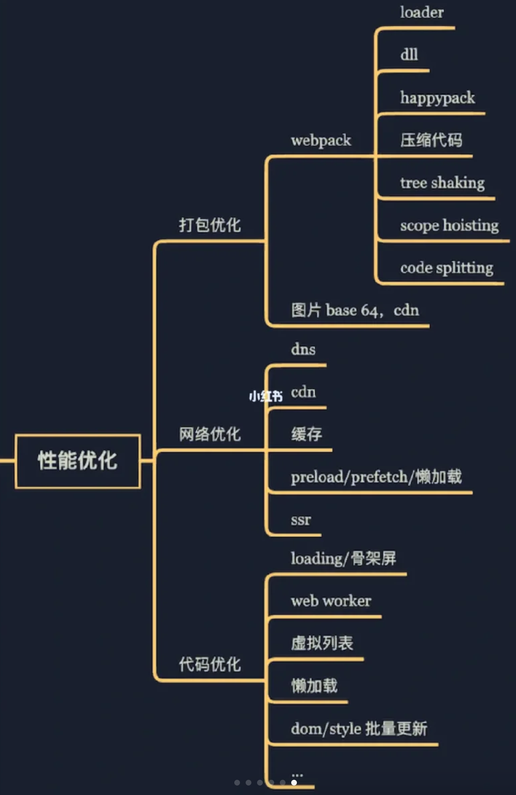

# 前端工程化
（1）使用Webpack实现项目构建
（2）使用Babel完成JavaScript编译
（3）CSS预编译：提供便捷的语法和特性供开发者编写源代码，随后经过专门的编译工具将源码转化为CSS语法
（4）模块化开发
（5）组件化开发
（6）开发环境的本地服务器与Mock服务
（7）规范化约束
（8）项目部署流程化  
# 真题演练
## Q. 首屏时间优化的方式

1. 长列表（虚拟列表） 触底加载
2. 懒加载
    1. **图片懒加载**
        
        渲染时设置一个节点的自定义属性，比如说`data-src`,然后值为图片url地址，图片的src属性指向懒加载的封面，监听scroll事件，通过`getClientBoundingRect`API获得图片相对视口的位置，当图片距离视口底部一定时，替换url地址。达成目标。
        
    2. **路由懒加载**
        
        减少首屏下载资源，当路由匹配时，才去下载对应视图组件。
        
        component: () => import(’./xxx.vue’)
        
    3. **按需引入**
        1. 用第三方ui框架时，可以按需引入一些组件，减少项目体积。
        2. 第三方库懒加载的方式，减少打包后vender的体积。
            
            ```js
            import moment from 'moment'
            export default {
                data () {
                    
                },
                mounted () {
                    
                }
            }
            //改成
            export default {
                name: '',
                beforeCreate () {
                    import('moment').then(module => {
                        this.moment = module;
                    });
                },
                data () {
                    return {
                        moment: null
                    }
                }
            }
            ```
            
3. 打包优化
    1. Webpack 对图片进行压缩
    2. Tree Shaking 打包时去除未引用的代码
4. 资源加载优化
    1. 图片使用雪碧图
    2. 降级加载大图资源
    3. 利用浏览器缓存
5. 浏览器渲染优化
    1. 减少强制重排
## Q.两层for循环如何优化
1. 循环次数小的放在外层
2. 中断的条件设为常量会更快
3. 直接从尾巴开始遍历
   1. `for (var i = arr.length - 1; i >= 0; i--) {}`
   2. 只读取了一次.length 也没开辟新的变量空间

# 异常处理+监听

## 异常分类
- Error：错误的基类，其他错误都继承自该类型
- EvalError：Eval 函数执行异常
- RangeError：数组越界
- ReferenceError：尝试引用一个未被定义的变量时，将会抛出此异常
- SyntaxError：语法解析不合理
- TypeError：类型错误，用来表示值的类型非预期类型时发生的错误
- URIError：以一种错误的方式使用全局 URI 处理函数而产生的错误

## 异常处理
### try-catch
```js
function testFinally {
  try {
    return "出去玩";
  } catch (error) {
    return "看电视";
  } finally {
    return "做作业";
  }
  return "睡觉";
}
```
`finally` 子句在 `try-catch` 语句中是**可选的**，但是 finally 子句一经使用，其代码**无论如何都会执行**。

**表面上**调用这个函数会返回 "出去玩"，因为返回 "出去玩" 的语句位于 try 语句块中，而执行此语句又不会出错。

**实际上**返回 "做作业"，因为最后还有 finally 子句，结果就会导致 try 块里的 `return` **语句被忽略**，也就是说调用的结果只能返回 "做作业"。  return只能一个

如果把 finally 语句拿掉，这个函数将返回 "出去玩"。因此，在使用 finally 子句之前，一定要非常清楚你想让代码怎么样。（思考一下如果 catch 块和 finally 块都抛出异常，catch 块的异常是否能抛出）

无论是 try/catch 还是 promise 都能捕获到的是**同步异常**

reject 是回调，而 throw 只是一个同步的语句，如果在另一个异步的上下文中抛出，在当前上下文中是无法捕获到的。
### window.onerror

通过在 window.onerror 上定义一个事件监听函数，程序中其他代码产生的未被捕获的异常往往就会被 window.onerror 上面注册的监听函数捕获到。并且同时捕获到一些关于异常的信息。

`window.onerror = function (message, source, lineno, colno, error) { }`
- message：异常信息（字符串）
- source：发生异常的脚本URL（字符串）
- lineno：发生异常的行号（数字）
- colno：发生异常的列号（数字）
- error：Error对象（对象）

## window.onunhandledrejection
window.onunhandledrejection 与 window.onerror 类似，在一个JavaScript Promise 被 reject 但是没有 catch 来捕捉这个 reject时触发。并且同时捕获到一些关于异常的信息。
                        
```js
window.onunhandledrejection = event => { 
    console.log(event.reason);
}
```
event事件是 PromiseRejectionEvent 的实例，它有两个属性：
                        
- event.promise：被 rejected 的 JavaScript Promise
- event.reason：一个值或 Object 表明为什么 promise 被 rejected，是 Promise.reject() 中的内容。
## window.rejectionhandled

因为 Promise 可以延后调用 catch 方法，若在抛出 reject 时未调用 catch 进行捕捉，但稍后再次调用 catch，此时会触发 rejectionhandled 事件

```js
window.onrejectionhandled = event =>
{
    console.log('rejection handled');
}

let p = Promise.reject(new Error('throw error'));

setTimeout(()=>{
    p.catch(e=>{console.log(e)});
},1000);

// Uncaught (in promise) Error: throw error
// 1秒后输出
// Error: throw error
// rejection handled
```